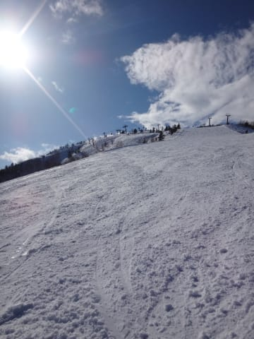

# 2月22日の志賀高原，詳細モード…晴れたものの，なんだこの混み具合は…！

📅 投稿日時: 2015-02-24 01:49:56

🏷️ カテゴリ: [2015スキー滑走日記](c09ea645cfc085f86dfcd80f49599dd89.md)

うーむ．なんだか．

やっぱり，日曜夜の雨で．

志賀高原の雪質はかなり悪化したようですね…（涙）．

…今週末までに，回復してくれるのか…

木曜が雪になりそうだから，それに期待かな～

＃週末，下地がアイスバーンなのは確実っぽいけど

ってことで．

昨日速報した日曜の志賀高原，詳細レポートをば…

日曜の朝．

低気圧が接近しているけど，南西風だから，

もしかすると，朝のうちは晴れるかも…？

と思っていたところ．

予想以上の晴天！

…でも．

朝からなんだかすごい気温が高いんですけど…

ウェアのジャケットを着ないで車の外に出ても，

全然寒くないくらいなんですけど．

さらに．

どうも，風が強いらしく…

はうぅ．

第2ゴンドラ運休（涙）

そして，第1ゴンドラも減速運転（泣）．

奥志賀は，第1ペア以外全滅（悲）．

…こんな天気がいいのに，これだけリフトが動かなかったら…

混む．第1ゴンドラ，人が集中して間違いなく，混む．

とりあえず，減速運転でいつもの倍以上の時間が

かかるゴンドラで，山頂に出てみると…

…朝イチの山頂で，マイナス2度って…2月にしちゃ，気温高すぎ（泣）．

[5月よりあったかい](d20130502.md)ってことだな…

でも，山頂はすっきり晴れて気持ちよく…

ゲレンデの雪質も，しっかり締まった圧雪バーン！

ふはははは！

気温が高くても，気持ちいいシマシマっ！

最高っ！

朝イチの3本は，人も少なくて，

飛ばしたい放題っ！

第2ゴンドラも動いてないし，コースの人はホントに少ないよっ！

いやー，天気はいいし，ゴンドラが遅い以外は最高だねっ！

…と，気持ちよく滑っていたのもつかの間．

いつもはまだ混まない9時を過ぎたばかりの時間に…

ええ？？もう，ゴンドラ10分待ち？？

列は短いけど，減速運転なので結構な待ち時間…（涙）．

さらに，ゴンドラ乗車時間も長いので．

1本滑るのに30分…

そして，1本滑って戻ってくると…

な，な，なんだ～っ！！！！！！

これはっ！！！！

ありえない．

ありえない列の長さ．

通常速度ならそこそこの時間で進む列でも．

減速運転なので，かなり待ち時間が長く…

30分近くの待ち時間（激烈な涙）．

スキーバブルをほうふつとさせる待ち時間ですな…（こぼれ落ちる涙）

ゴンドラの待ち時間が長いので，リフトに逃げようか？

とも思ったけど…

当然みんな同じことを考えるわけで．

リフトも20分待ちですか…（強烈な涙）．

ただ．

第2ゴンドラが動かず．

第1ゴンドラもすごい減速運転で，輸送力が低いため…

ゴンドラのコース，ゲレンデ自体は，ガラガラ！

我慢してゴンドラを待てば，シアワセバーンが待ってるので．

…午前9時から11時過ぎまで2時間，こんな感じの20分以上待ちの

ゴンドラに並び続けました…

…でも．

でも．

1時間に2本も滑れないゴンドラ待ち時間だったけど．

それを待てば．

無人のフラット快適バーンが待ってるんですもの！

滑る人が少ないので．

晴天ピカピカの中．

ホントに人がいない，好きなラインを取り放題の．

朝イチの状態が昼近くまで続くという．

…滑る分には，かなりシアワセバーンだったんだけどなぁ…

で．

12時になって．

やっとゴンドラは待ち時間が0になってくれたよ！

よーし，ガンガン滑るぞっ！

…と，思ったら．

うーむ．やはり気温が高いからか…

雪質は，ちょっと3月下旬ころの感じに…

山頂の気温は，昼間でプラス2度と，

そんなにすごい高いわけじゃないけど，

日差しが強烈なせいで，

ちょっとしっとりとして，固まっていく感じの雪に…

おーーーーい．

今はまだ，2月だよ～（涙）．

時折雲がかかって，日が陰ったけど．

曇った方が，雪が冷えていい感じなんだけどな～．

これ以上，晴れなくていいよ…と思うほど．

で．

いつもの日曜なら，午後はガラガラなんだけど．

この日は天気が良かったからか．

昼の時間は待ち時間が0になったゴンドラですが．

午後になると，食事を終えた人が戻ってきたのか，

また待ち時間が増え始め…

午後1時以降も，5分くらい待ちましたね…

そして，減速運転だったので．

いつもの半分しか滑れない感じ…（涙）．

でも．

基本的に，午後まですっきり晴れの天気が続き．

雪質は重くて引っかかる雪だったけども．

ゴンドラの輸送力が低いから，それほどコースは荒れず．

ってか，ゴンドラ待ちがあるというのに，ゲレンデには

人がほとんどおらず．

どの写真にも，人が写ってない…

うーむ．

おかげで，コースは夕方まで完璧にフラットで．

最後まで，大回り用のX-raceを履き続けられるコンディション

だったのが，せめてもの救いか…

って感じで．

午前中は20～30分待ちというありえないゴンドラ待ちがあり．

さらに，減速運転のため，ゴンドラ乗車時間もいつもの倍ほどで．

1時間に2本も滑れない状況という，かなりの試練だったけど．

その代り，

「雨が降るかも？？」というわりに，天気は良く．

夕方まで，人のいないフラットなゲレンデを大回り

し続けられたので，まぁ救われたかな…

とりあえず．

スキーをしている昼間は見事に晴れてくれて．

ちょうど午後5時を過ぎてからの撤収中というタイミングで，

ぽつ，ぽつと雨が降り始めたのは，

きっと私の祈りが…（サクッ）←読者に刺された音
