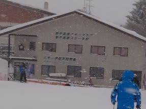
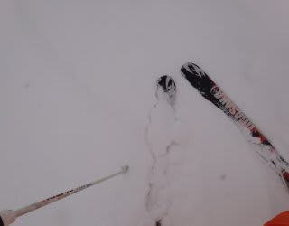
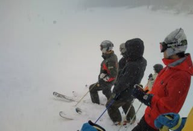
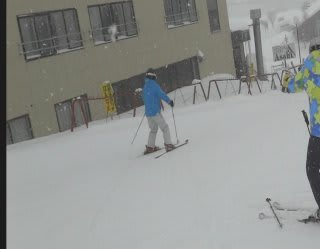

# レジャースキーヤー失格？

📅 投稿日時: 2012-02-01 00:43:29

えー．

検定を受けるわけでもない，

有資格者でスキーを教えるわけでもない．

何かの大会に出るわけでもない．

…といった感じで．

ひたすら自分の快楽を求める道楽スキーヤーの私は．

自らを「レジャースキーヤー」

と称していたわけなのですが．

スキー仲間「菅平修行場に来て，だ」

私「うん」

スキー仲間「オガサカの板を履いたり」

私「うむ？」

スキー仲間「一列にならんで講習を受けてたり」

私「うぬぬ？」

スキー仲間「プルークを練習している人間はね」

スキー仲間「…レジャースキーヤーと言えないと思うんだ」

私「ううっ(滝汗）」

こ，コンプリートっ！

この週末，

非レジャースキーヤーの4条件，コンプリート！

これから私は，レジャースキーヤーと言わず，

なんと名乗れば良いんでしょうか…

候補1：似非レジャースキーヤー

候補2：レジャースキーヤーみたいなもの

候補3：レジャースキーヤーとは言えないスキーヤー

## 💬 コメント一覧

### 💬 コメント by (HT)
**タイトル**: Unknown
**投稿日**: 2012-02-03 12:09:03

全く往生際が悪いなぁ…

もうスキーオタクって素直に認めて楽になっちゃいなYO

### 💬 コメント by (Skier_S)
**タイトル**: オタクでは無いと思ってるんですが
**投稿日**: 2012-02-04 01:23:05

うーむ．

スキーオタクですか…

ひたすらスキーを滑りまくっていますが，

オタクというほど，スキー技術や何かに

凝っているつもりは無いのですけど(笑）．

このブログも，スキー技術ネタは無いですし…

とりあえず，自分が「娯楽系スキーヤー」

だということは間違いないかと思ってるんですが(自信なさげ）．

