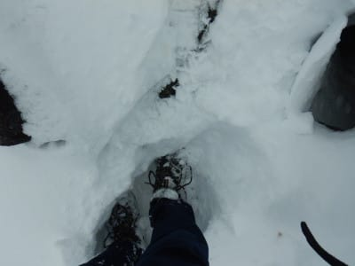
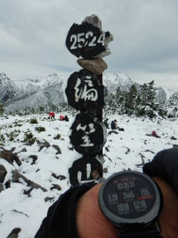

# 2020年10月，八ヶ岳の編笠山に登ってみた，その5

📅 投稿日時: 2021-08-10 03:14:30

🏷️ カテゴリ: [登山・旅行](c1d637a11a25b457ac978d197adbdafc5.md)

うーむ．

自分でこの山登りレポートを書いていて．

ダイビングができないこの夏休み．

「せめて山に登りに行きたい…（涙）」

と思いながらも．

せっかくの9連休を狙ったように，

緊急事態宣言と台風のダブルパンチに

やられて山登りどころではない

今日この頃．

皆様いかがお過ごしでしょうか（泣）．

ってなことで．

山に行けない今日も，山登り日記の続きです．

では，どうぞ～！

ーーー

ということで．

「ここ，登るの？」

と，思わずつぶやいてしまう，

積雪のある岩場登りを始めた

わけですが．

まずは足元が滑らないように，

足場の雪をしっかり踏み固めながら…

手を掛ける場所を考え，

次の足場を考えながら，

滑らないように，3点確保を

キープして．

確実に身体を持ち上げていく

わけですが…

しばらく登った後で．

下を見ると…

怖い．

これはちょっと怖い！

この写真だと，斜度感が全然ないけど．

実際はかなり高さを感じるところで．

かつ，足場は狭く滑りそうな

感じなので…

結構怖い！

この時は知らなかったけど．

観音平側から登るのに比べると，

私が選んだ富士見高原から登る

ルートはより急だったらしく．

ビビりながら，滑らないように

ルートを選んで，確実にゆっくりと

岩をひとつずつ登っていったので…

最後の標高差100m．

順調なら20分もかからず登るところ，

50分近くかかったけど．

…それでもなんとか登山開始から

約4時間．

11時に無事山頂へ到着…！！！

えらい！

えらいぞ，自分！

（この征服感が，山登りを続けさせるモチベーションだよな…！）

いや．

良く登った…

…

…って，

なんか，意外と山頂に人がいるんですが！？？

私が登った，富士見高原からのルートは，

私の前には1人か2人分の踏み跡しか

無かったし．

自分が大変な思いをして登ってきたのに．

観音平側からそれほど苦労せず

登ってきた人が大勢いたのを見て，

「なんで自分はこんな日に，わざわざ

厳しいルートで登ってきたのか…」

と，ちょっとがっかり…

でも．

山頂からは富士山もきれいに見えたし．

山頂は真冬みたいに積雪で真っ白で．

八ヶ岳の権現岳，赤岳方面は真冬のように

冠雪していて．

うん…

ここまで4時間もかかったけど．

諦めかけていた山頂まで来ることができて．

良かった…

…と．

このころはまだ満足感をもって

山頂でくつろいでいた，Skier_S

だったのでした…

