# 2025/2/8(土)の志賀高原焼額山スキー場は…朝は積雪50cm以上！終日雪降りのエンドレスパウダーデー！！

📅 投稿日時: 2025-02-08 22:34:46

ということで．

本日も睡眠1時間半で志賀高原にやってきた，

Skier_Sです…

いやーー．

今日は高速道路も出発したときは長野ICから

先が通行止めだし．道路状況もひどそうだから，

無事志賀高原に着けるのか？？？

と，心配だったけど．

何とか営業開始までに志賀高原に到着し，

一日パウダーを楽しんできました～！！

今日は今シーズン一番のパウダーデー

でしたよ～！！

（この雪煙の向こうにスキーヤーがいる…）

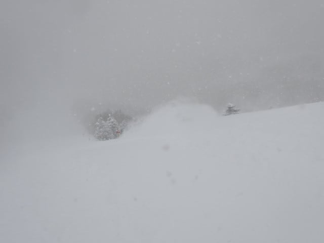

でも…

冒頭に書いたように，早朝出発したときは，

長野から先の高速が通行止め．

さらに横川からのチェーン規制でのチェーンチェック

渋滞に15分ほどつかまり，

その後も除雪車を先頭にした，時速50km以下

での隊列走行が1時間ほど続き…

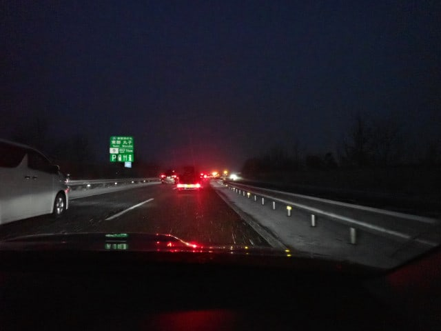

果たして，志賀高原着は何時になるのか？

と心配していたら．

朝6時過ぎには高速道路の通行止めも解除され，

さらに心配していた高速路面状況も，

せいぜいこの程度の積雪で済んだので…

いつもより1時間近く早めに余裕を見て出発して，

ちょうどいい時間に志賀高原に着くくらいでした…

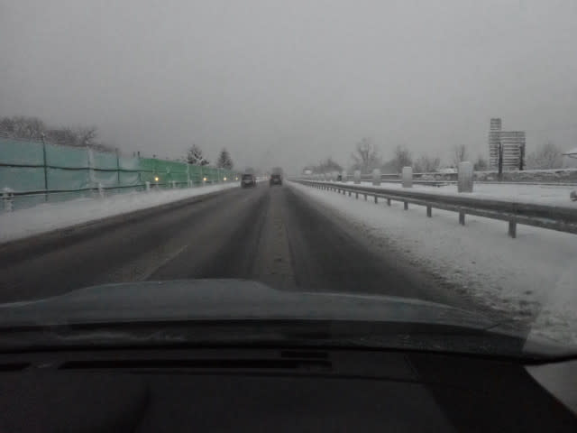

ただ，志賀高原の上り坂は，除雪は行き届いて

いたものの，ホワイトアウトっぽい感じで

見にくく，こんな感じで道の先がよく

見えない，かなりデンジャラスな道でしたが…

でも，何とか営業開始前に無事到着！

が．

なんということか！！

今日は風が強いらしく，第2ゴンドラが

朝から終日営業見合わせ（涙）

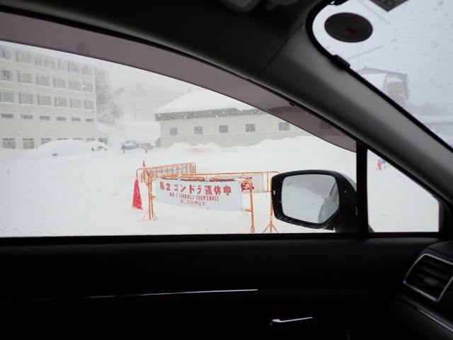

さらに，第1ゴンドラのファーストトラックも

本日営業されなかったので…

朝イチの焼額第1ゴンドラ待ちは，

いつもならファーストトラックに

参加している人や，第2ゴンドラの分の

お客さんもいて，いつもよりちょっと

人が多めな感じ．

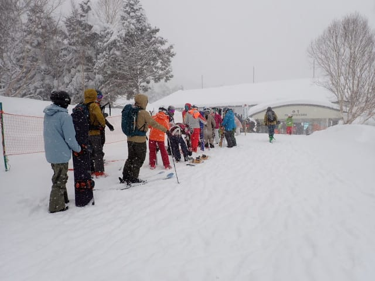

悪天候なので営業開始が遅れるかな…

と思ったけど．

予定通りの8時半に営業開始！

朝イチのゴンドラで山頂に上がると…

山頂の気温は予想ぴったりの-15℃！！

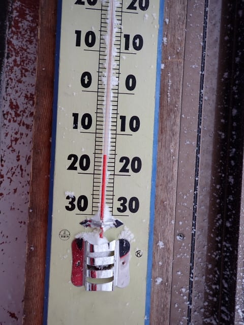

そして山頂に着くと…

昨日からの積雪は50cmを越えてるのかな？

予想の40cmよりは積もった感じです！！

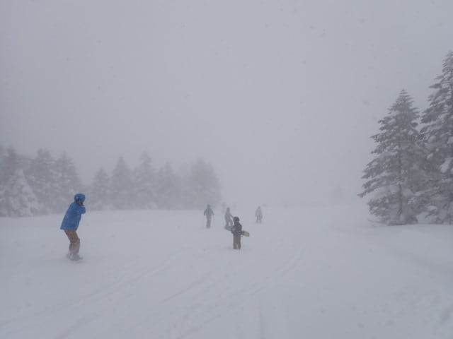

朝もかなりの勢いで雪が降っているので…

圧雪後にもかなり雪が積もり，

圧雪バーンも積雪10cmくらいありますよ！！

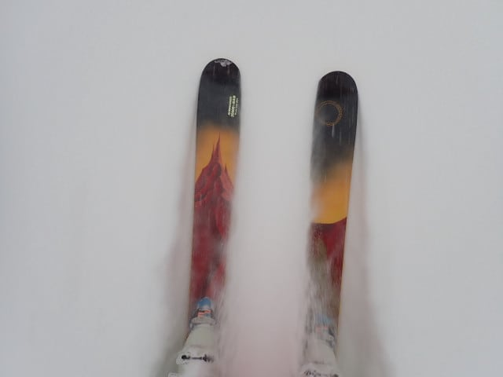

こんな日は…

そうです．夕方圧雪で，昨晩からの

新雪がたっぷり積もっているオリンピック

コースへ向かうのだ！！！

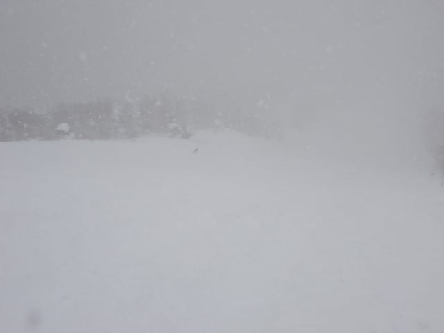

オリンピックコースは…

太ももパフから腰下パフだぁ！！！

間違いなく，私にとっては今シーズン

一番の深さのパウダーだ！！！！

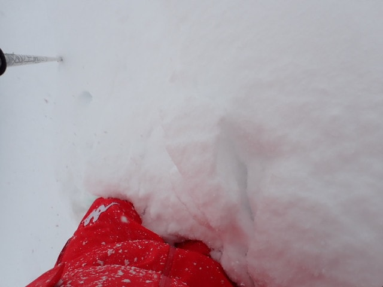

ファーストトラックが営業されて

なかったので，朝イチのノートラックの

オリンピックコース．

ちょいと雪が重め（志賀高原比．新潟の人に

これで雪が重いと言ったら基準がおかしいと

クレームあり(笑)）だったので，

緩斜面ではゴキブリホイホイ状態になっている

人もいましたが…

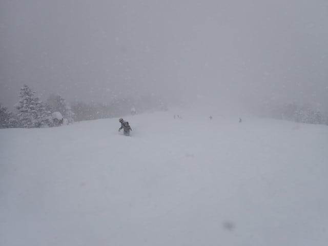

それでも，太ももから腰パフのパウダー！！

センター幅108mmくらいだと足りず，

もっと太い板が欲しくなるほどのパウダー！！

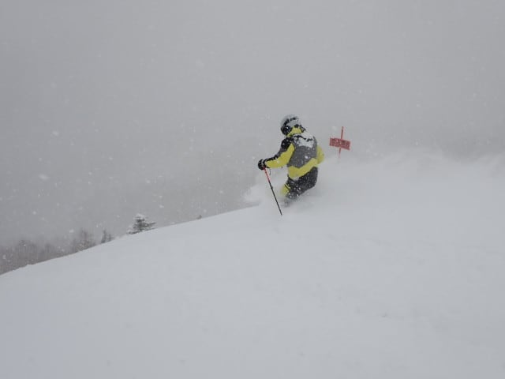

何本か滑っても，この降りっぷりなので，

また新雪が供給されて…

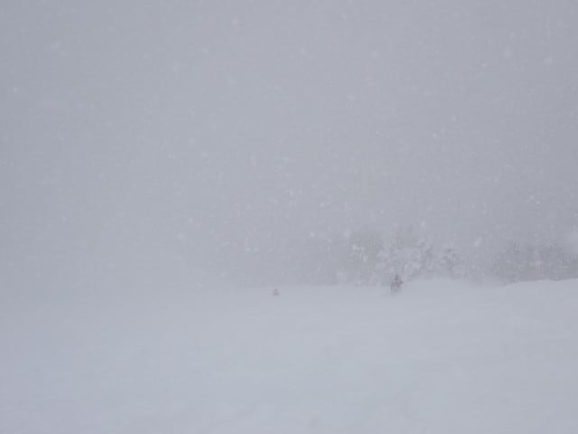

2時間くらいは，ひたすらパウダーを

楽しめました～！！

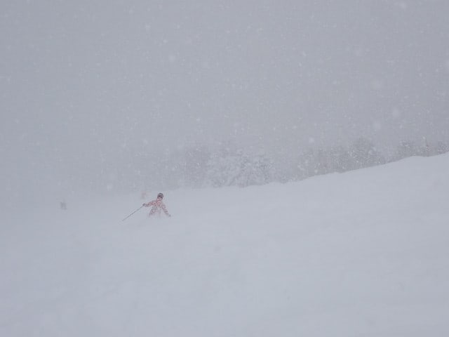

ただ…

2時間滑った，午前10時半ごろには．

前が見えないくらいに雪の降りが激しく

なってきた上に，風も強まってきて．

天気が悪化しているなぁ…

と思ったら．

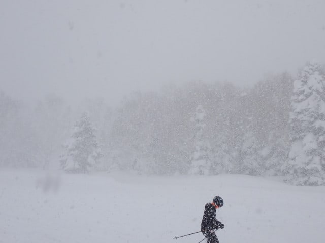

なんと．悪天候のため，奥志賀高原が

全面営業休止に…（泣）

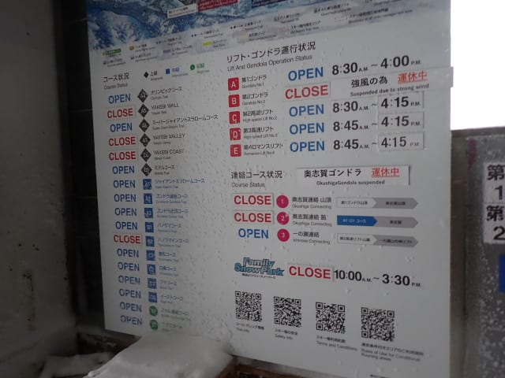

奥志賀も第2ゴンドラも止まってしまったし．

リフトは寒すぎて乗ってられないので．

動いている第1ゴンドラにお客さんが集中し…

悪天候のわりに，ゴンドラ待ちがちょいと

長めになってきました…

でも，相乗りレーンなら2－3分待ちで

済んだので，土曜と考えればそこまで

混んでないかな．

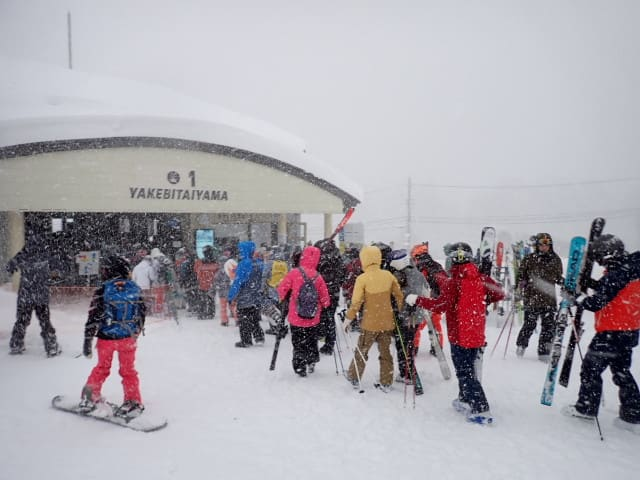

とりあえずこの日は，いつ写真を撮っても

こんな感じで，視界が悪く雪が降り続けている

写真がひたすら続く感じで…

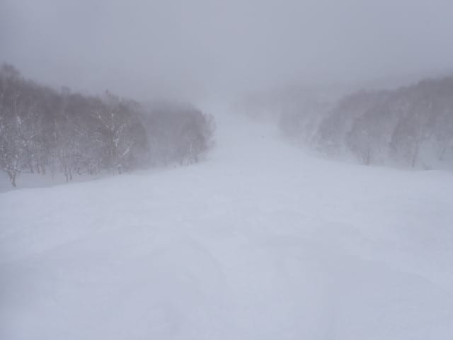

そのせいで，圧雪コースも人が多いコースの

真ん中付近は踏まれているけど，コース脇に

近いところはあまり踏まれないのでだんだん

雪が溜まっていき．

いったん雪が溜まるとみんなそこを避けるので．

圧雪コース内なのに，コースの左右には

こんなパウダーが積もっていくし…

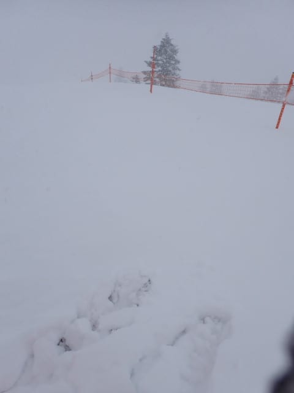

ミドルコースは昼を過ぎても膝パフのところが

残っているし…

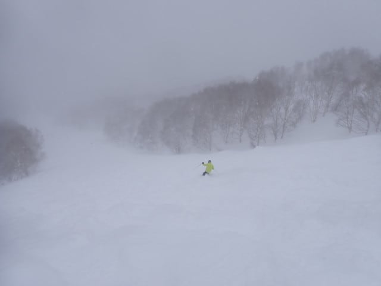

第2ゴンドラが動いてなかったので，

第2ゴンドラがメインとなるパノラマコースを

滑る人が少なく，パノラマコースは午後に

なってもコース脇はこんなパウダーが

残ってるし…

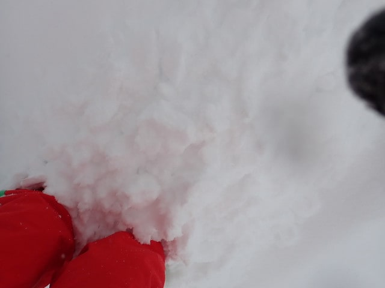

なんにしろ，今日はどこへ行っても

パウダー，パウダー，パウダー！！！

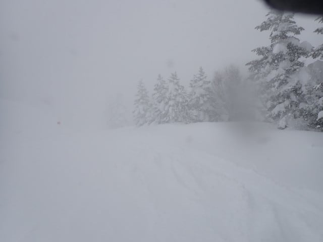

パウダー以外の圧雪も滑らせろ！！

というくらい，どこへ行っても

いつまでたっても新雪を滑っていられる，

ゼイタクな一日で，私は楽しかったけど…

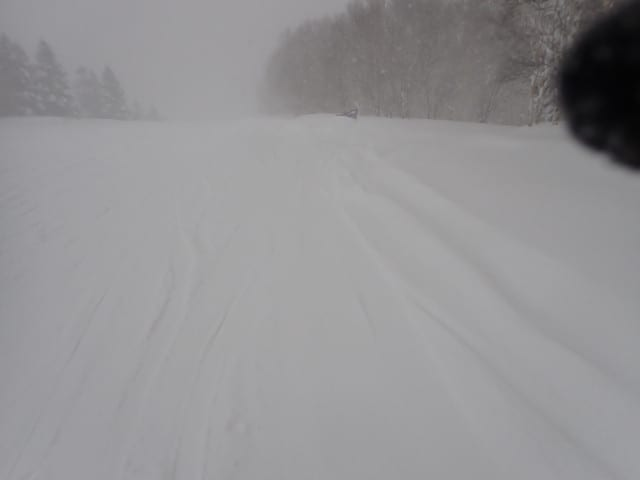

おそらく多くの人は．

降雪でどっちがコースかわからないくらいの

視界の悪さと，いきなり現れる新雪が

吹き溜まった見えないボコボコにやられる

エキサイティングなバーン状況と，

ゴーグルの曇りがすぐに凍り付いて

前が見えなくなっちゃうような寒さとに

やられちゃって，

楽しめるのかどうか微妙な天気では

ありましたが…

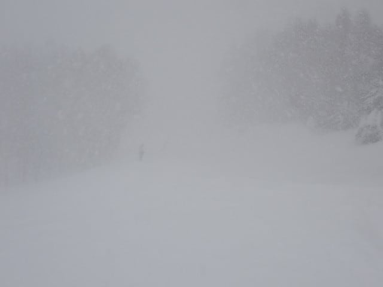

そんな悪天候の中でも，誰かさんは

「パウダー楽しい，パウダー楽しい」

とバカのように滑っていたら…

なんと．

「本日は悪天候のため，15時にゴンドラ

終了します～！！」という無慈悲なアナウンスが！！！

…ええええ？？？？

予定より1時間早くゴンドラが終わって

しまったんですけど！！？？？

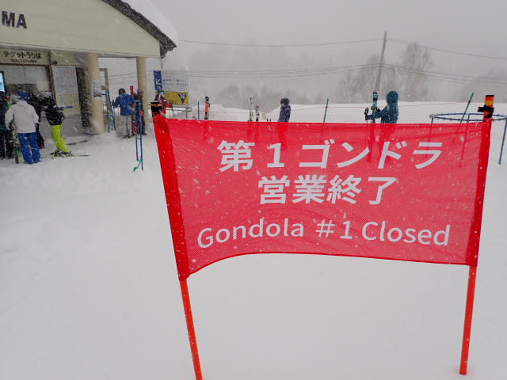

さらにそのうえ，残りのリフトも15:30に

営業終了と，さらに悲しいアナウンスも

流され…

普段の営業終了より1時間近く早く，

すべてのリフトとゴンドラの営業が

終わってしまったのでした…（泣）

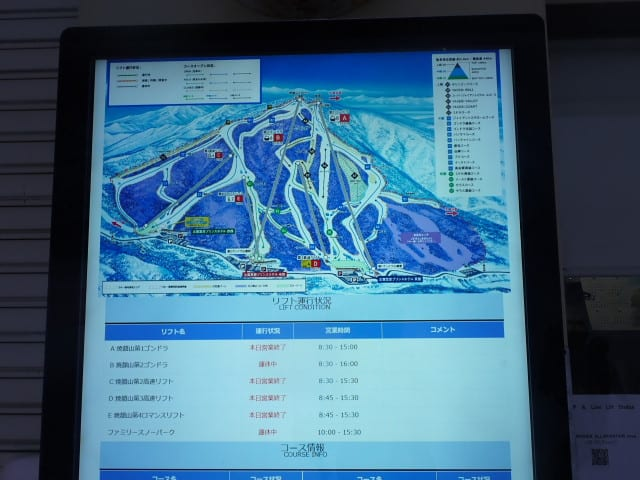

そして．

なんということか．

本日はナイターも中止とのアナウンス（涙）

あぁ…ナイター…

シマシマナイターが…

せっかく焼額のセカンドシーズン券

買ったのに…（激烈涙）

ってな感じで．

早めの営業終了とナイター中止の

悲しいニュースにやられた状態で車に

戻ると…

…

また発掘作業か…(泣）

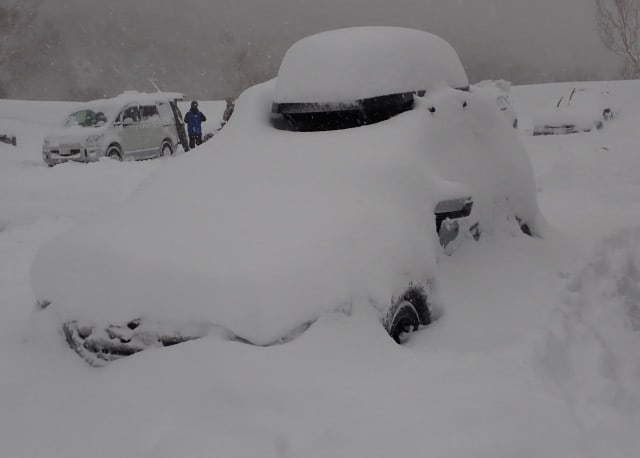

さらに追い打ちで，下りの道も

道路は見えないし．

車は詰まってノロノロ運転だし…

最後はかなりいろいろ打ちのめされて

終わった感じの今日一日だったのでした…

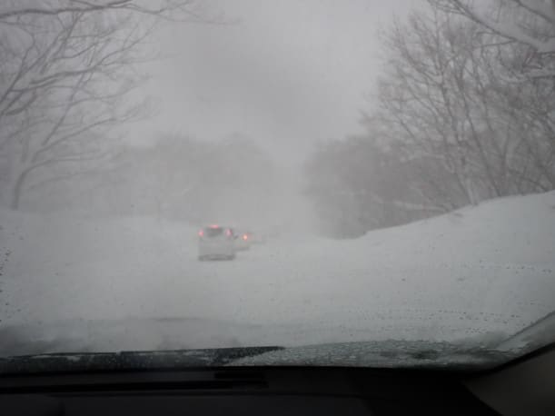

…とはいえ．

今シーズン文句なくベスト，

ここ数シーズンでもそうそうなかった

ディープパウダーが楽しめたので．

そこは良かったかな…

良かった．

いや．楽しかった！！！

…と，

今頃はナイターを滑っていたはずなのに…

と考える自分を慰める，Skier_Sだったのでした．

## 💬 コメント一覧

### 💬 コメント by (地元民)
**タイトル**: Unknown
**投稿日**: 2025-02-08 22:44:02

・・・でしょうね。

・・・というより、むしろ、ゴンドラ、よく動きましたね・・・。

郷も一日中降り続けて凄まじかったです。まだ、ガンガン降ってます。

### 💬 コメント by (副院長)
**タイトル**: Unknown
**投稿日**: 2025-02-08 23:41:05

S様、根性です。湖西まわり、北陸道。僕も上信越道、妙高あたりから、中野も？ここも、パウダー？、上林から、新雪、パウダーを堪能して、上がってきました。最後に駐車場で、スタック。掘り出し、無事駐車。

で、最後のオチは　太板忘れたぁ。

明日は、山の駅からスタートします。

### 💬 コメント by (Skier_S)
**タイトル**: 明日も志賀高原！
**投稿日**: 2025-02-09 23:22:15

＞地元民さま

2ゴンは終日運休，奥志賀も止まったので…

第1ゴンドラはやっぱり風に強いですね…

今朝は積雪50ｃｍ超えでしたよ！！

駐車場の除雪が間に合っておらず，すごいことになってました…

＞副院長さま

志賀到着，お疲れさまでした…

でも，駐車場でスタックですか？？？

あと，せっかくの日曜のこの状態で太板を忘れたのは痛いですね…

私は月曜も滑ってますので，またお会いしたらよろしくお願いします！

