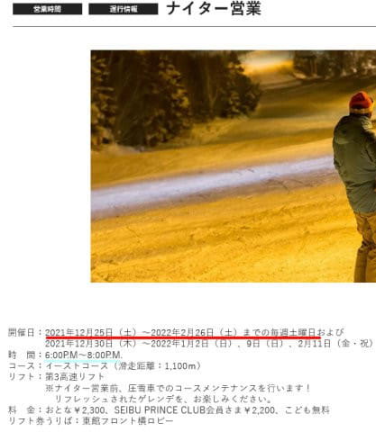
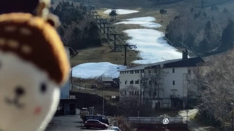
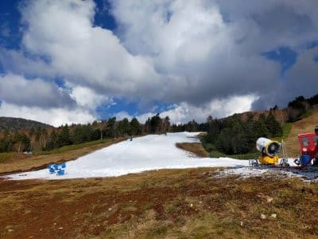
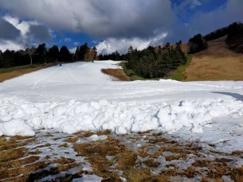

# 焼額山スキー場のナイター，12/25から開始！…そして本日の横手山＆熊の湯の雪の状況を特派員から

📅 投稿日時: 2021-11-18 06:07:43

🏷️ カテゴリ: [日記](cc4b5682fb7b8b144980957a978653fb0.md)

なんだか．

今日もご無体時間で，ついさっきまで

仕事してました…

これから1時間半後に仕事に行かなくては

ならないのに，大丈夫か！？？

それでもBlogを更新する自分…

えらい．

偉すぎる！！

ってなことで．

焼額のナイター営業の日程が発表

されましたね～．

ほぼ例年通り，12/25～2月いっぱいの

土曜日＆正月＆3連休での営業です．

([焼額山スキー場ホームページ](https://www.princehotels.co.jp/ski/shiga/informations/night_ski_1/)より)

…でも．やっぱり．

今シーズンも18:00～20:00なのね…

この時間だと，宿の夕食を食べると

ナイターに行けないんですよね(泣）

せっかくの宿の夕食をキャンセルしなくては

ならず，これだと毎週行くのは辛い…

21時まで営業してほしいと切に願って

いたんだけど，やはり今シーズンも

ダメだったか…

で．

今日は特派員から志賀高原の

写真が送られてきました～！！

…熊の湯はやはり今週末オープンは

とてもダメそうですが…

横手山，意外と雪がしっかりついて

ます！

いや…これまでのこの天気で，

ここまで雪を盛れたのはすごい…！！

これなら，今週末は結構イケそう

ですね…！

ってなことで，これからの天気ですが．

やはり本日からしばらくは人工降雪機が

動かせる気温ではなさそう（涙）

20，21日の週末晴れてはくれるけど…

晴れて気温が上がりそうなので．

横手山，雪のコンディションはだんだん

悪くなっていきそう…

で，やっぱり今日の天気図を見ても．

22日(月)は荒れ荒れの南風＆雨(涙）

横手の雪も消えちゃいそうです．

だけど．

23日(火）以降は冷えます！

23，24は志賀は西風で積もらなさそうだけど．

日本海側は雪が降ります！

冷えるので23，24は人工降雪機が

フル稼働できます！

…惜しい…

22日の雨が無ければ…

まぁ，23日の祭日は滑れるスキー場は

なさそうだけど．

24日以降27日の週末にかけて

次々スキー場はオープンしそうなので．

やはり来週に期待ですね…！

## 💬 コメント一覧

### 💬 コメント by (ヒータロゥ)
**タイトル**: Unknown
**投稿日**: 2021-11-18 08:27:01

志賀高原のオープンが近づいてきましたね。だが、私は昨年車に突っ込まれて骨折して入れたプレートを12月の頭に取る手術があり抜糸までは流石にスキー無理そうです。なのでヤケビオープン日のシーズンインは諦めました。翌週以降参戦しますのでヨロシクです。

### 💬 コメント by (Skier_S)
**タイトル**: ＞ヒータロゥさま
**投稿日**: 2021-11-18 23:55:50

あ，今度はプレートを抜くんですね…

スキーシーズンにかからない時期に抜釘できなかったのは

ちょいと惜しかったですね…

しかし，抜糸翌週にゲレンデ復帰ですか！？？

すごい…

