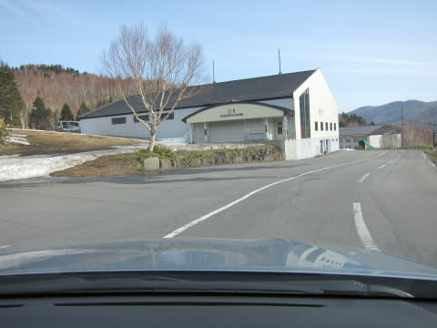
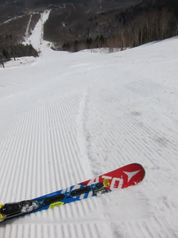

# 4月9日，土曜日の志賀高原のゲレンデは…晴れたけど，例年のGWより雪が少ないよ（涙）

📅 投稿日時: 2016-04-09 22:06:13

🏷️ カテゴリ: [2016スキー滑走日記](c70c67ed5248e9432b899dcd5747048bb.md)

久しぶりに．

実に，久しぶりに戻ってきました，志賀高原へ…

2週間ぶりです…！！（感動の涙）．

何もかも，皆懐かしい…←いや，そんなに時間経ってないから

ってことで．

久々の志賀高原に，心躍らせながら登ってくると…

…道路に雪がないのはともかく…

うげげ？

サンバレー，もうこんなに雪がなくなってるの…？？

右の不整地側，もう完全に雪がない…！

丸池も，もうはげはげです…

…そして，今は亡きホームゲレンデ，焼額の横を通過し…←まだ無くなってないから．今シーズン終わっただけだから

今日は奥志賀スタートです！

＃焼額が滑れれば…（涙）

…しかし．

今日の志賀高原の登り路．

完全ドライです．

駐車場にも雪がないし．

夏タイヤでも問題なくやってこれるレベルでした…

＃まだいつ凍結しても不思議じゃないから，ちゃんとスタッドレスで来ましょう

で．

奥志賀ですが…

…

…

雪，少ないね…（ちょっと涙）

そして，朝8時の気温は…

すでに+6℃ですか（かなり涙）

でも．

朝イチの奥志賀のゲレンデは…

びっくりするほど人がいないんですが．

ひとっこ一人いないんですがっ！！

ちょうどアイスバーンが緩んだ感じの，

エッジがしっかり食い込む快適シマシマバーン！！

いいんですか？

いいんですか？こんな気持ちよさそうなバーンを

貸し切りで滑っちゃって…！！？？

貸し切りシマシマバーン，いただきま～す！！

もうホントに誰もいない！！

まさに自分のためにだけあるシマシマバーンを，

好きなように切り裂くこの快感っ！！

そう．しばらく忘れてたけど．

スキーって，こんなに楽しかったんだ…

…スキー場に，帰って来たよ～っ！！！

＃中1週間休んだだけで，大げさ

と．

ホントに，かなり気持ちよくこんな感じの

人がほとんどいないバーンを．

「うひょひょひょひょ！！」

と叫びつつグルグルしていたら…

…気温が上がりましたね…

晴天で，日差しも強烈ですね…

その，当然の帰結として．

ゲレンデは，朝10時ごろには．

たいへん残念なことに，完全な春雪になっちゃいました…（涙）

それも．

こういう水の浮いた部分が顔を出すような…

パーフェクト春雪．ザ・スプリングスノーです（泣）

まぁ，それでも人が少なくフラットだったので．

午前中いっぱいは，まだ滑りよかったですね～．

＃昼頃の写真だけど，相変わらずガラガラ

ただ，さすがに午後になってくると．

あぁ…荒れてきましたね…（残念）．

そして，エキスパート下部，第一ゲレンデは…

あぁ…土が出てきました（超残念）

上から見ると，こんな感じで…

奥志賀第1ゲレンデも，残りは短いか…

来週までが精いっぱいって感じだなぁ…

だもんで．

第3ペアを登って…

ゴンドラ側，ダウンヒルコースを降りようと思うと．

…あれ？

クローズ？？

…かと思ったら，何とか行けるようですね…

だもんで．

古い板に履き替えて，チャレンジだっ！！

ふーむ．

取りつき部分はまともに見えるけど…

一壁は…

あら？

い，一壁ですでにこれか…っ！！

去年のGW，営業最終日よりひどいぞっ！！

そしてコースのところどころ…

こんなコース端のぎりぎり，石ころだらけの部分を通る感じなので．

皆さんに忠告しておきます．

普通の神経を持っている人は，奥志賀のゴンドラ側，

ダウンヒルコースは滑らないほうが幸せです．

ってことで．

再び戻ってきた，第2ペアのエキスパートコース．

が…

午後2時ごろには，もう雪も重く，ずっしりした感じの雪で…

ゲレンデ全面荒れ荒れになり…

そして，第2ペアリフト乗り場付近の雪も，かなり

土が出かけた微妙な感じになって来たので…

午後3時以降は，一の瀬へ移動！

明日の大会のためのネット設営が進んでましたが…

いやー．

ファミリーも，この2週間でありえないほど

雪が減ったなあ…（涙）

ってか．

ファミリーから向かいに見える，ダイヤモンドスキー場．

これ…間違いなく今週で終わりだよね…（泣）

とりあえず，ファミリーの正面バーンに上がってみますが…

やっぱり，当然のごとく．

今日の夕方には，どのゲレンデも荒れ荒れになるよね…

ってか…

なんだ，こりゃ？

…そして．

12月～1月にかけて．

いやというほどお見かけしたブッシュさん．

ついにガンガン人工雪を打ちまくった

正面バーンにも登場です．

これは…

昨年までなら，GWレベルの雪の状態ですね…

雪解けが一か月早いよ…

こんな感じでブッシュが出始めたら，雪が消えるのは早い．

GW営業のためにガンガン人工雪を打っていたけど．

GWまでは絶対持ちませんね（泣）

もって来週末か…（涙）

ってことで．

GWにスキーできなかったらどうしよう…

という，目前に示された恐怖におびえながらも．

睡眠不足にもかかわらず，しっかりとリフトストップまで

滑ったSkier_Sなのだった…

＃滑り始めた時は死ぬほど眠く，「午後は早めに切り上げよう…」とか

＃思ってたんだけど…やっぱり途中でやめられなかった（笑）

## 💬 コメント一覧

### 💬 コメント by (いか)
**タイトル**: Unknown
**投稿日**: 2016-04-10 02:24:06

更新時間からすると一泊二日…！？

おひっこしおつかれさまでした…

私は今週は14sxに写真のような出来事が起き、悲しみでおやすみですが(もはや想定線の剥離)、志賀のブッシュも大変凶悪ですね…

八方は先週にはうさぎのコブの溝にコンニチハが…

どこも一週間早いですね…

### 💬 コメント by (Goku)
**タイトル**: Unknown
**投稿日**: 2016-04-10 11:32:50

ウワー!

これはひどい！

来週まで雪もつでしょうか？

### 💬 コメント by (Skier_S)
**タイトル**: 1泊2日でした…←アホ
**投稿日**: 2016-04-11 00:58:18

＞いかさま

そうです．

正解です．

1泊2日です…

しかし，14SXやっちゃいましたか．

私もご存知のように，かつてSALOMONの板で

同じことをやっちゃいました…

http://blog.goo.ne.jp/tsakamot2001/e/6302c5755708c26ad01f9cd7b82c90ae

こんな状態になるとは，よっぽど板をいじめる滑りを

するに違いない…

と思っちゃいました（笑）

＞Gokuさま

…ひどいです．

例年のGWよりひどいです…

奥志賀エキスパート，一の瀬正面バーンは

来週で終わりっぽいです…

それ以降滑れるのは，奥志賀第3，

高天ヶ原NHKバーン，一の瀬下半分，

後は熊，横手ってところでしょうか…

うーむ．

GWはどうなることやら…（涙）

