# 今シーズンを過ごすスキーマテリアルたち…REXXAM R-EVO 130MとFISCHER RC4 SC Proが新たに参加！

📅 投稿日時: 2020-12-16 03:20:25

いやーーー．

来た．

来ましたよ．

降ってますよ．

積もってますよ！！

焼額は，14日，15日の2日間で40cmほど

積もったようで．

明日16日（水）から，第2高速リフトも動くようです！

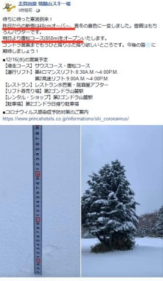

（[焼額山Facebook](https://www.facebook.com/yakebitaiyama/posts/3501347486627239?__tn__=-R)より）

一の瀬も，まだファミリー正面上部は

滑れませんが．

こちらも16日からダイヤモンド

スキー場がオープン．

ダイヤクワッドが動きます！

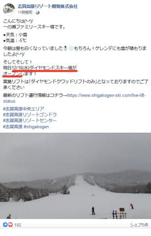

（[志賀高原リゾート開発エリアFacebook](https://www.facebook.com/ShigaKogen.Ski/?hc_ref=ARQ-8E1aIhTiA-JHn8quTbGUX2-tZdsaJxXXI9zGcXGxPSqtha5SvKoLTphU2cuI_6U&fref=nf&__tn__=kC-R)より）

かぐらスキー場もジャイアント，パノラマ，

ゴンドラコースがオープンして，

18日から田代エリアも全面オープン

するようです…！

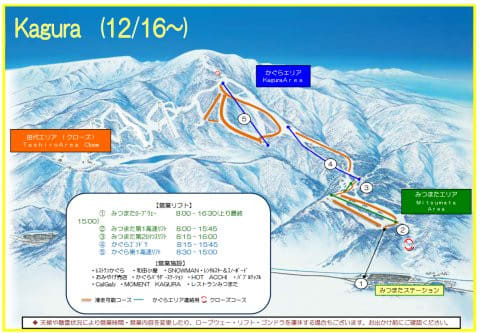

（[かぐらスキー場ホームページ](https://www.princehotels.co.jp/file.jsp?id=331894)より）

いやーー．

この雪は16日がピーク．

明日はまだまだ積もりますよ～！

ピークを過ぎても，週末までは

雪が降り続けるので．

この週末はようやっと本格シーズンに

突入する感じですよ～！！

ってなことで．

Yetiから始まった，本格シーズン前の

長い準備運動の期間が終わり．

やっとシーズンが始まる感がありますが…

ここで，今シーズンを一緒に過ごす

スキーブーツ＆板たちの紹介しましょう！

まずは，[今シーズンの物欲選手権](ec30d65ecf2d67ea374cb89930ce53a9e.md)で敗れた

ニューブーツ．

REXXAM R-EVO 130Mです…！

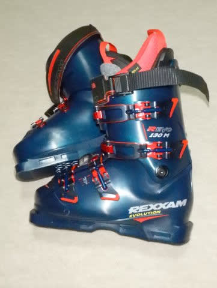

…2013シーズンからスキー板は

ATOMIC DEMO SXを履き始め，

それから9シーズン，ATOMICの

SXばかり6台乗り継いできている

ので，←かなり偏ったスキーヤーだな…

ブーツも板に合わせ，2014シーズンから

7シーズン，3足続けてひたすらATOMIC

ブーツばかりを履き続けて来た私．

久しぶりのATOMIC以外のブーツです…！

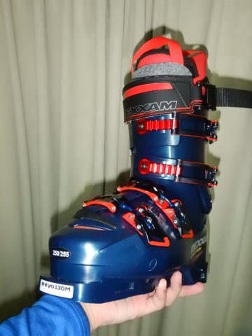

これまで，LANGE，NORDICA，ATOMIC,

SALOMONなんかを履いてきた私．

長岡のショップ，エキップさんの

「今シーズンモデルのREXXAMはお勧め」

という言葉に惹かれ，生まれて初めての

REXXAMブーツを買ったわけですが…

エキップさんでしっかりと調整してもらい，

久しぶりにインソールまで作った今回の

ブーツ．

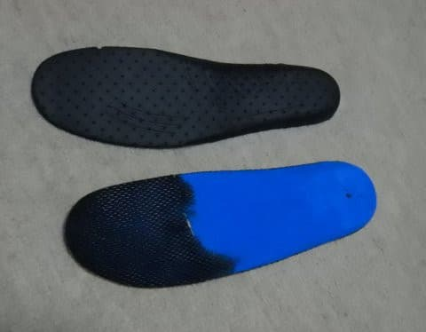

いや．

これ．

どんなブーツなのか．

また別途，詳細にレポートしますので，

お楽しみに…！

そして．

ブーツの次は，板ですね．

今シーズン，物欲選手権を経て新たに

仲間に加わったのは，こいつ．

FISCHER RC4 SC Proです！

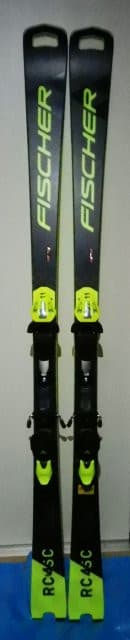

[物欲選手権](e1d88adddba28d0a22ed46ad7d01acde9.md)の際に書きましたが．

この板，本来なら

FreeFlex Z13ビンディングがセット販売

であるところ．

なぜか，いつものお店では

FreeFlex Z11ビンディングをつけて

かなりお安くしてくれたという…

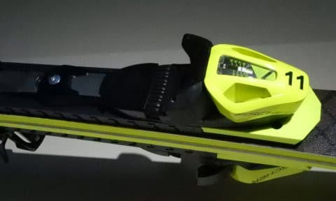

ということで．

私の板は，普通とは違って，

Z11ビンディングがついた

特殊仕様になってます（笑）

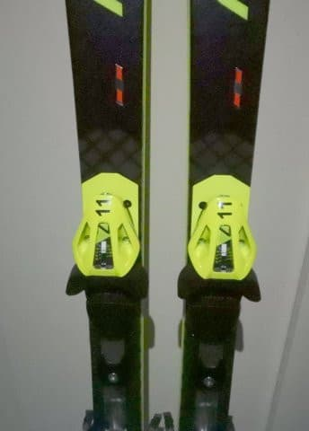

…そして，この板にも，いつもの

お店のシールが貼ってあります．

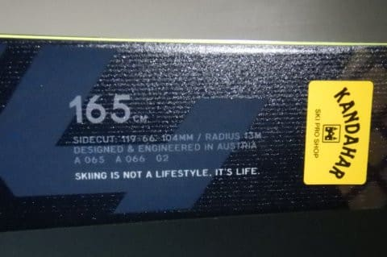

…どうでもいいですが．

この板の滑走面，やっぱり派手ですね…

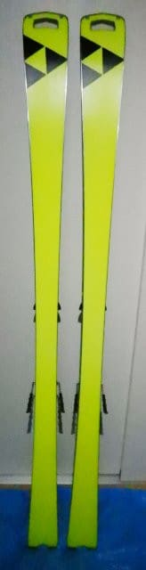

ってなことで．

この板，今履いているSXの四朗君がへたったら，

普段履きのメインマシンとして登場予定です！

で．

このほかの板としては…

今，メインマシンとして履いている

SXの四朗君．

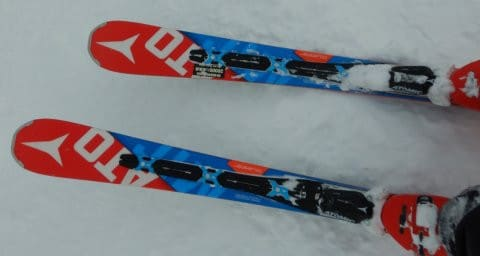

…って．

このBlogの新しい読者は

四朗君って何？？

…と，思う人もいるかと…

このBlogの古くからの読者はよく

知っているのですが．

あまりにもATOMICのSXが気に入りすぎて

しまった私は．

[次々とSXがヘタッていくという恐怖](ef0c360ac12bd72263d69f111b44fb947.md)に

恐れをなし，

2016シーズンモデルと2017シーズン

モデルのSXを，[なぜか合わせて
4セットも買い続けてしまった](e8a53c5e38b2ebcf1a084dc391aaad69d.md)ので…←勝手に増殖したとも言う

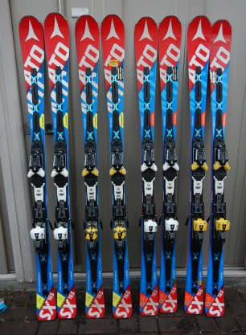

それぞれ，初代から一郎君，二郎君，

三郎君…と名前を付けていたの

でした（笑）．

だもんで．

今，Yetiで履いているのは

昨シーズンの途中でヘタッた三郎君．

今シーズンは，三郎君が捨て板として

石ころを踏みそうなYetiや月山で活躍する

予定です…

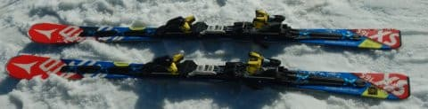

ちなみに，三郎君は2014モデルのSXから

ビンディングが移植されているので，

本来の白色と違う黄色いビンディングが

ついてます…

あ，一郎君，二郎君は見事なほどに

ペタペタにヘタり，さらに剝離も

進んで，すでにお亡くなりになってます…

ってな感じで．

ATOMICのSXとFISCHERのSCが，

小回りベースの普段履きですが．

これ以外に，大回り用として．

もうかなりヘタリ始めている，

2015シーズンモデルの

SALOMON X-Race 175cm．

これは，大回り用バックアップ機として

今シーズンも生き残ってます．

コンディションが悪い時の大回り用

として使う予定．

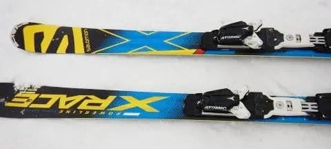

こいつも，よく見ないと分かりませんが．

SALOMON板にATOMICビンディングを

つけた特殊仕様になっています…

そして，大回りのメイン機がこちら．

2018シーズンモデルの

SALOMON X-RACE GS MASTER 181cm．

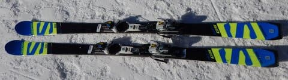

こいつは，あさイチ用の大回り板ですね…

で．

ラストはこいつ．

新雪が積もった時用の太板，

LINEのSir Francis Bacon．

センター幅108mmのファット板です…

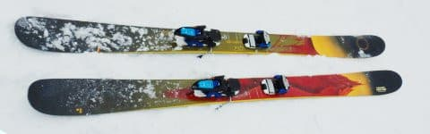

…昨シーズンは2回ほどしか出番が

なかったこの板．

今シーズンは出番がいっぱいあると

いいなぁ…

ってなことで．

今シーズンは，この6セット体勢で

望みます！

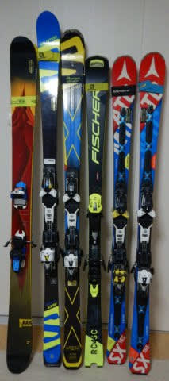

…しかし．

こうやって書いた記事を冷静に見返すと．

１シーズンで板を6セットも使ってるのは，

ちょっと普通とは言いがたい気が…

でも．

私の周りは，物欲に負けまくっている人が

多く．

さらに一人8セットやら10セットもって

いる人がザラなので．

このくらい普通だよね…

うん．普通だ．

…と，自分に言い聞かせる，Skier_S

なのでした…←周りが異常すぎるから

## 💬 コメント一覧

### 💬 コメント by (yumi)
**タイトル**: Unknown
**投稿日**: 2020-12-16 06:35:08

Ｓさぁ～ん☃️⛷️💨

お久しぶりでぇ～す😆🎶✨（blog💬）

板、６本の写真👀📷️✨を見せたら・・・

「Ｓさんって、足👣12本も 有るんかぁ❓️🙄」って😂😂😂

うちの ぴー😲が 申しておりました😅

### 💬 コメント by (アリス)
**タイトル**: 週末の志賀高原楽しみ
**投稿日**: 2020-12-16 07:51:36

Skier_S様

積雪によりコースが次々にオープンし、今週末のヤケビはゴンドラコースも滑走できそうで楽しみですね。

それにしても板の数がすごい・・・

ゲレンデのシチュエーションに合わせて使い分けるわけですね？

もしかして、スキー場に行くときはルーフBOXの中には6台積んでいるとか？

ブーツはGoku妻さんと同じで、板はGokuさんと同じブランドみたいですね。

### 💬 コメント by (レインボー73)
**タイトル**: Unknown
**投稿日**: 2020-12-16 11:12:25

フィッシャーの板、私と同じです。ビンディング開放値は7しか使わない私が13とはなんとも無駄そう。板も下手な私が180で名人のエス様が165とは、なんか変。

さて本日水曜日の志賀高原情報です。

ニゴンパーキングで足首までのふかふか新雪。気温は朝の蓮池マイナス9℃。終始粉雪の小雪が降り続け、足の指先は完全凍結、手の指先も凍結寸前。

そんなときに電話が！　急停止して、手袋外して、ポケットから慌ててガラケーを出したところで、、、。

かけ直そうとしても指が凍って思うにまかせない。今どきの若者にとっては簡単なことでも、、、。

老人への電話は長く鳴らしてくださーい!

本題に戻ります。隊員２名が今年の唐松一番乗りをゲット。

昨日の４ロマを100点とすると、今日の４ロマは、さらなる雪質アップで120点。唐松は寒すぎるうえに例の向かい風。まあ70点かなあ。唐松右側の非圧雪は、底に何があるか不安だし、滑ってる人の真っ直ぐ恐る恐るの様子を見て、今日は許してやることにしました。

以上、途中報告でした。

### 💬 コメント by (Goku)
**タイトル**: Unknown
**投稿日**: 2020-12-16 15:13:57

メインの板二本では足りそうにないから、もう一本ドーベルマンなんかいかがでしょうか。

昨年モデルならお安いかと😁

### 💬 コメント by (レインボー73)
**タイトル**: Unknown
**投稿日**: 2020-12-16 16:26:06

水曜日の志賀高原情報その２

友人の南館の部屋で足と手を解凍してから２回戦です。さすが部屋はいいですね。

唐松は雪で視界が悪いときもあり、朝から降った雪がかなりたまって、力のいる馬場（競馬場じゃないよね）。４ロマはずっとさらさらで快適。

我々レインボーは、誰かがやめようと言ったら終了なんですが、風の便りに体格が横にヒロがった隊員が『疲れた。やめたい』と言っていたと聞き、私は何としても２時まで逃げきろうと、二高と４ロマを入れ替えて、見つからないように必死で逃げました。ヤケビの従業員が諜報部員となってくれたおかげもあって、レインボーきっかりに板を脱ぐことができました。あー楽しかった。

滑ること以外にも、楽しみっていっぱいあるんですね。２万もそうだけど、楽しみは作り出すもんだと、つくづく思いました。

帰路の蓮池もマイナス9℃。帰りにミニカイロをしこたま買いだめしました。明日の新雪がたのしみです。

### 💬 コメント by (Northfox)
**タイトル**: Unknown
**投稿日**: 2020-12-16 17:30:21

一郎、二郎君リタイアしても6セット体制は凄いですね。

それと比べると、あー自分はまだまだ大丈夫だ、自分は普通なのだ！と安心できました。（^^;

もう当分は何も買いません。

あ、でもゴーグルがかなり傷んでいるしなぁ。SWANSのゴーグルが良さそうだけど．．．ガマン。

### 💬 コメント by (ikkun)
**タイトル**: Unknown
**投稿日**: 2020-12-16 19:27:16

いやいやすごい雪になっています❗まあ魚沼地方が大変らしいですが…下手をしたら年越しそば前に屋根に(泣)         ぇ～四台も？……………絶句 あ私しもREGZAしかし昨年のm120ですがね(笑) 19日には初地元になるかもですが……物欲は誰しも( *´艸｀)しかしそんなに買えません( *´艸｀)

### 💬 コメント by (しんちゃん)
**タイトル**: 手入れも大変でしょうね
**投稿日**: 2020-12-17 00:55:15

今シーズン6台体制とは、恐れ入りました。

6台を駆使して、週末に帰ってから車と板の手入れをした後に、ブログを書いているのかと思うと、だれにもまねできない（よい子はマネしてはいけない）超人だなと感心してしまいました。

さすがです(^^;

どの板で登場するのか、会うたびに楽しみにしておきます(笑)

### 💬 コメント by (Skier_S)
**タイトル**: 週末までにむちゃくちゃ積もるよ…
**投稿日**: 2020-12-17 02:37:25

＞yumiさま

そうなんです…足が12本あるんです．

普段は残り10本は隠しています（噓）

＞アリスさま

今週末はゴンドラ動きそうですね…！

イチゴンも動いて欲しいのですが…

板は6本全部持っていくことは無いです（笑）．

大体3セット位を選んでもっていきます．

ブーツは極妻さんのフレックスがもう一段階硬いモデル，

板はGokuさんのSCの次の年のモデルです．

＞レインボー73さま

今シーズンは同じFISCHER仲間ですね！

ただ，四朗君が元気なうちは四朗君がメインかな…

そして，今シーズンの唐松一番乗りですか！

でも，4ロマのコースの方が良かったんですね．

木曜も寒いのでお気をつけて…

＞Northfoxさま

いや，6セットくらいあっても普通ですから…（ちょっと動揺しながら）

＞ikkunさま

新潟方面，すごい積もってるようですね…

そして，同じREXXAMユーザーだったのですね．

一緒に物欲に負けましょう．

＞しんちゃんさま

毎シーズン板が1-2セットヘタッていくので，

ロングの新・旧，ショートの新・旧，ファットで

5セットは最低限

揃ってしまいます…

あれ？でもしんちゃんもそろそろ板が増殖するころでは？？

### 💬 コメント by (Skier_S)
**タイトル**: Gokuさんコメントを見落としてました
**投稿日**: 2020-12-17 02:40:17

＞Gokuさま

いや…Nordicaも良かったです．

でも，FISCHERとNORDICAの小回りが2セットあっても，

使い分ける方がめんどくさいかも（笑）

