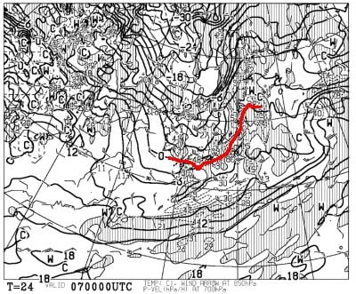
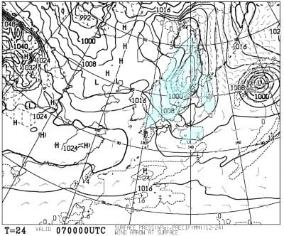
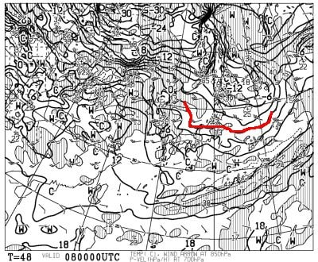
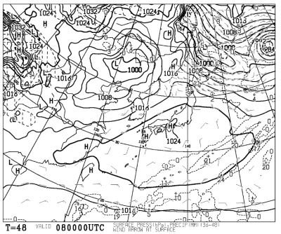
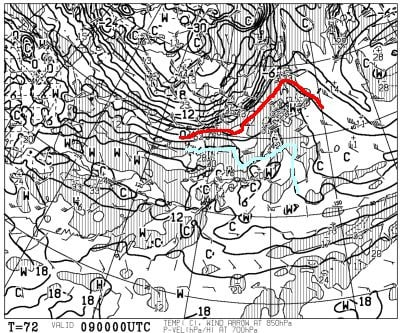
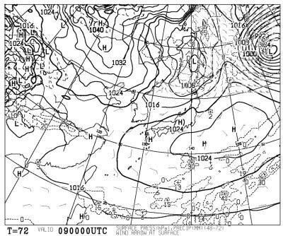
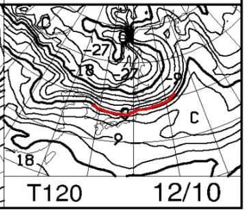
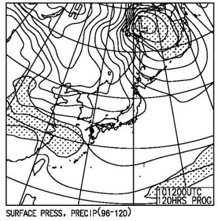
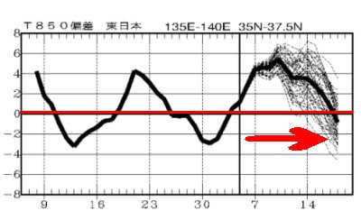

# 12月9,10日の週末の志賀高原の天気は…土曜は晴れで暑いくらい．日曜もそんなに冷えず積雪期待できず

📅 投稿日時: 2023-12-07 02:18:36

🏷️ カテゴリ: [スキー天気予想](c6554f5c3c106093b511a8daae23757e8.md)

志賀高原も，知らぬ間に

横手山が第1リフトを動かしていたり，

熊の湯第2ペアが山頂から滑れるように

なっていたりと，わずかずつながら

滑れるエリアが拡大しているようですが…

果たしてこれから週末にかけて，

雪は積もるのか？？

焼額のゴンドラは動くのか？？

ということを，日本中の全人類が

気にしているところだと思います．←いや，全人類が知ろうと思ってないから

ってなことで．

今週末までに雪が積もるのかを読み解く，

水曜深夜恒例の志賀高原天気予想です！！

まずは．

7日木曜の850hPa図を見てみますが…

7日は赤い0℃線がぎりぎり志賀より南に

あるので．

激冷えとまでは行きませんが，

そこそこ冷えて人工降雪機は動かせそう…

で，木曜の地上天気図は．

日本海側にわずかに降水域が近づいて

ますが．

志賀高原には降水域がかかってないので，

ほとんど降らないか，降っても1-2㎝程度．

積雪は期待できず…（泣）

続いて，8日金曜の850hPa気温を見てみると．

うーん．

朝9時の段階でぎりぎり志賀に赤い0℃線が

かかるかどうかで．

この語，0℃線は北上していくので…

人工降雪機は，8日は朝までしか

動かせませんね（涙）

そして，金曜の地上天気図は．

完全に高気圧に覆われているので…

雪は全く積もりません．

晴れです．すっきり晴れます．

この日は天然雪もなければ，

人工降雪の打ち増しもできず（泣）

で，肝心な週末の土曜日，9日ですが．

850hPa気温図を見ると…

だめだこりゃーーー！！！

水色の+6℃線が志賀高原にかかってます．

これは，日が差すとかなり暖かく

感じるレベルで．

雪が融けかねない高温です（涙）

この気温だと，降水があったら間違いなく

雨ですが…

幸いなことに，地上天気図では全国的に

高気圧に覆われ，雨が降るという危険だけは

避けられそう．

これで雨が降ったらやばかった…

でも．金・土と積雪や人工雪の積み増しは

全くないので，土曜のゴンドラ運転は

あきらめた方がよさそう…（激涙）

で，日曜10日の850hPa気温図を見てみると．

この日は何とか赤い0℃線が志賀付近まで

下がってきますが．

でも，人工降雪機を動かすのは無理．

土曜から日曜も，バーンコンディションは

改善せずです（泣）

そして天気図は…

まぁ，本州では降水量が全く予想されて

なくて．

晴れ～曇り，という感じでしょうか．

うーーーん．

これから週末まで，

7日から8日朝にかけて，人工降雪機を

動かせる程度で，

天然雪の積み増しは全くないし．

8日の朝以降は，週末までずっと人工降雪は

動かせなさそう…

ということで，まとめると

12/7(木)：そこそこ冷える．曇り．

　積雪はなし．人工降雪機は終日

　フル稼働可能！

　バーンコンディションは，人工降雪

　ながらも気温が冷えるので固めの

　しまったいいバーン．

12/8(金)：晴れ．朝は冷える．朝まで

　人工降雪機が動き，朝のバーンは

　人工降雪が圧雪され締まったいい感じ．

　ただ，午後にかけて気温が高くなり，

　日差しとあいまって雪が緩んでいく

12/9(土)：晴れ．朝から気温は高め．

　朝は前日緩んだバーンが固まった

　結構硬めのバーン．

　昼間は気温がかなり上がり，日差しも

　あり雪が緩んでいく．

　午前は人工降雪の下地の硬い雪が

　表面に出てきそうだけど，高温で

　緩んだ雪になっていく．

12/10(日)：晴れ～曇り．

　この日も朝は気温が高く，天然雪も

　人工雪も積み増しがない朝はザラメが

　固まったようなバーン．

　昼間は気温が上がり，雪は緩み気味．

　曇って日差しがなければ，土曜ほど

　雪は緩まなさそう．

という感じで．

8日朝まで人工雪が打てる以外，

それ以降は天然雪も人工雪も期待できない

です（泣）

何かの奇跡がない限り，今週末の

ゴンドラ営業はあきらめましょう(涙)

あぁ…ゴンドラ営業までもう一降り

だったのに，惜しい…

ちなみにこのあと．

来週末の16日ごろまで，最高で

平年比+5℃という高温になっちゃう，

残念な高温期間

が続きます（涙）

うがーーー！！

なんてこった！！！！

とりあえず，ヘタすると今週末どころか，

来週末もゴンドラが動かない可能性が…（泣）

しかし．

12月になって高温になるのは悔しいけど．

この高温期間がもう1週間早かったら，

12月頭のスキー場オープンは危うかった

ということで．

11月末のオープン時期に冷えてくれたことに，

せめてもの感謝をすべきなのかも…

と，自分を慰めてみるけど．

でも．

早くゴンドラ滑りたい…
