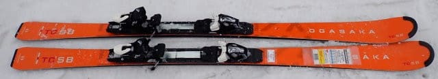
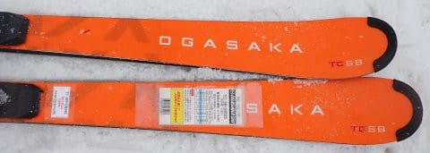
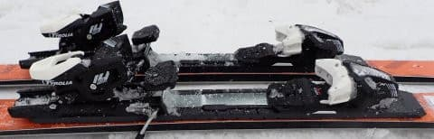
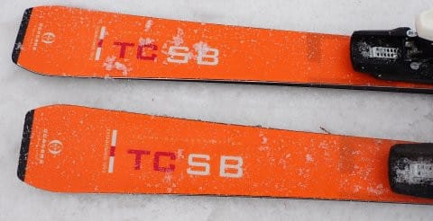
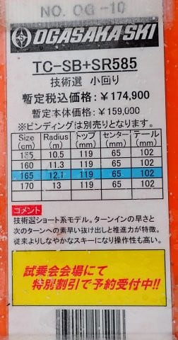
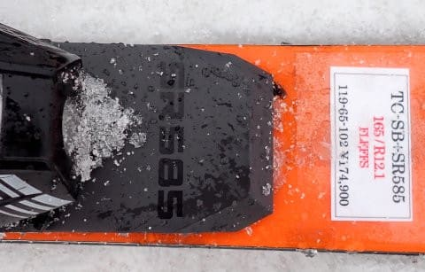

# 2024シーズンモデルのスキー板，試乗レポートその20…OGASAKA TC-SB + SR585

📅 投稿日時: 2023-06-29 03:48:34

🏷️ カテゴリ: [スキー板試乗](c0bd8048615710cee890e403a36cc9a2b.md)

今日も出張から深夜に帰宅して．

相変わらずとんでもない時間に更新してますが．

明日もまた，朝6時過ぎに家を出て出張です…（泣）

あれ？？

今もう午前4時近い？？

あと2時間しか寝れない気が…（激涙）

とりあえず．

先週の月山で私の2023シーズンは

終わったようですが…

いまだにスキーシーズンが終わったということを

理解しきれていない，Skier_Sです（時候の挨拶）

あぁ…

次に滑れるのは，Yetiか菅平のオープン．

10月20日前後ですね…

あと，3か月と3週間もスキーができない

のか…っ！！！←いや，オフシーズン4か月切ってるって異常に短いから

ってなことで．

私のシーズンは終わっちゃいましたが…

スキーネタはまだ続きますよ～！！

2024シーズンモデルのスキー板の試乗レポート，

今回はオガサカ編です．

では，どうぞ～！！

〇OGASAKA TC-SB + SR585　165㎝

基礎小回り

技術選向け小回り板のTC-SB．

[前回は柔らかめのFMプレート付き](e828ef4b3ab5694d057275a962c5d5fc8.md)でしたが，

今回は強めのSRプレート付きのレポートです．

履いてみたところ…

FMプレートの時とかなり印象が変わる！！

やっぱり，SRプレートのほうが足元が

しっかりして，スピードを出していった時の

返りの強さ・速さが出てきます！

ただ，やはり来シーズンのTC-SB．

がっつりグリップ系ではなく，ズレを

うまく使って滑る板という感じ．

この日は重い荒れた4月の雪の上に，

重い新雪が積もっていく難しいコンディション

でしたが…

そんな中でも，SRプレートになると

グリップ感も強くなり，しっかりエッジを

捉えたカービング小回りで滑っていけますし，

SRプレートの返りの早さ・強さで板が

右から左にピョンと走っていく反動を

もらえます．

グリップさせると，結構反復横跳び系の

小回りスペシャルっぽい感じが出てきます．

スピードを出していくと，返りがかなり

強く，早くなっていくので，その返りに

載っていくと，ピュン・ピュンと左右に

板が飛んでいく，ピッチの早い小回りに

なっていきます．

板のテール側の旋回力が高く，

ターン後半まで強い旋回が続くので，

この板で大回りをするのはきつい感じ…

というより，小回りをするのが楽しいので

大回りをしようとは思わなくなりそう．

で．

グリップさせると強烈なカービング

小回りマシンですが．

これでいて，FMプレートの時と同じ，

ズレの使いやすさも感じる不思議な板．

ズラシでのコントロール性も高いので，

荒れた凸凹斜面でも，丁寧にリスクなく

滑り降りることもできます．

ずらしを使っても，ズレズレでなく，

丸い弧を描いたターンができます．

小回りスペシャルなので，

普通のゲレンデをロングクルーズしよう，

という板ではないですが．

単なるカービングの快楽に溺れる板じゃなく，

カービングした中でも，ちょっと荒れてたら

ズレを入れて調整しよう…とか，乗り手が

自由にいろんな小技が使える板だし．

カービングやズレをうまく使って，魅せる

ターンができるし，カービングでしか

滑れないリスキーな板でもないので．

技術選やプライズ検定でこれ一本で

点を出そうという滑りには，すごい

武器になるかも．
