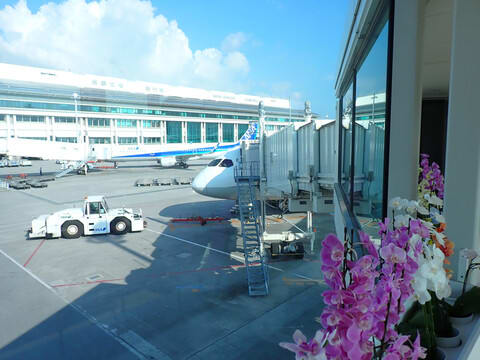
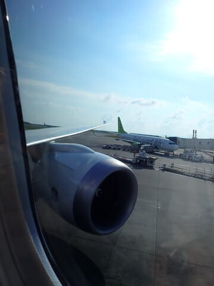
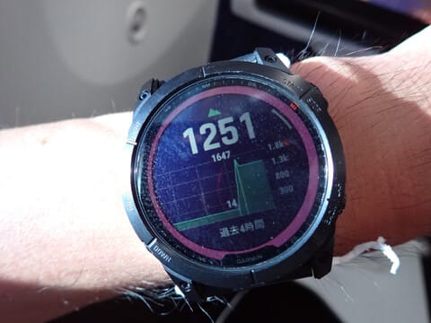
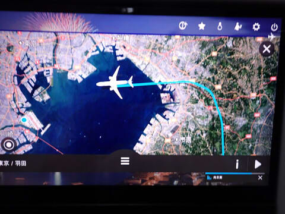

# 2024年8月，今年も座間味で親子ダイビング！ファイナル…旅のラスト，帰りの飛行機は夕日を眺めてのフライト

📅 投稿日時: 2024-09-24 04:14:37

ダメだ…

1日目の午前中にちょっと出かけた以外，

3連休，ホントにほぼずっと家でずっと座って

仕事してて．

それでも終わらなかった…（泣）

あと4時間ちょいで3連休明けの仕事が

始まるのに，まだ仕事が終わらない．

かなりクリティカル．

ヤバい．

ホントにヤバい…

今日は何とか記事を書いたけど．

明日更新できない可能性があります…

更新できなかったら，Skier_Sは死んでいると

思ってください…

とりあえず，今日は何とか書き上げた座間味の

ダイビング旅行記，これでファイナル！

ーーー

（[前回はこちら](eeb615befce4f9b63d44bd3f95b4eedb3.md)）

ってな感じで．

定刻10分遅れでの搭乗開始でしたが．

帰りの飛行機もB787 ですね…

さて．

787－8か？９か？

乗ってみたら…

おっと．こいつは昨年も乗った，B787-9最新機

じゃないですか！

各席に大型ディスプレイがついてるし．

エンジンも見ての通り，GE製のGEn-X

エンジンだよ！

予定では16時35分発のフライトでしたが…

ボーディングブリッジが離れたのは16時50分．

そして，チョークオフしてプッシュバック開始は

そこからさらに遅れて，17時．

…まぁ，帰りは特に急がないし．

むしろ飛行機好きの自分にとっては，最新鋭機に

長く乗ってられるのはうれしかったりするん

ですけどね（笑）．

ってなことで．

定刻ちょい遅れの返りの飛行機は，

RWY-36RからTake off！

あぁ…

さよなら，沖縄…

次に戻ってくるのは，再来年だよ…！

離陸した飛行機は，つい数時間前まで

いた慶良間諸島を左手に見ながら上昇

していきます…

慶良間諸島もサヨナラ~！！

また再来年～！！！

そこからしばらく，離れていく沖縄を

名残惜しみながら，窓からの景色を

眺めてすごしましたが…

…どうでもいいけど．

B787，やっぱり客室の与圧，

他の飛行機より高めだよな…

35000ft，11000mちょいの高度で，

Cabin Alt.が1200m台って，かなり

キャビンプレッシャーが強めな感じ．

ってな感じで窓の外を眺めていると．

夕刻のフライトなので，

じきに太陽は低くなっていき…

上空の雲を不思議な色に染めながら．

目を捉えて離さない不思議な美しさを

残して，日が沈んでいきました…

あぁ…

旅行も終わっていく…

でも．

台風も来なかったし．

天気も良く，海況も良く．

ダイビングの海の透明度も高くて．

阿真ビーチも高月山も行ったし．

楽しい旅行だったよ…

そして．

日が沈み切った後．

雲の上からポツンと頭を出す富士山が，

残照にシルエットで浮かんでました…

ってなことで．

飛行機は関東上空に達し．

眼下に街の明かりが見えてきましたが…

千葉県上空を，木更津も通過して北上し，

このあたりで左旋回をかましているので…

そうですね．このBlog読者なら知っている，

RWY 22か23へのLDAアプローチです！

どうやらIKLのローカライザに向かっている

ようなので…

RWY 22へのLDAアプローチですね．

という予想通り，

19時半ごろ，定刻より遅れはしたものの．

羽田のRWY 22へタッチダウン！

そして…

飛行機を降りて．

羽田へ上陸したら．

一気に旅行気分は吹き飛んで．

明日の仕事どうしようか…

という現実世界に引き戻されて，

3泊4日の座間味旅行は終わったのでした…

（おしまい）

エピローグに[続く](ebab9e9d757ec6d78a61351ff4f5af35a.md)

## 💬 コメント一覧

### 💬 コメント by (1kamakura)
**タイトル**: Unknown
**投稿日**: 2024-09-24 07:10:11

江戸の秋

はー、楽しい時間はあっという間。

またあの時に戻りたいですね。

Sさんは飛行機にお詳しいですね！

しかも、いいお席に座っていらっしゃる。

空が美しい😍

ずっと見ていられますね。

飛行機内の気圧を記録なさるところが

Sさんらしいな〜と思いました。

ダイビングやっている方ならではかな。

着陸する滑走路とか、私はちんぷんかんぷん。

どうしたらそんなにわかるのかな？

ダイビングブログ、楽しかったです！

見る人少ないの、信じられない。

### 💬 コメント by (Skier_S)
**タイトル**: ＞江戸の秋さま
**投稿日**: 2024-09-25 04:57:54

コメントありがとうございます～！

応援コメント，旅行記を書く励みになります…

いや，でもホントにこのBlog，ダイビング日記になると一気にPVが減るんですよ…

ヘタすると，ダイビング日記を書いた時は最新記事よりその前の記事の方がPVが多いとか，

そのくらい見る人が減ります（涙）

まぁ，本来スキーBlogですからね～…

でも，このBlogでの一番人気はなぜか車ネタです（笑）

