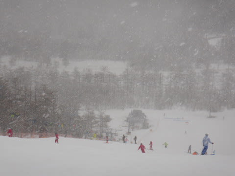
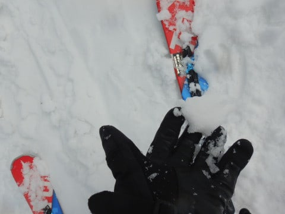

# 2020/3/22(日)，3連休最終日速報モード！…え？志賀高原じゃない？？アサマ2000？…朝は晴天，午後は曇ったり降ったり

📅 投稿日時: 2020-03-23 00:58:29

🏷️ カテゴリ: [2020スキー滑走日記](c282e9230de179e245c7334eabeb0a3b3.md)

えー．

なんだか，明日23日から25日の午前中まで．

志賀高原は季節外れの激冷えとなり．

23日月曜の夜から，24日火曜の朝にかけて，

冷え冷え雪が5～10cmほど積もりそうに

見える今日この頃．

皆様いかがお過ごしでしょうか．

とりあえず，明日月曜の志賀高原は，

かなり冷え冷えで，ガチガチに

なりそうですが…

でも，23日夜くらいから雪が降り始めそうで．

24日朝には冷え冷え雪がわずかに

積もりそう！

24日は最高でも-5℃程度までしか気温が

上がらない冷え冷えデーで，

終日雪がぱらつきそうな感じ…

24日は，下地が硬めなものの，

いいコンディションで滑れるかも？？

で．

25日まではいいコンディションで滑れそうだけど．

…そのあとの，26日から29日にかけて．

超高温になります（涙）

23から25日は水色の矢印で示したように，

平年比-6℃くらいまで冷えそうだけど．

26日から29日かけて，赤矢印で示したように，

平年比+8℃くらいまで上がりそうです（泣）

…ヤバい…

次の週末，このままだとヤバい感じ

なんですけど…（涙）

今シーズンの天気は，冷えたり暖まったり，

極端すぎる…（激泣）

とりあえず．

今週末にかけて，例の踊りを休むことなく

必死に踊り続けるしかなさそうですね（泣）

ってな，いつもの天気の話題の後は，

今日も帰宅が深夜になったので．

日曜深夜定例の，速報モードでの

スキーレポートなわけなんですが．

本日も当然，いつもの志賀高原で滑ってきたと

お思いでしょうが…

なぜか今日は志賀高原ではなく，アサマ2000で

滑ってきました～！

…昨晩，夜9時のナイターラストまで

滑った後に，

20000mな皆さんに誘われてしまい，

ついつい夜遅くまで飲んでしまったというのに．

どうしたわけか，今朝5時半に起きて，

アサマ2000まで移動して滑ってました…！

(朝，眠くて死ぬかと思いましたが…)

とりあえず．

頑張ってやってきたアサマ2000．

朝はすっきり晴天！

そして…

あさイチは…

うはーー！これは，傾きたい放題の

ウホウホ最高圧雪バーンじゃないですか！

ぐほう！

最高！

アサマ2000，なかなかいいじゃないか！！←だから，どうしてそんな上から目線？？

…と，ガシガシ滑っていたら．

11時ごろに，リフトが止まるかも？

と心配するほどの風が吹きはじめ，

さらに激しい雪が降りつけて

きたのですが…（涙）

驚きの天候激変（泣）

…雨じゃないだけましだけど．

気温が高い湿った雪で．

ウェアに着くと溶けてびしょ濡れになり．

雨とあんまり変わらん…（涙）

雪質も，あっという間に濡れた重い

雪になっていきます…（泣）

その後は，降ったりやんだりの

天気を繰り返しますが．

安定しない天候のため，

午後3時前には，早くも

ゲレンデが無人状態に…

いや．

雪は重いけど．

それほど人が滑ってないので

ひどい凸凹にはならず．

いつもできる小回り道もできず．

さらにガラガラなので．

いい感じで，4:30のリフトストップまで

滑れました～！！

ってことで．

ほぼびしょ濡れになる雪ではあったものの．

雨にはならず．

本日は焼額が落雷の危険で一時全山

営業中断したらしいですが，

そういう事もなく．

今日はアサマ2000で良かったのかも…←無理やりなポジティブシンキング

ってことで．

明日また，詳細レポートをやりますが．

出発前日の木曜は1時間睡眠，

金曜の夜は7時間寝られたものの，

土曜の夜は睡眠時間5時間以下で

またアサマまで移動という，

そこまでのご無体をしてまで，

なぜアサマまで行ったか？

というと…

そうです．

皆さんもうお分かりかと思いますが．

いつもの試乗会に行ってました～！！

ってなことで．

また試乗レポートやりますので，

お楽しみに～！

PS.試乗会場で，[炎の奈良県民](http://ski-yoshi.jugem.jp/)さんとお話しましたが…

　もしかしたら，炎の奈良県民さんも

　このBlogを見ているのではなかろうか…

## 💬 コメント一覧

### 💬 コメント by (ほっぽ)
**タイトル**: 3/22　志賀高原
**投稿日**: 2020-03-23 06:12:23

Ｓさん

あれっ？

一ゴン前駐車場によく似たレヴォーグがいたのですが、あれは錯覚だったのか。(^^;

私は今日試乗会に行ってきます。

4/18、19の一の瀬は微妙ですしね。

昨日の滑走日記をアップしておきました。

http://www2.tokai.or.jp/nana_hoppo/

### 💬 コメント by (Northfox)
**タイトル**: Unknown
**投稿日**: 2020-03-23 13:03:07

私は20日のアサマの試乗会に行ってきました。

予想より冷え冷えで硬く締まったバーンでの試乗で良かったです。

しかし新しい板って気持ち良く滑りますね。

物欲が刺激されます。。。

### 💬 コメント by (レインボー)
**タイトル**: Unknown
**投稿日**: 2020-03-23 15:27:09

にゃんてこった。たくさん書いたのに、消えた!

雨の翌日にしては滑りやすい。でも、10時半の山頂マイナス５度なのに、ダウンヒルはすでにズクズク。ヤケビも然り。潔く任務を完了した隊員でした。明日の新雪に期待！

### 💬 コメント by (かず)
**タイトル**: Unknown
**投稿日**: 2020-03-23 19:43:55

レインボーさん ヤケビゴンドラ制限ってどうなってますか？

### 💬 コメント by (レインボー)
**タイトル**: Unknown
**投稿日**: 2020-03-23 20:26:56

また消えた。変な画像認証で、失敗の連続です。

制限はそのまま継続されています。

### 💬 コメント by (Skier_S)
**タイトル**: 24日は冷え冷えパウダーデー！
**投稿日**: 2020-03-24 00:27:09

＞ほっぽさま

うーむ．

それはきっと，幻覚を見られたのかと…

＞Northfoxさま

20日なら，試乗はいいコンディションで出来たでしょうね…

こちらは強風で途中一旦試乗中止という，結構悲惨な状況でした（涙）

＞レインボーさま

え！？？書いたコメント消えちゃったんですか？？

それはご愁傷様です…

今日は朝は結構良かったんですね．

でも，気温が低かったのに，雪は緩んだんですね…（涙）

＞かずさま

3月31日まで，乗車定員制限継続です．

それ以降も延長する可能性ありです…

