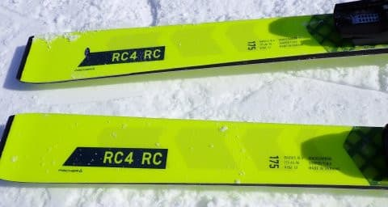

# 2024シーズンモデルのスキー板，試乗レポートその5…FISCHER RC WC RC Pro

📅 投稿日時: 2023-05-21 00:06:07

ってなわけで．

かぐら，横手山ともに，明日がラストデー

となるわけですが…

本日も，かぐらに忠誠心が高い（？）

特派員から，20日土曜のかぐらスキー場の

状況が送られてきました…！

本日は曇り時々ガス．

あさイチのロープウェイは，2便で全部

上がれるくらいのお客さんしかおらず，

ガラガラだったみたいです…

けど．

リフト待ちはほぼ無かったということですが，

コース幅が狭いので，コース上の人口密度は

ちょい高めですね…

コース上の人口密度が高いので，

コースはだんだん荒れ荒れになっていき．

そして，コース右側は雪が薄いので

早いうちにヤバい感じになっていった

ようですね…

さらに，午後2時ごろにはガスも出てきた

みたいで．

そのせいで，午後は結構ガラガラになった

とのことでしたが…

午後になると，やはりそこかしこに雪が

薄くなった部分が出てきてますね…（涙）

営業時間終了間際には，残念ながらシーズン

終わり感があふれ出てきてますが…

でもまぁ，この雪不足＆異常高温の日が

続いた今シーズンで，よく当初営業予定の

21日まで営業できたもんだ…！！

ということで，明日，ファイナルかぐらに

行ってきます～！！

…今日も，あと3時間半後に出発なんですが…

で，本題へ．

2024シーズンモデルのスキー試乗レポート，

今回もフィッシャー編です．

では，どうぞ～！！←睡眠時間少ないんだから，レポート書かずに寝ようよ

〇FISCHER RC4 WC RC Pro 175cm

基礎大回り用．

来シーズンは競技用も含め，FISCHERのトップモデルは

黒から黄色になりますが．

RC PROも黄色になります…

ちなみに[SC Pro](ed4a10fce34767e8edfaf258bb703798f.md)同様，2023シーズンモデルは

試乗板のみオーストリア製で，一般販売品は

ウクライナ製でしたが，2024シーズンモデルは

試乗板もウクライナ製です．

昨シーズンモデルまでは，ウクライナ製品も

「Designed and Engineered in Austria」

と書かれていたけど，2023シーズンモデル

からは，ウクライナ製は堂々と

「MADE IN UKRAINE」と書かれるようになって，

ウクライナを応援したい人々に訴えかけて

いるんでしょうか…

で．

この板もSC同様，トゥピース下が動くM/Oプレート

から，全体が一体化したMプレートに変わりました．

Mプレートに変わって，ちょっと硬さを感じた

SCと違い，このRCは私が普段履きにしている

2021モデルのRCと比べても，しなやかさと

柔らかさを感じて，良くたわんでくれるので，

175cmの長さのわりには，切れて曲がって

きます．

R=18というより，もう少し小さいRに感じます．

縦目に落とせば大回りできるし，踏めば

175cmと思えないほど小回りに近いところまで

持っていけるオールラウンド性があり，

ある程度のスピードを出す人ならフレックスも

比較的柔らかめなので，それほど手ごわく

ないです．

スピードを出さないとたわまないですが，

スピードを出せば，驚くほどたわんで

かなりの小回りまでもっていけます．

結構グリップは強くて，回転弧が小さくなって

強い横Gがかかっても，板が逃げていく

ような頼りなさは無いです．

大きくたわんでも，板のグリップが抜ける

ことなく，たわみに沿ってキュインと小さく

回っていきます．

ただし，返りは小回り板と違って比較的

優しくてゆっくり返ってくるので，

キュインと回っても小回り板みたいに

反動で切り替えるというよりはゆったりと

谷回りの間を取った切り替えになって

いくので，そのあたりはやはり大回り板

っぽい感じですね．

ただ…このRCもSCと同様，昨年度の

M/Oプレートで感じたしっとり感が，

Mプレートになってちょっと弱まったような

気がします…

とはいえ，トップからテールまでのエッジが

ガッツリグリップして，きれいにたわんで

このたわみに沿ってグッと曲がってくる

驚くべき回転力があるし，スピード耐性も

結構高いので…

たわませて曲がっていく快感を知っている人，

あるいはそれを身に着けていきたい人には，

お値段高めだけど，ロングの板として

持っていてもいい板だと思います．

…ただ．

来シーズンモデルは長さ170，175，180cm

の3種類みたいで，

今私が履いている185cmのRC，来シーズン

から無くなるんだな…
