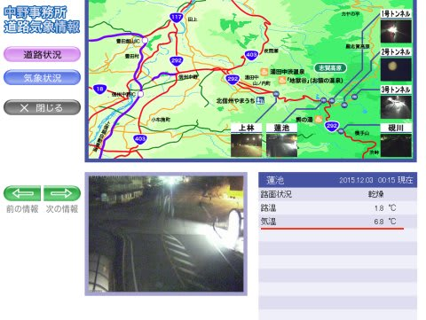
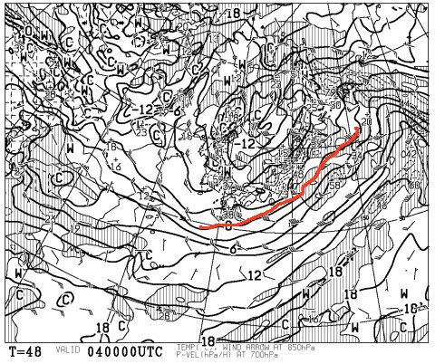
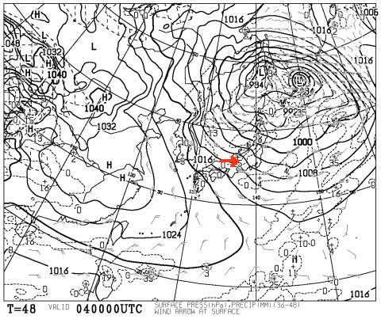
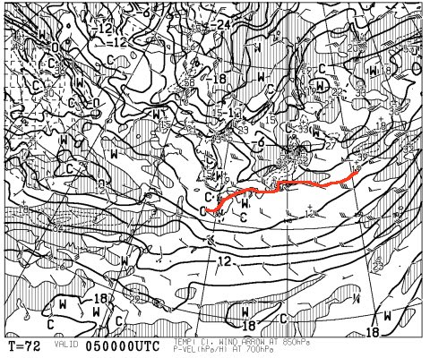
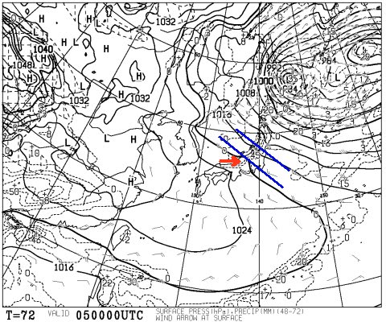
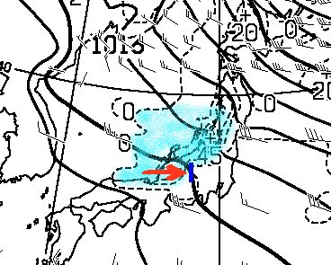
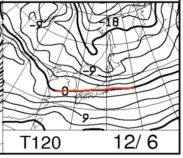
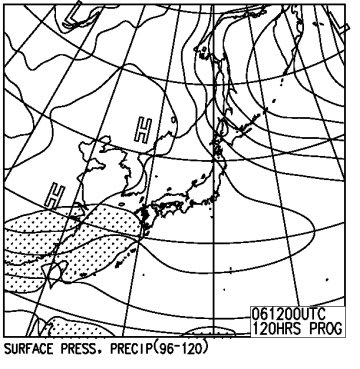

# 今シーズンも始まるよっ！今週末の志賀高原の天気は…雪は積もらなさそう…

📅 投稿日時: 2015-12-03 01:27:06

えー．

無事，[12月5日の焼額オープンが決定](http://blog.princehotels.co.jp/yakebi/2015/12/02/)し．

ちょっと安心している今日この頃．

皆様いかがお過ごしでしょうか．

ということで．

今週末から志賀高原通いがスタートするので．

当然，始まるわけですね．

…はい．

そうです．

みなさんお待ちかねの　←ホントか？？

毎週水曜夜恒例，「志賀高原の天気予想」，今シーズンもスタートです！

ってことで．

…焼額は，とりあえず4ロマ沿いのサウスコースの準備が

完了したらしいですが．

おそらくこれから，2高沿いの唐松コースの整備を開始

するのかなぁ…

上手く冷え込んで，5日には4ロマ・2高の2本体制で

オープンしてほしいところ…

…

…

…ですが．

なんだ，これはっ！！！

深夜12時過ぎの，志賀高原の気温が+6.8℃って…

12月ですよ？？

深夜ですよ？？

なにこれ？？

たしかに，昨日の記事には．

2日は気温がぐぐぐぐぐぐっっと上がり．

日本のスキー場で，人工降雪機を打てるところはありません（涙）．

2日の深夜は…雨です．降り始めは，雨です．

とは書いたものの…

実際にこれだけ気温が上がったのを見ると…（T_T)

そして，これから雨になりますので…（涙）

ただ．

3日昼間から，ドサドサ降ります．

と書いたように．

朝のうちはヤバくても．

そのあと，昼前には雪になるのだっ！

そして．

4日土曜日は．

850hpa気温図の0℃線は，ちゃんと日本の南．

それどころか，志賀にはマイナス6℃線が近づくので．

この日は，朝は-7～8℃くらいまで冷えますね～っ！

ただ，地上天気図はこんな感じで…

見事な西風になるので．

志賀をはじめとする，信州には．

…それほど雪が積もりません（残念）

でも．

人工降雪機は動くよ！

ガンガン積もらせるのだっ！！

そして，土曜日は…

こんな感じで，850hpa0℃線は，日本より南にあるので．

志賀高原は，しっかり終日マイナス気温をキープしますね．

ただ，やはりこの日の地上天気図も，

等圧線は縦縞じゃなく，青線のように右下がり．

この場合は，赤矢印のような西風になるので，

志賀高原には積もらないパターン…（涙）

具体的に書くと．

下の図の点線で囲まれた降水域．すなわち，水色に塗った雪雲が…

西風だと，日本海から吹き付けたあと，

濃紺の線の位置にある北アルプスにブロックされ，

北アルプスより東には，水色の雪雲が届いてません．

志賀高原は，ちょうどこの北アルプスに邪魔される

部分に位置するので，西風だと雪が降らないんです…

なので…

土曜は，志賀高原では雪は積もらないですね．

時折雪は降りますが．

積もるほどではないなぁ…

で．

日曜．

この日も，0℃線は信州より南．

朝方は冷えるかな～．

でも，土曜は日本より南にあった0℃線．

この日はもう少し北上し，かなり志賀高原

まで近づいているので．

昼間は0℃近くまで気温が上がりそう…．

さらに，この日の地上天気図はこんな感じで…

ふむ．晴れそうなので．

昼間はちょっと暖かく感じるくらいかも…？？

ってことで．

まとめると．

土曜：朝は雪がちらつく．スキー場までの雪は積雪覚悟！

　気温は寒く，曇り時折雪．日が射すタイミングも．目まぐるしく天気は変わる．

　人工雪の上に，うっすら冷えた天然雪が乗った感じで，

　雪質はいいでしょうが…人工雪が無いところは滑れないな．

日曜：朝から晴れ！朝のうちは気温が低く，土曜晩から

　人工雪が足されてるでしょう．

　新しい人工雪に，圧雪がかけられたコースコンディション．

　時折雲がかかるかもしれないけど，基本的に晴れ．

　昼間の気温は0℃前後まで上がってしまいそうだけど，

　天気も良くいい感じかな．

ということで．

木曜朝まで，かなりダメダメな感じだけど．

土曜までにはかなり改善するはずなのだ！

＃志賀はあんまり天然雪は期待できないけど…

## 💬 コメント一覧

### 💬 コメント by (Goku)
**タイトル**: たしか去年も・・・
**投稿日**: 2015-12-03 19:46:43

たしか去年も今頃って志賀はあまり降らなくて、白馬方面は結構降った気が・・・

まー今週は４ロマ＆２高で我慢しますか。

で、土曜日はしゅ・しゅ・しゅっきんが決定した私は日曜日出撃です。

### 💬 コメント by (Skier_S)
**タイトル**: Gokuさま
**投稿日**: 2015-12-04 00:45:33

昨シーズンも，11月下旬は，志賀は降らず…

ってパターンでしたが．

12月上旬にリカバリーして，

オープン週の日曜から，ゴンドラが動くという．

結構恵まれたコンディションだったかと…

今シーズンは，とてもとても，ゴンドラ運転が

望める状態ではないですね…（涙）．

昨年の比ではない感じです．

