# 2024/12/29(日)，年末休の志賀高原焼額山スキー場は…朝は一瞬晴れ，午後はかなりの雪降りでモサモサバーン，ちょい混み

📅 投稿日時: 2024-12-30 06:33:44

🏷️ カテゴリ: [2025スキー滑走日記](cacd3fbf84d4a679ee61a5894c3f95e14.md)

ということで．

本日，志賀高原に舞い戻ってきました～！

さて．

年末年始休み期間の志賀高原の状況や

いかに？

ってなわけで，本日の志賀高原ですが…

…まず．

本日の高速道路は，信州中野から北が

チェーン規制，志賀高原まではチェーン規制

なしでこれたのですが．

中野の町中を過ぎて，志賀高原に上り始める

までは，空も晴れていて，路面は凍結があり

ながらも積雪はなかったけど…

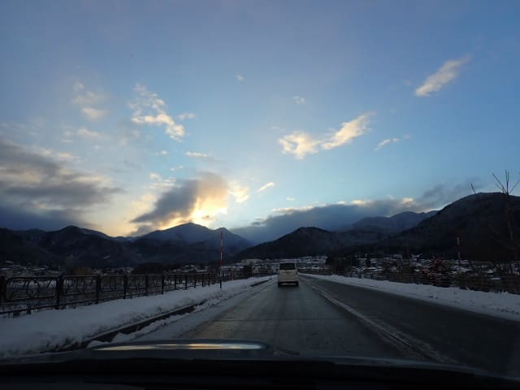

志賀高原の上り始め，上林のチェーン

装着所を過ぎるあたりから曇りはじめ，

完全な雪道になってました…

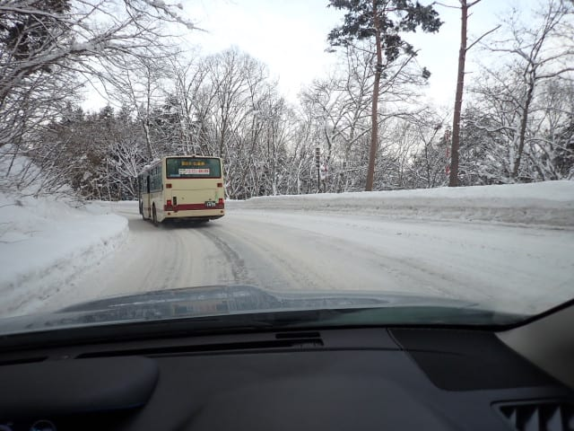

で．

いつも通り，営業開始の8:30を狙って

焼額の第１ゴンドラに到着しましたが．

ゴンドラに並ぼうとした直前にゲートが

オープン！

列の後ろのほうだけの写真になり，

オープン前の列がどのくらいの長さだった

かが写ってませんが．

年末休みとすれば，それほど長い列じゃ

なかったですね…

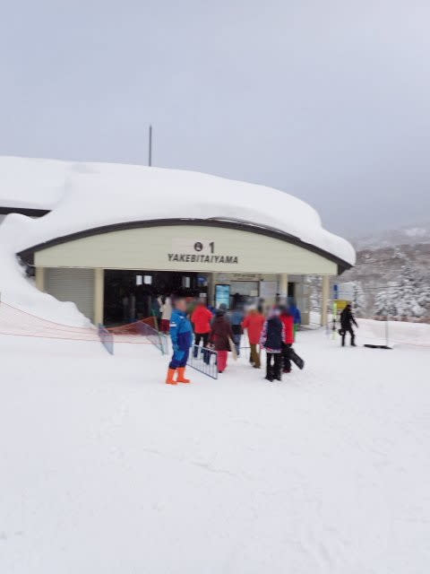

ってなことで．

中野市街は晴れていたのに…

焼額の山頂にやってくると雪降り（涙）

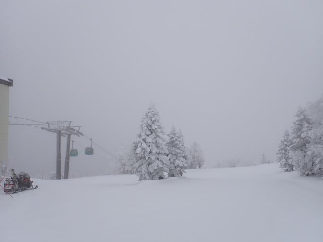

山頂の気温は-11℃と予想より2度ほど

低めだったけど…

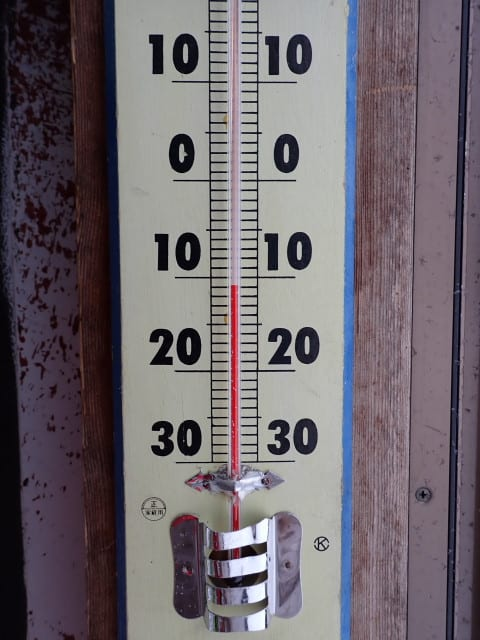

そのおかげで，圧雪バーンはいい感じの

冷え冷えバーン！！

ライブカメラを見ると，一晩で予想より多い

30cmほど積もったようで，

それが圧雪された柔らかめの雪で，

ハイシーズンの志賀らしい雪質です…！！

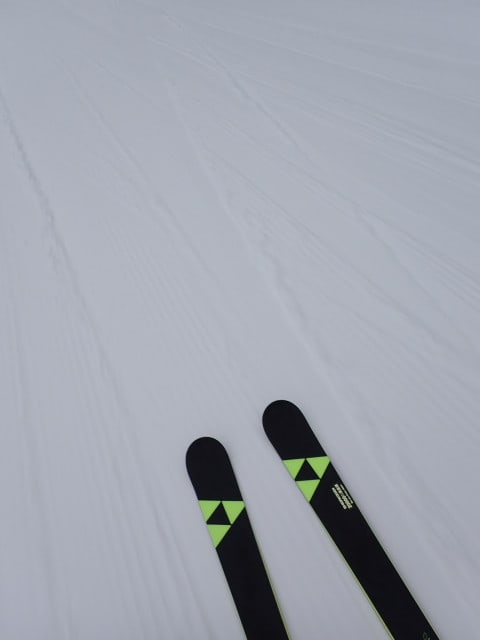

ただ，降ったのは夜中で．

圧雪作業が終わった後の朝の時間帯は

それほど降らなかったようで…圧雪

バーンの上には新雪はほとんど乗って

おらず，圧雪された時間により，

シマシマバーン～5cm積雪といった

ところでしょうか…

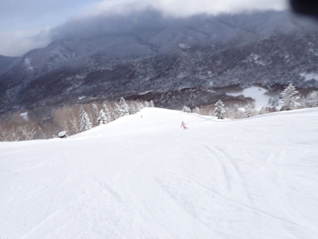

そして，ゴンドラ2本目のころには，

太陽ものぞき始め…

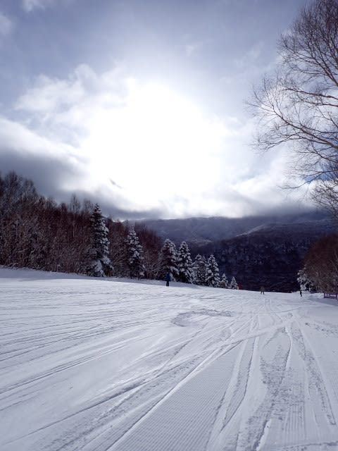

うほほほほほ！！

シマシマっ！！！

日差しの中でシマシマが滑れるシアワセ…っ！！

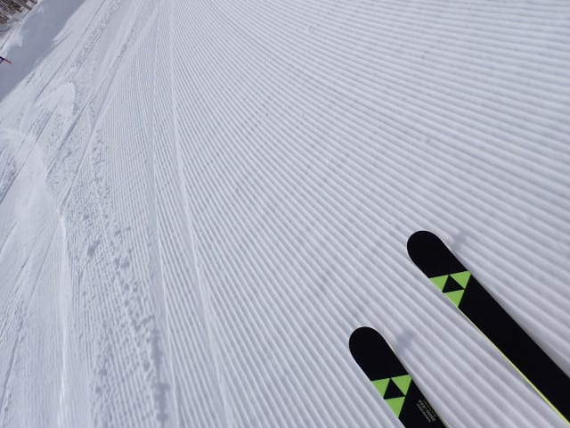

シマシマがなくなった後も，

柔らかトップシーズンのいい雪を

日差しの下で滑れる，このシアワセ！！

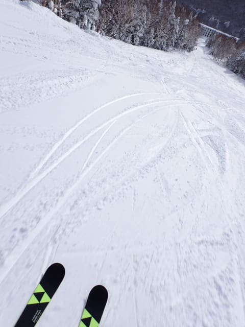

雪もたっぷり，

全コースオープンして，

リフトもすべて動き出し…

もう，コンディションは完全にトップ

シーズンですね…！！

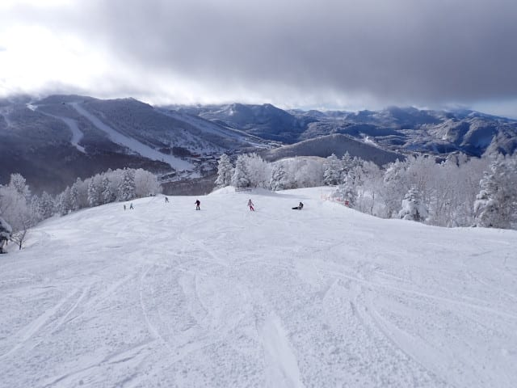

年末休みなのに，朝はコースも

そんなに混んでおらず…

こんなにいいコンディションで，

こんなガラガラコースを滑れて

いいんですか！？？？

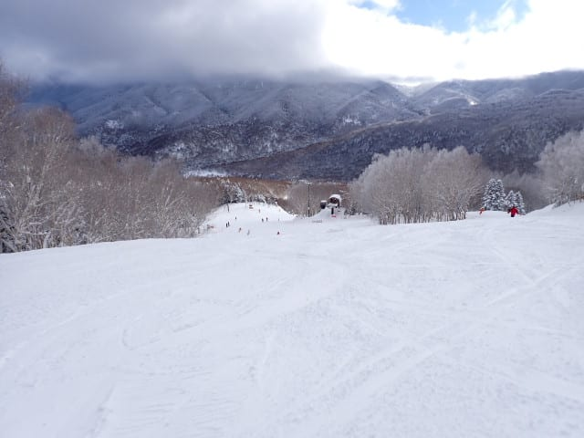

リフトもガラガラだし…

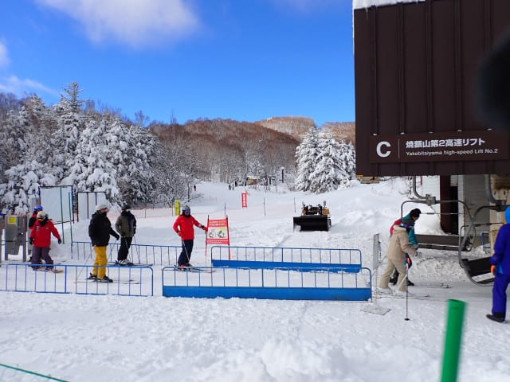

ゴンドラもピークの10時過ぎでこの程度の

混雑で．

いやーーー．

今日はいい一日になりそう！！

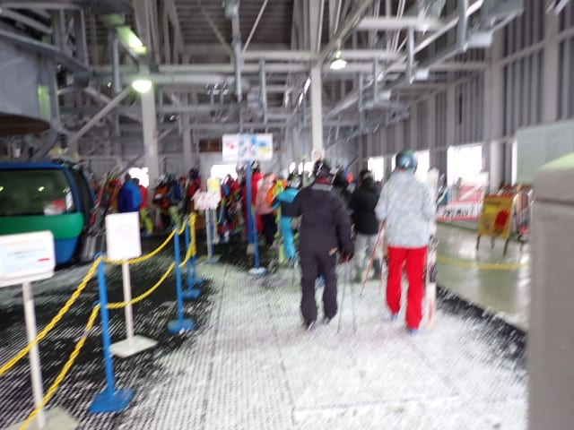

…と，思っていたのも束の間．

なぜだか11時を過ぎると，いきなり雪が

激しく降り始めました…（泣）

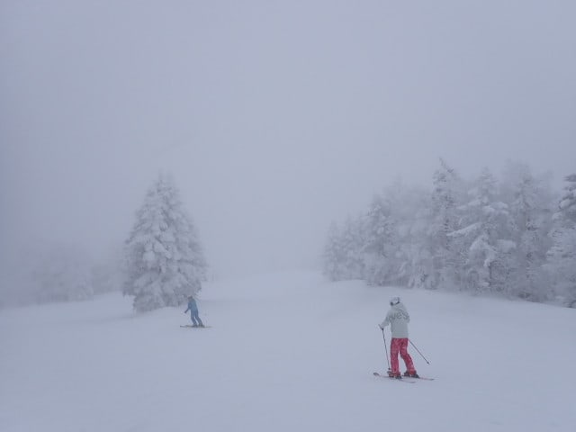

曇り午後は雪が降る（略）

運が良ければ朝は西風で晴れるかも！

と予想はしたけど．

ある意味，予想はかなり正確に当てたけど．

まさかここまで激変して雪になるとは…（泣）

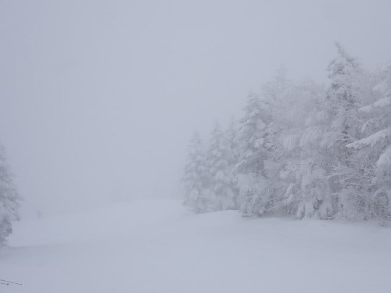

そのおかげで，午後はゴンドラが

ガラガラになったものの…

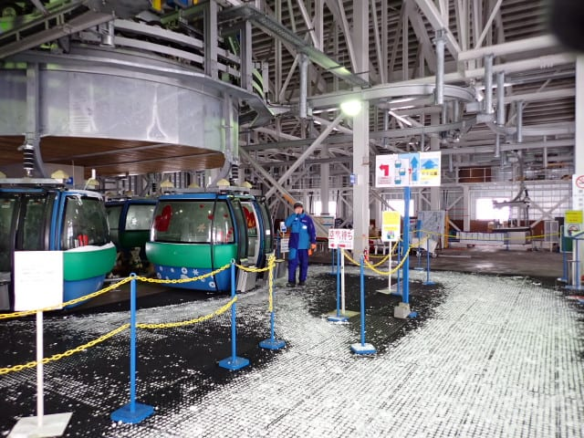

なぜか，コース上の人は午後のほうが

増えてきたんですが！？？？

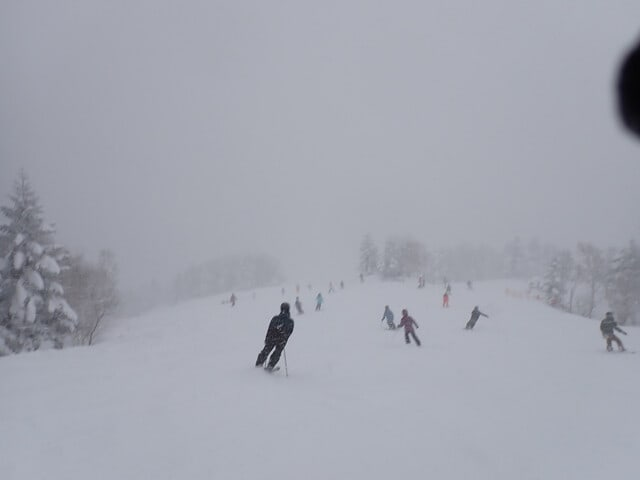

そして，雪がすごい勢いで降っているので，

コース上に雪が積もっていき…

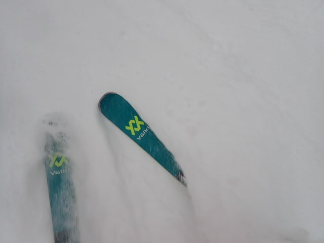

それが大勢の人に蹴散らされて，

コース全面凸凹になってきちゃったん

ですが…！？？

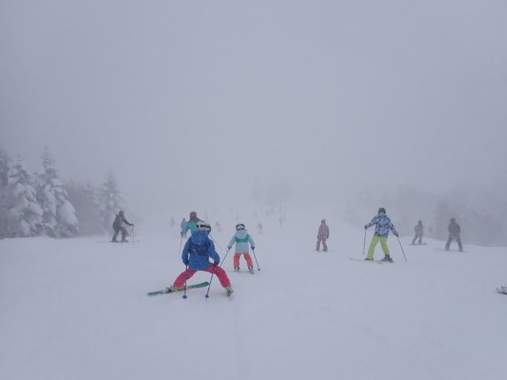

あまりにも午前と午後が違い過ぎる…

柔らか最高圧雪をガラガラ＆日差しの下

滑れた午前と，

雪降りで視界が悪い中，モサモサ雪の

凸凹に飛ばされながら人の間を縫って

滑る午後と，

あまりにも極端すぎる一日なんですけど…！！

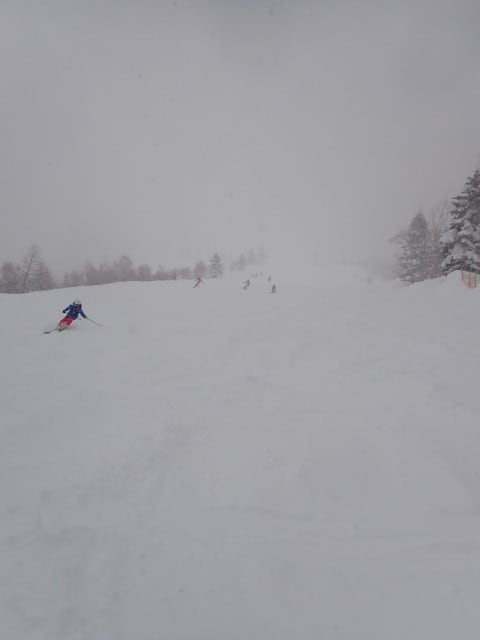

なんでコンディションの悪い午後のほうが

人が多いのか不思議で仕方なかったけど．

午後は風＆雪で寒すぎてリフトに乗って

られず，ゴンドラのありがたみを

存分に感じながら滑ってる感じで．

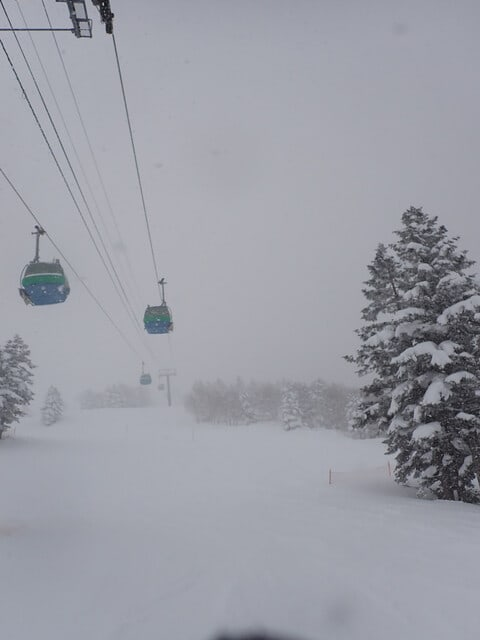

朝とはうって変わった，

激寒＆視界悪し＆雪降り＆積もった雪が

蹴散らされてボコボコという状況の中．

今日もラストの16時まで滑り続けたの

でした…

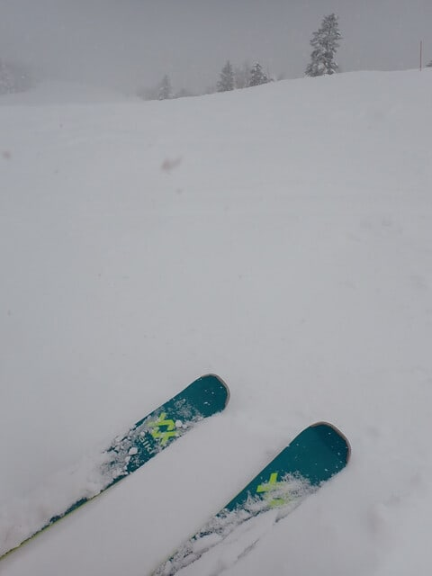

そして．

今日も午後だけでこれだけ積もりました…

一日じゃなく，午後だけでこれだけなので，

どのくらい降ったか想像つくかと…

いやーー．

今年は雪が多い…！！

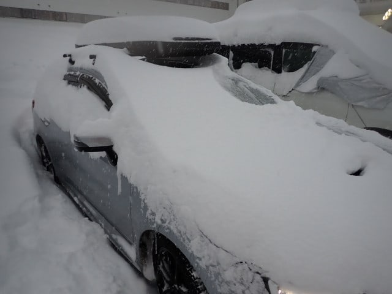

ってなことで．

今シーズンは，もうこれ以上降らなくても

大丈夫というくらい，雪が降り続けて

ますが．

今日は午後からよっぽど日ごろの行いが悪い

人が来たんじゃないか？？？

と思わざるを得ない，あまりにも午前と午後が

違い過ぎた一日だったのでした…

明日は朝は曇が多いかもしれませんが，

日が射すいい一日になるはず…！！
