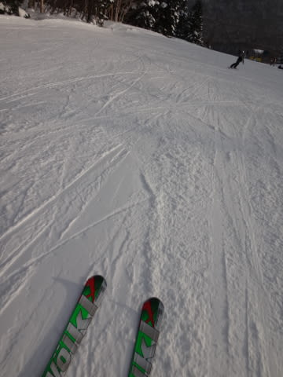

# 1月18日の志賀高原は…なんとっ！今日は一日超晴天

📅 投稿日時: 2014-01-18 23:27:05

えー．

なんだか，西日本では大雪みたいですが…

志賀高原は，なんと．

今日一日晴れでしたっ！！

すごい晴天の一日でした…

…それも，なんと！

リフトストップの夕方までずっと晴れつづけたという…．

これは，あれですね．

本来，今日の午後は崩れるはずの予想天気図だったのに．

私の日ごろの行いがあまりにも良かったために．

実際の天気図には，予想天気図にはなかった，

こーんなでっかい高気圧を発生させて，晴れにしてしまったんですっ！←天気予想が外れたのをごまかしている

やっぱり，私の日ごろの行いの…ビシィッ！←神の怒りの雷が落ちた音

とりあえず．

今日は朝から晴天で．

冷えひえで．

バーンはやわらかすぎず，圧雪後に冷えて締まった，

スピードの乗る超最適快感快楽大放出バーンっ！

シマシマを切り裂くこの快感っ！

んで，がらがらっ！！！

ゲレンデに人がいないよっ！

…ゴンドラ待ちも，今日は最大1分くらいかな…

今日は平日かっ！？？

なぜ．こんなに天気が良くて．

こんなに雪が良いのに．

こんなに人がいなくて飛ばしたい放題なの？

もう，人がいないから，夕方までゲレンデは完全フラットっ！

これがリフトストップ時のゲレンデ状況とは信じられないっ！！

リフトストップまで，大回り板を履いて大回りしたい放題でしたよ！！

いやー．

天気，混雑具合，雪質と．

3拍子のすべてがそろう，シーズンに1-2度あるかどうかという，

シアワセな一日でした…

でも．

今晩から結構な雪になるはず…

ナイターの終わりごろには，そこそこの雪に

なって来ました…

ちょっと予想より降り始めは遅かったけど．

明日までには，積もるかな～？

## 💬 コメント一覧

### 💬 コメント by (ゆうこ)
**タイトル**: 羨ましい！
**投稿日**: 2014-01-19 01:13:38

私、今週は用事で東京なんです。

いい天気で、羨ましい。

空いていて、羨ましい。

本当本当本当羨ましい。

行きたかったなぁ。新しいウェア買って行きたい気持ちはMAXです。

このままだと、滑らなきゃ死んじゃう病なので今日は休みますって来週休んでしまいそうです。

### 💬 コメント by (Skier_S)
**タイトル**: ゆうこさま
**投稿日**: 2014-01-19 12:19:00

今日は、昨日と違ってパウダーデーです！

予想通りです！

パフパフを楽しんでます～

例年、連休の次の週はガラガラで、

ねらい目なんですよね～

来週、新しいウェアデビューで、鬱憤を

はらしてください！！

### 💬 コメント by (Goku)
**タイトル**: Unknown
**投稿日**: 2014-01-19 17:26:11

うわ～！終日大回りし放題ですか。

羨ましすぎる。

それにしてもいい天気でしたね。

長野市からも志賀高原が良～く見えましたよ！

「今頃Ｓさん気持ち良く滑ってるんだろうな～」

なんて思いながら仕事してました。

### 💬 コメント by (Skier_S)
**タイトル**: Gokuさま
**投稿日**: 2014-01-20 00:33:59

いやー．

この日は絶対Gokuさんなら大喜びの

一日でしたよっ！

ホントに夕方まで大回りの板を履いてました…

リフトストップまで大回りの板を履き替えようと

思わなかったなんて，私としては奇跡に近いです．

毎週こんなだと良いんですけどね～

