# 2015年10月　子連れで西表へダイビング旅行その2…なぬ？西表の大原行き高速船，欠航？？

📅 投稿日時: 2016-08-23 03:23:05

🏷️ カテゴリ: [ダイビング日記](ce3a7a8d424d112fce83ee85c81a0e344.md)

ということで．

昨夜フィリピンから帰ったばかりというのに．

…夏休み明け本日から，いつもの帰宅時間ですね（涙）．

ホントに昨日まで夏休みでくつろいでいたんだっけ？

という感じですが…

とりあえず，本日から．

西表旅行記，再開っ！

--

で．

那覇に前泊した翌朝…

本日は，朝8時石垣港発，西表島上原港行きの

高速船に乗る予定．

…だったのですが．

朝7時過ぎに宿を出ればよいよね…

という感じで起きて．

上原港行きの高速船，予定通り運行されることを

確認しようと，スマホを見たところ…

なぬ！！！！！？？

上原行，強風のため終日欠航？？？？

な，なんということっ！！！

…ただし．

西表島，上原港行きは欠航だけど．

大原港行きの船は予定通り運行しており，

うむ．

西表島には行けそうだな．

で．

高速船の大原到着後，大原→上原連絡用

バスが出るとのことで…

上原のダイビングショップにも，問題なく

行けそうではあるけど．

でも．

西表島到着後のバス移動時間を考えると…

1時間近く早い7:10発の大原港行きに乗らないと，

1本目のダイビングの開始時間に間に合わないっ！！！

…と，7:10発の高速船に乗るべく，

まだ日が明けきらぬ6時半ごろ，

慌ててホテルを飛び出し．

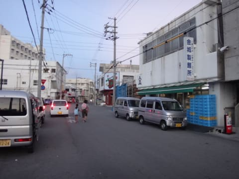

とぼとぼ歩いて徒歩5分．

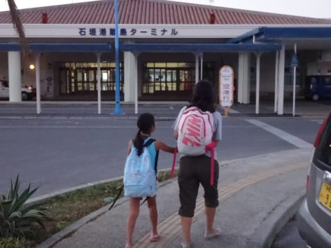

石垣離島ターミナルへやってきました…

朝早いので，まだ太陽が昇ってません…

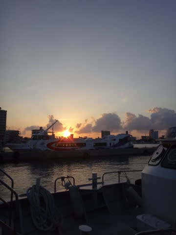

…しかし，石垣離島ターミナルにあった，この像．

ふーむ．

やっぱり．地元のヒーローなんですね…

ターミナルの窓口で，

乗船手続きその他をやっていると…

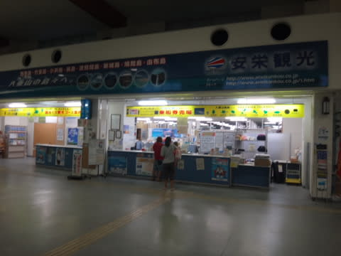

乗船時間になったようなので．

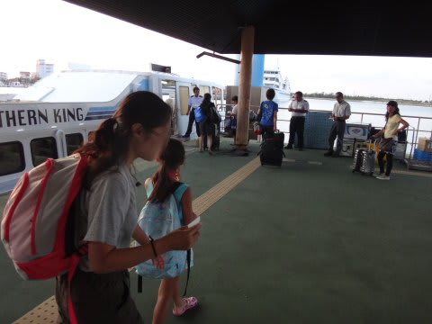

高速船へ乗り込みます．

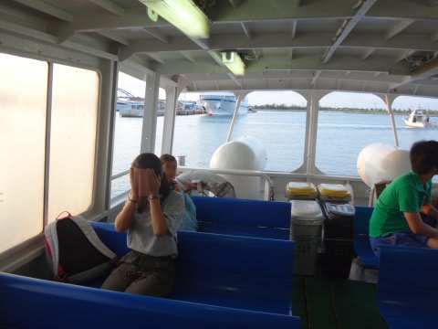

そして，朝日が昇る中，出航！

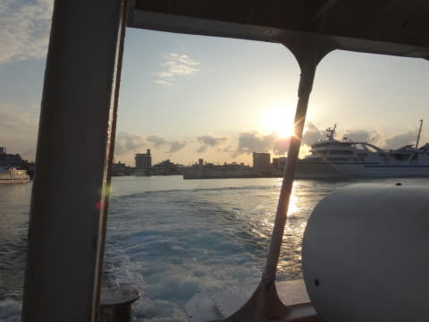

悪逆な速度を誇る，石垣離島高速船．

すさまじい水しぶきを上げながら，疾走…！

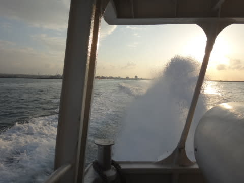

最高速度40kt超えるようで…

時速70km以上ですね～．

速いよ！

だもんで．

石垣島を離れてから，わずか40分で

西表は大原港へ到着！

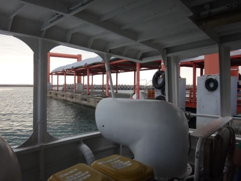

高速船に連絡する，上原行のバスに乗って…

こんなバスでとぼとぼ40分ほど．

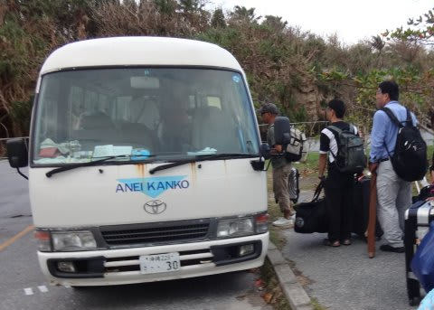

8時40分ごろ，無事上原港に到着しました…

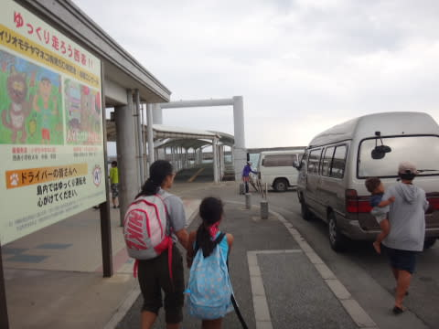

いやー．

上原港行き高速船が欠航という案内を見た時は

びっくりしたけど．

何とか1本目のダイビングに間に合うように，

ダイビングショップのある上原までやって来れて，

一安心…

…しかし．

今回の旅行も．

一筋縄ではいかない，波乱に満ちたものになりそう…？？
