# 2024/4/13(土)の志賀高原焼額山スキー場は…終日晴れ，GW並みの暑い一日．朝は雪が締まり気味，昼には雪は緩んだけどガラガラなのでそこまで凸凹にならず

📅 投稿日時: 2024-04-14 00:13:24

ということで．

本日も志賀高原で滑ってきました～！！

いやーー．

今日も暑かった…（泣）

でも，もうこの時期，滑ってる人が少ない！！

だもんで，昼には雪はゆるゆるになったけど，

滑る人が少ないので，そこまで雪は荒れません

でした…！

もう，昼間は+10℃を超える高温と日差しで，

ウェアのジャケットを着てられないほど

暑いので，明日滑る方は，ウェアじゃなくて，

薄手のものを着ていくことをおススメ…

あ，早朝だったらウェア着てても

大丈夫かな．

ってなことで．

今日も朝8時の焼額スキー場の通常営業開始に

間に合うように志賀高原へ向かいますが．

朝8時前だと気温もかなり高く，

道路は完全にドライ．

多分明日も，夏タイヤで問題なく志賀まで

登ってこれちゃうと思います…

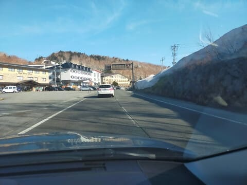

そして．

早朝営業は駐車場もかなり混んでいて，

結構な人が滑ってたけど，通常営業の開始を

待つ人は10人もいない感じで…

みんな早朝営業狙いなんだなぁ…

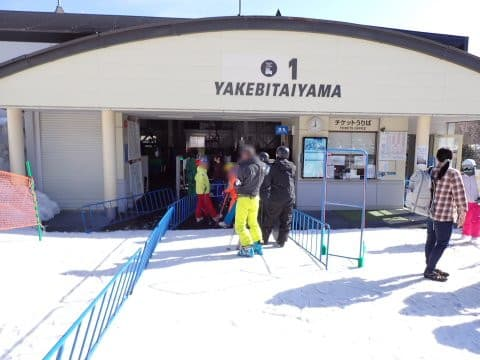

8時ちょうどの通常営業開始とともに

ゴンドラに乗り込み，山頂へ向かいますが…

山頂の気温は，朝8時時点ですでに

+5℃近く（泣）

GW並みの高温ですね（涙）

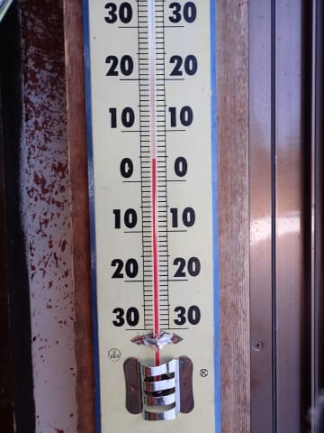

で．

気温が高くも，せめて日差しが弱ければ

雪は融けないから曇ってほしいけど…

悔しいほどすっきり快晴！！

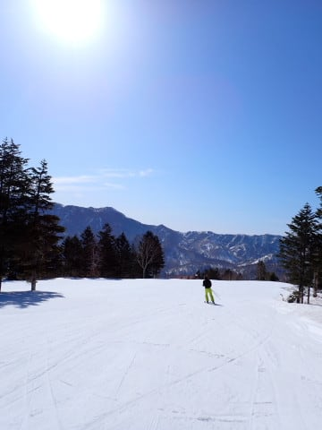

ただ，明け方にかなり気温が下がったのか．

朝8時の段階でも，表面は緩いけど下地は

結構しっかりした，かなり楽しく滑れる

バーンコンディションっ！！！

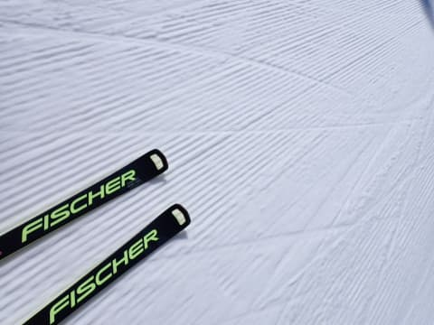

絶対朝からユルユルの雪だと覚悟して

来たけど…ここはうれしい予想外で，

あさ9時ごろまでは，結構気持ちいい

バーン状況が続きました…！！

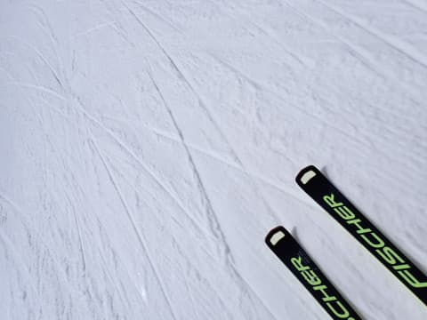

明日で今シーズン最終日となる唐松コースも，

まだまだ雪はたっぷりあって…

10時近くになっても，結構締まり気味で

いい感じで飛ばせるバーン！！

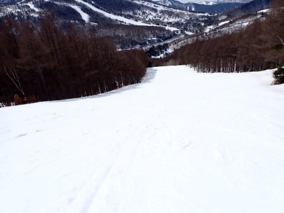

ただ…

唐松コースのリフト乗り場手前．

早々にクローズしたブナコースから

雪を運ぶ際に，かなり土も運んじゃった

みたいで．

雪に土が混ざってる部分が一部あった

のが惜しい…

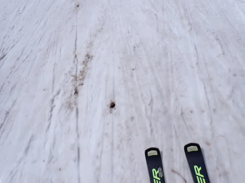

とはいえ．

今日は意外と，午前9時過ぎまでは

比較的しっかりした下地のバーンを

滑ることができたので，結構よかった

かな…！！

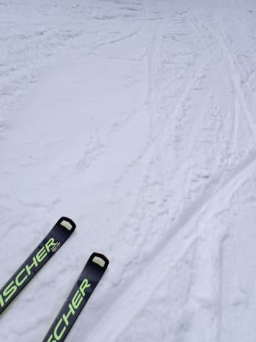

だけども．

さすがに日差しがかなり強かった本日．

10時頃にはかなり雪も緩んできましたが…

でも．SGSコースを経由してイーストに

行けば，まだほとんど誰も滑ってない

ぴかぴかバーンを滑れるはず！！

と，SGSコースへ向かいますが…

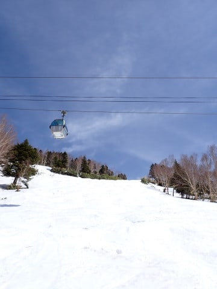

SGSコースのコブ斜面．

あまり人が入ってないのできれいなコブじゃなく，

重い雪の凸凹斜面で滑りにくくて…

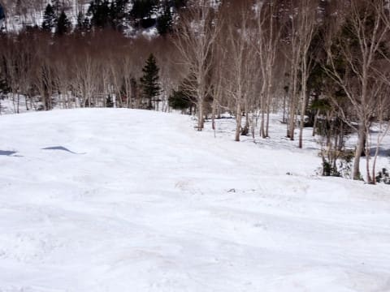

そして，コブ溝にはブッシュが（涙）

うーん．来週末まではSGSコースはもたないな～．

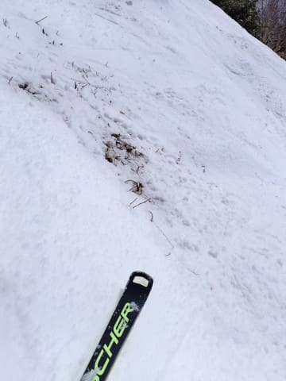

ただ．

SGSコースを抜けた後のイーストコースは，

ちゃんと圧雪がかかっているのにほとんど

誰も滑っておらず…

朝11時近くまで，ほとんど荒れてない貸し切り

フラットバーンを堪能できました～！

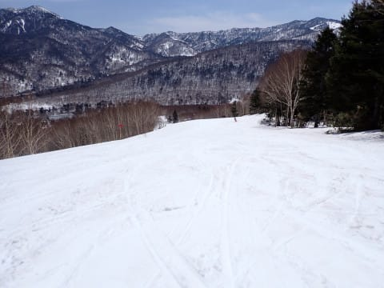

で．

さすがに晴天高温だった本日．

12時ごろには，かなりザブザブの残念な

感じの雪になってきました…（涙）

でも，緩斜面で多少滑りが悪いかな…

という程度でストップ雪にはならず．

板は滑ってくれたし…

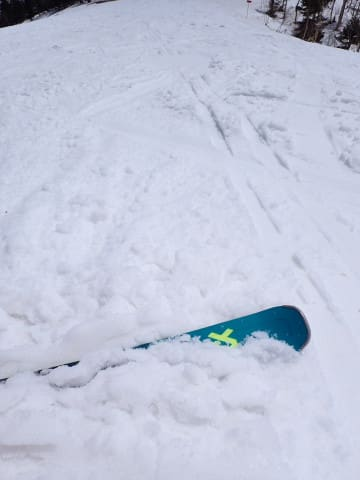

なにぶん第1ゴンドラもガラガラだし．

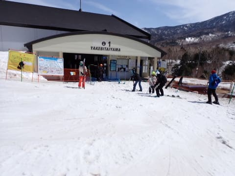

第2ゴンドラもほぼ終日飛び乗り状態．

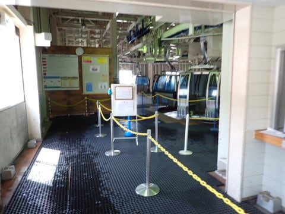

土曜というのに．

コース上では，ほかに滑ってる人がいるのか？？

と疑ってしまうほど，寂しく感じる無人状態で…

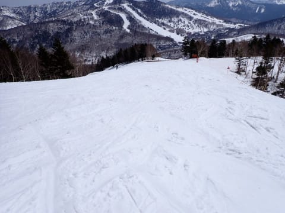

なので．

昼間の気温は+14℃と，

4月の2000mの山頂では許されざる

超高温だったというのに．

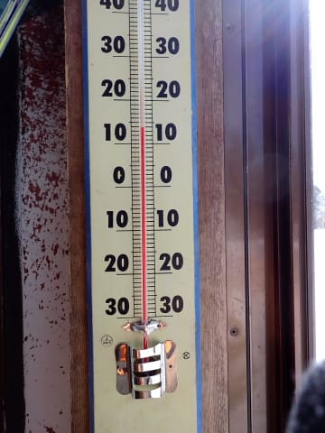

意外とバーンは午後になっても荒れず．

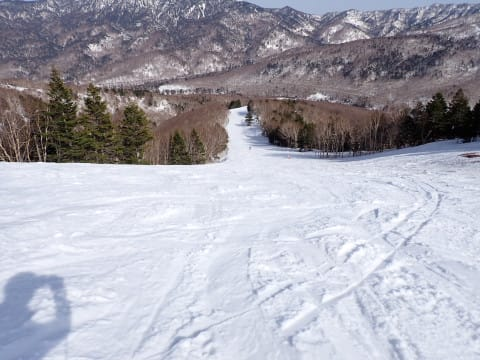

春雪では無敵のDeaconを履けば，

まだまだフラットに感じるバーン状況！！

いや…春の雪でのDeacon，ホントにいいよ…！

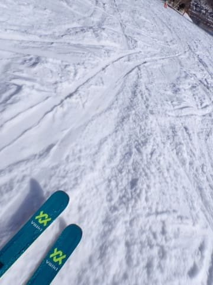

とはいえ．

さすがに2時半を過ぎると，

ところどころに凸凹ができてきましたが．

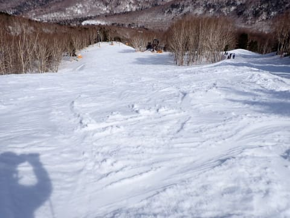

ひどい凸凹になったのはサウスのごく

一部と，GSコースの一部だけだったかな～．

GSコースの営業終了時間には，

いつも荒れるところはやっぱり

この程度の凸凹になっちゃって

ました（涙）

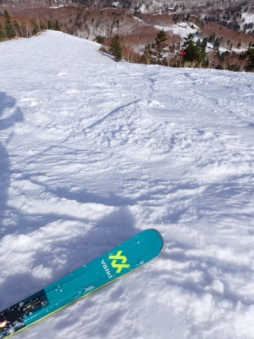

とはいえ．

営業終了時間でも，ほかのアングルの写真は

この程度なので．

そこまでひどい凸凹にはならず．

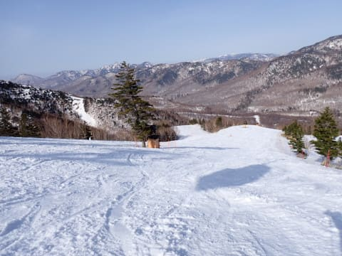

そして気温が高かったにもかかわらず，

ラストまで妖怪板つかみは出現せず，

板は滑ってくれたので…

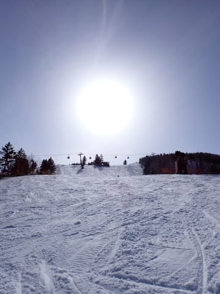

今日も営業終了の15:30まで，昼休みも

とらず，ひたすら楽しく焼額をぐるぐる

滑り倒してきたのでした…

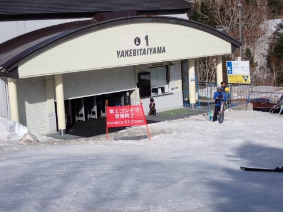

ってな感じで．

今日は予想より楽しかった一日でしたよ～！！

明日も朝は雪がちゃんと締まってくれて，

それほど緩まずに午前中までもってくれると

いいんだけどなぁ…

明日のほうが気温は上がりそうなので，

それは期待薄か…

でも，早朝はかなり楽しめると思うし．

明日も楽しい一日になるはず…っ！！

と信じて，今日は早めに寝ます…

おやすみなさい…

## 💬 コメント一覧

### 💬 コメント by (ハリー)
**タイトル**: 毎朝の楽しみ
**投稿日**: 2024-04-14 07:39:33

長年通った志賀高原をいつも身近に感じられるので、元気が出ます。2年前に脳梗塞を発症し、今では一ノ瀬の緩斜面を滑るだけですが、昔を懐かしく写真を見て思い出してます。

### 💬 コメント by (Skier_S)
**タイトル**: ＞ハリーさま
**投稿日**: 2024-04-15 01:25:31

コメントありがとうございます～！

このBlogが何かの癒しになってるなら，うれしい限りです．

しかし，脳梗塞からゲレンデ復帰ですか…！！

すごい…！！リハビリ大変だったかと思いますが，無理せず体にお気をつけて，

引き続きスキーをお楽しみください．

### 💬 コメント by (だんご)
**タイトル**: Unknown
**投稿日**: 2024-04-15 09:59:39

はじめまして。楽しく、そしてうずうずしながら読ませて頂いています。

土曜日、もーしかすると第一ゴンドラの前に並んでいた方が筆者さんではないかと思ったのですが、違ったら恥ずかしいし、申し訳ないし、何よりお名前が思い出せず、それでも頂上に着いたら

「スキーをしないとしんじゃう病の方ですか？」と声を掛けると心に決めていたのですが、着いた時にはもはや後ろ姿は遠くを滑っていて、お声を掛けるに至りませんでした。

またまた、楽しく読ませて頂きます。

### 💬 コメント by (Skier_S)
**タイトル**: ＞だんごさま
**投稿日**: 2024-04-16 02:02:50

コメントありがとうございます～！

土曜日，朝8時の通常営業開始時に並んでいたなら，それは

私の可能性が高いです…

今後も志賀高原に来られるようなら，もし次お見かけの際は，お声をかけてください～！

