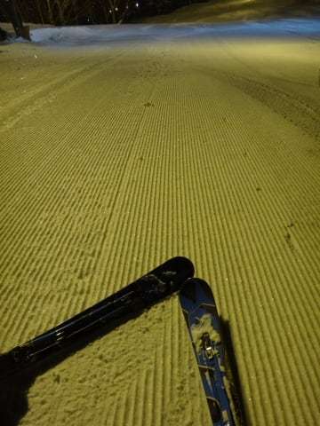

# 2月22日の志賀高原は…冷えひえの晴れ！好コンディションっ！

📅 投稿日時: 2014-02-22 22:33:17

🏷️ カテゴリ: [2014スキー滑走日記](c992167609b6415052179ee69ea1ea7d8.md)

えー．

実に．

実に2週間ぶりにゲレンデに立てました…(感動の嵐） 

10日間もスキー板を履いてなかったという．

ハイシーズンの私にとってはありえない，

全くもって信じられない，超長期ブランクを乗り越え．

ゲレンデに戻ってきました…(感激）

もう，中10日なんて．

私にとっては，スキー忘れてるんじゃないか？

ってほどのブランクですよ．

ええ．

しかし．

今朝も，何事もなくゲレンデに到着させてくれない，

試練が準備されていました(;_;

上信越自動車道の，横川近辺から．

なんだ？だんだん路肩が狭くなってきたぞ…

そしてついに．

完全1車線化しちゃったよ…

そのために，とろとろ運転が続いていたのですが…

神は，ここで試練を与えたもうたわけで．

なんと．

この状態で．

故障車発生（激涙)

通れる1車線を完全にふさいで，トラックが止まっちゃった

という…（泣）

1車線しかないので，車を撤去するのも一苦労．

ってことで．

故障車が撤去されるまで，1時間．

軽井沢IC付近で待たされて．

車はその間，1mmも動きませんでしたよ…(涙）．

…って感じだったので．

スキー場着10時前（落涙）．

涙をぬぐいつつ，10時ごろにようやくゲレンデに立つと．

ををっ！

むむぅ！

晴天だぁ！

…そして，気温も冷え冷えっ！

雪質も適度に締まった圧雪で，Goodっ！！！

…だけど．

だけど．

ゲレンデが…

混んでる…(涙）

先週滑れなかったので，今週にお客さんが集まったのかな…

ゴンドラも待ち時間が…

＃とはいえ，ピークで3分，午後は1分～待ちなし

ゲレンデはちょいと人が多め…

人が多かったので．

気温は低かったものの，ゲレンデの雪も荒れ始め．

さらに，午後には私の天気予想通り←ここ強調するところ

時折雪雲が流れて，雪がちらつく瞬間も…

そして．

雪が降って，人が多いので…

午後のゲレンデは荒れて行きます…

んでも．

まぁ．

基本的に日が射す一日で．

緩斜面はそれほど荒れず，風も穏やかで．

ちょっとゲレンデがぼこぼこになったとはいえ．

スキー場に立てる，スキーで滑れる．

それも太陽の下滑れるなんて！！！

という，感動に包まれつつ．

たっぷり夕方まで滑ったのでした…

…いや．

夜までたっぷり滑ったのでした…

しかし．

焼額ナイター．

本日で今シーズン終了とは(涙)．

もったいなすぎるっ！

…でも

もう，「今シーズンは終了」という言葉が出てくる

時期になったとは…

シーズンも終盤なのかなぁ(ちょっと悲しい）

## 💬 コメント一覧

### 💬 コメント by (ゆうこ)
**タイトル**: 上信越渋滞
**投稿日**: 2014-02-24 02:11:27

志賀高原は、さいこうだったけど、上信越の渋滞、ひどかったですね。

友達を送り届けて、やっと帰宅しました。

明日は休みたいけど、仕事行かないと。

絶対眠いです。

### 💬 コメント by (Skier_S)
**タイトル**: 渋滞ひどかった…
**投稿日**: 2014-02-24 04:03:05

私も今帰宅です…

明日仕事に行けるかなぁ…（涙）．

お互い頑張りましょう…

