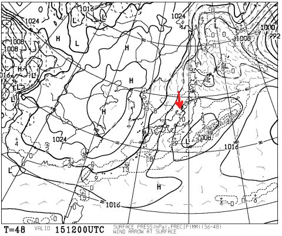

# この週末の志賀高原は…パウダーが来そうな気配！

📅 投稿日時: 2013-02-14 02:20:23

えー．

まず，のっけから．

ちょっと言い訳からはじめちゃいますが．

おとといの月曜日．

…3連休最終日ですね．

私の天気予想では．

3連休は3日とも冷えて，晴れ～曇り．

＃日本海側は曇り～雪かな．

信州では，ぱふぱふパウダーになる降雪はまったく期待できません．

って書いたのに…

実際の天気は，レポートしたとおり，終日激しい降雪．

…だめじゃん．

天気予想，大外しだよ…

終日雪になるって予想じゃなかったのに…

なぜこうなったかというと．

この微妙な等圧線の曲がりとか，いろいろ微妙な影響で，北風になり．

雪雲が志賀高原に流れ込んだんですね～．

うーーん．

同じような天気図でも．

地上で西風になると晴れて，北風になると降るという．

わずかな風向きの違いで天気がまったく変わってしまう志賀高原．

天気予想，難しいんだよな～．

…と，言い訳をしてみる．

さてさて．

本題の今週末の天気予想に移りましょうか…

…なんだか．

この週末．

来ますよ来ますよ～

金曜から，来ますね～．

パウダーがっ！

これが金曜日の夜9時の予想地上天気図ですが…

南岸低気圧が通過，この低気圧に向かって，冷たい風が矢印のように北から吹き込むので…

…志賀も降ります．金曜の夜は，積もりそうです．

土曜の朝は，パフパフパウダーになりそうですっ！

…で，土曜の天気ですが．

これは，土曜夜9時の850hpa面の予想図．

…すごい．0度線ははるか日本の南．

志賀高原には，標高1500mで-12度以下の空気が入り込んでます…

んで．こっちは土曜夜9時の500hpa面．

…大雪の目安である，「上空-30度の寒気」が，関東近辺まで南下してます．

そして，土曜夜9時の地上天気図．

相変わらず，矢印の方向の北風が吹くパターンですね．

…これらを総合すると．

土曜，志賀高原も一日降り続けます．

がんがん雪が降り続けます．天気は悪いです．

んで．寒いです．

凍えそうです．

そして，土曜の夜まで降り続くので，日曜朝もパウダーが楽しめるでしょう…

んで，日曜17日．

この日も，850hpaの0度線は日本のはるか南．

冷えますね～．

しかし，日曜夜9時の地上天気図はこんな感じで…

高気圧がすっぽり地上を覆ってます．

つまり．

日曜は，朝はパウダーパフパフ．

それも，昼に向かって天気が良くなり，日が射すという．

で，気温は低くて雪はいいまま．

…このままの天気図なら，最高の一日になるんじゃないかな？？？？

FZCX50で，土日の500hpa特定高度線のクラスタばらつきを見ると…

それほどばらついてませんね～．

スプレッドもそれぞれ0.19，0.29と．かなり小さい値．

土日の予想精度はかなり高く，これから大きく予想は変化しないってことが読み取れますので．

ので．

この週末，パウダー好きにとっては，すごくいいコンディションになりそうな予感っ！

PS.

…でも．

赤で示した16，17日は冷えるけど．

青矢印部分，18，19日の異常な高温は，いったいなんなんだ？？？

…また，19日は雨で．

せっかくパウダーが積もったというのに，またアイスバーンになりそうな気配…（涙）
