# 2013年9月　子連れタイ・タオ島ダイビング旅行記　その23…4日目の午後

📅 投稿日時: 2013-11-12 00:18:47

🏷️ カテゴリ: [ダイビング日記](ce3a7a8d424d112fce83ee85c81a0e344.md)

うむ．

[ここでの予想通り](ec51ec8627f01fdc1d83bfc0667ded835.md)，11日は多くのスキー場で積雪があったようですね～．

[かぐらでもかなりの雪が積もり](https://www.facebook.com/media/set/?set=a.412437132216946.1073741835.241102069350454&type=1)．

人工降雪機を稼動させてますね～．

そのほか，丸沼やアサマ2000のライブカメラを見ても．

夜半から人工降雪機を稼動させているように見えます…

で，12日もこんな感じで…

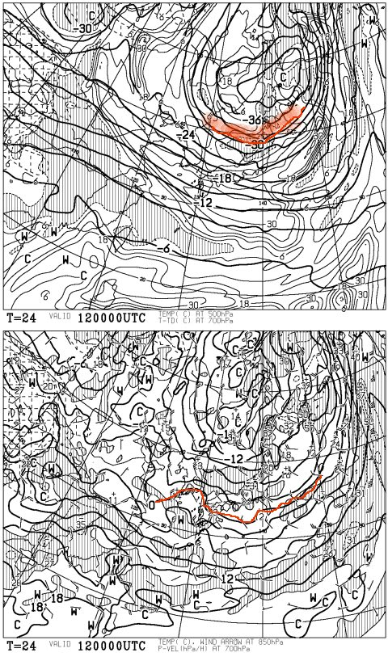

上の図，500hpa面に赤い線で示したように，真冬なみの-30度っていう，

結構な雪になる歓喜寒気が入っていて←スキーヤーとしては歓喜したいところだが

下の図，850hpaの赤く記した0度線が日本の南まで下がってますので．

かなり標高が低いところでも，山では「降れば雪」ですね～．

…っつーか．

志賀高原あたりでは，-9度くらいまで冷え込みそう！？

…ただし．

この寒気も14日の午前中まで．

週末の16，17日にはこんな感じで…

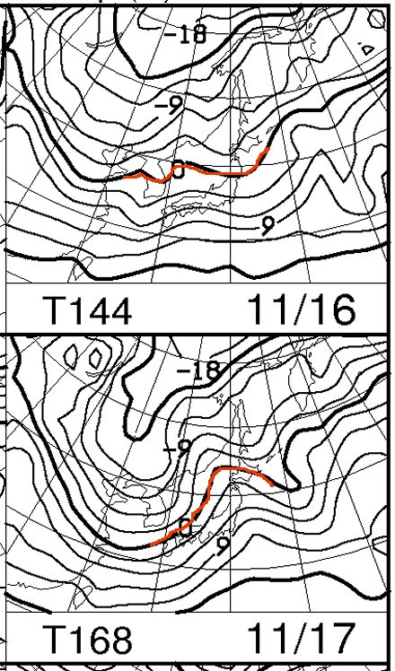

850hpa0度線はかなり北上しちゃうのだ．

うーむ．15日の金曜日．

ちょいと気温が上がって，標高がよっぽど高いところじゃないと

雨になりそうなので．

せっかくつけ始めた人工雪が，雨で溶けてしまわないように祈りたいところ…

…と．長い前フリがあったところで，本題へ行きましょう！

このブログのメインの読者＝スキー好きな人から「ここまでが本題じゃないの？」という声が…聞こえるっ…

---

という感じで．

…これまでの海況の悪さから．

4日目にしてようやっと，海で泳ぐことができた娘．

泳ぎ終わったあとは，船の上でお昼ご飯です．

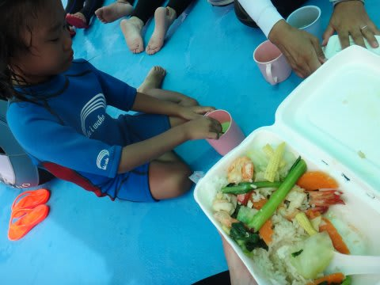

ダイビングショップに注文しておいたお弁当をみんなで食べたら…

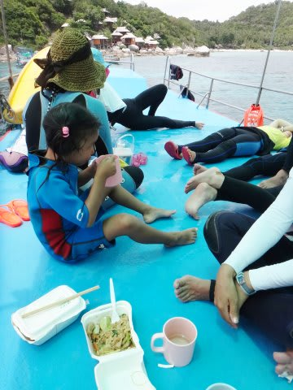

午後のダイビングへ向かって，船は動き出します．

…今日は泳げたので，満足の娘．

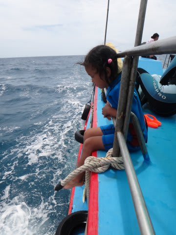

「お昼からプール行きたい～」などということなく，

午後もおとなしく船に乗り続けてくれました．

…そして．

移動中の船の上は．

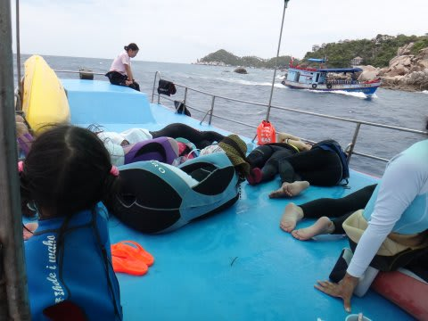

適度なゆれと，食後というのもあって，みんな討ち死に…

ならぬ，お昼寝してます．

午後のダイビングポイントに到着したら．

討ち死にした武者たちがゾンビのように起き上がり，ダイビング開始です．

午後1本目は，私が潜りに行く番ですが．

…

まぁ．

どうせまた沿岸部だし．

ジンベエが出るわけでもないし．

あまり期待せず，エントリー．

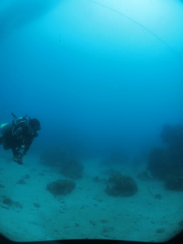

だいたい，予想通りの感じ…

ちょいと浮遊物が多く，透明度も…

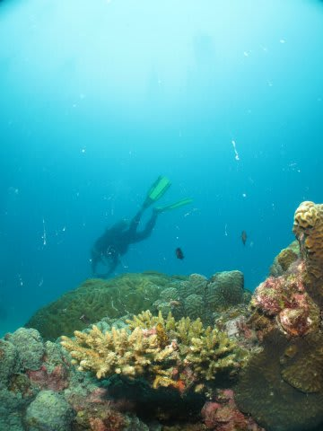

まぁ，あまり多くは期待せず．

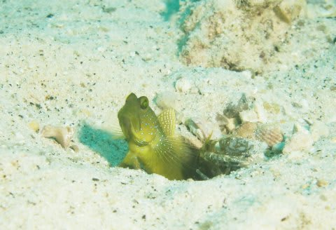

あまり写真も撮らずに．

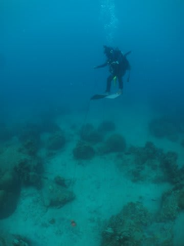

安全停止のあと，Exit.

船に上がったら．

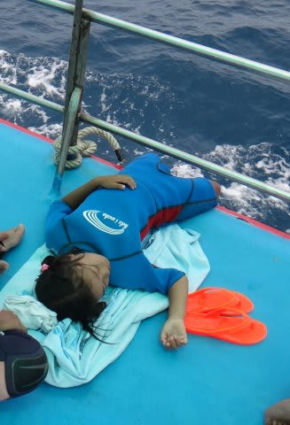

たっぷり泳いで疲れたのか．

娘は気持ち良さそうにお昼寝してました…
