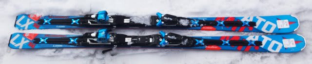
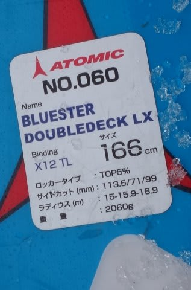
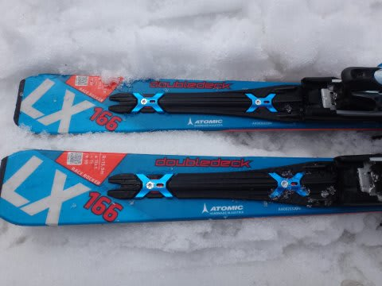
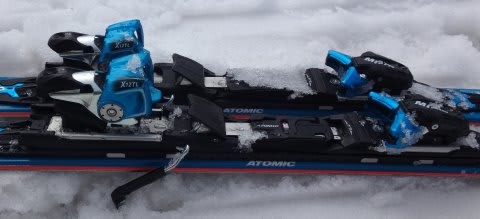
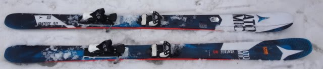
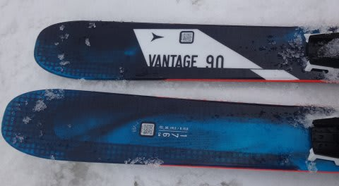
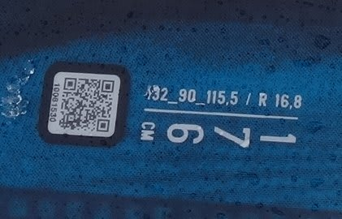
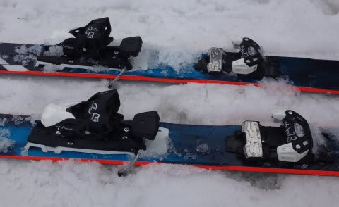

# 2017シーズンモデル，スキー試乗レポート第14回…ATOMIC編その2

📅 投稿日時: 2016-06-06 02:12:13

🏷️ カテゴリ: [スキー板試乗](c0bd8048615710cee890e403a36cc9a2b.md)

今シーズンも，あと残すは月山のみとなりましたが．

現在，滑走日数63日にして．

なんと．

まだ一度も転んでません．

昨シーズンは自損転倒0とはいえ．

ぶつかられて転倒しているので…

今シーズンは，わが人生初めての，

転倒回数0で終わるのか？？？

残るは月山1回．

無事，転ばずに終わりますように…（懇願）

で．

まだまだ続く，2017シーズンモデルの

スキー板試乗レポート．

本日は，アトミックの2機種です．

では，どうぞ～！

○ATOMIC Bluester D.D. LX +X12TL 166cm（2回目）

基礎オールラウンド（ロングベース）

この板も，SX同様に優し目のTLビンディングと，

前後がバーで接続されてフレックスが強くなる

VARビンディングが選べますが…

今回乗ったのはTLビンディングがついたモデルです．

これも…

SX同様，プレートが変わったはずですが．

私には，今年モデルと違いが分かりません（笑）

アトミックらしい，完全テール荷重でコントロールする板です．

粘る感じのエッジグリップがあり，安定感あって．

テールのグリップが強いです．

高速安定性，振動吸収性は高め．

ただ，SXと違うのは．

ターン後半でテールを抑えた際に，

切れ上がっていく感じは弱く，

SXより縦に落とせる感じです．

SXのようにターン後半に，切れ上がって

ぎゅっと曲がる感じは無し．

このあたり，SXに慣れた人間にとっては刺激が

足りないのですが…

妙に切れ上がったりすることもなく．

TLビンディングだと，エッジグリップは強めの

板だけど，ターン中に板を動かす自由度もあり．

無難なオールラウンド板だなぁ…

と思いました．

○ATOMIC VANTAGE90 176cm

オールマウンテン系

センター幅90mmという，セミファットな板です．

まぁ，オールマウンテン系で，柔らかい雪に合わせた

それほどグリップを重視しない板だよね…

と，思い込みを持って履いてみたところ．

…な，なんだこれはっ！！

まるでGS板のような，しっかりしたメタルの張りと．

しっかりしたグリップ．

アイスバーンの熊の湯のゲレンデでも，

板が逃げることなくガッツリグリップして

切れていく，この快感！

…これは．

長さ176cmってのもあって．

しっかり締まった整地でかっ飛ばすと

ものすごい気持ちいい，ハイスピード

大回り板じゃないかっ！？？

見てくれと全然違うよっ！！！

結構いい，縦に落とせる大回り板ですが．

固く，トーションも強い板で．

グリップしっかりしているので．

結構体力があり，スピードを出す人に

向いてます．

体力がない人・あまりスピードを出さない人は

もてあますかもしれません．

しかし．このしっかり感のため，

かなりスピード耐性は高いです．

ヘタなエキスパート用大回り板より

しっかりしてるかも？？

幅が広くて安定感があり，

ザク雪でも行けるのに，

整地でのスピード耐性は高い．

さらに，このビンディングがいいのか…

履いた感じ，足元は軽く．

意外と振り回しやすいです．

90mmの幅を活かし，パウダーや柔らかい春雪でも

走破性は高いし．

ガッチリ固まった整地でも，しっかりグリップしていくし．

かなりの張りの強さがあり，スピードを出しても

ぜんぜん耐えるし．

これは，1セットで2度おいしい板かも…？

パウダー用太板と考えるとちと細いけど．

…これは．マズい．

かなり物欲を刺激する板でした…

## 💬 コメント一覧

### 💬 コメント by (マルハバ)
**タイトル**: どこからともなく・・
**投稿日**: 2016-06-06 09:00:10

試合終了のゴングの音が聞こえてきます・・（笑）

そんな私も・・

昨年、板2台を買ってしまったにも係わらず

今、なぜか手元には赤いブーツが・・？（汗）

### 💬 コメント by (Skier_S)
**タイトル**: マルハバさま
**投稿日**: 2016-06-07 01:31:50

いやー．

いろいろやっぱり試乗はやばいですね．

物欲が刺激されてｔ…

しかし，あれれれ？行っちゃいましたか？

赤いブーツ…

もう，完全に物欲に完敗ですね（笑）

