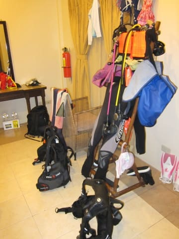
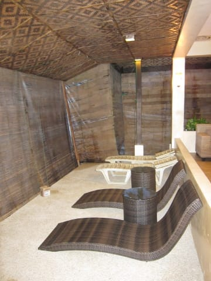

# 2013年11月　フィリピン・オスロブ　子連れでジンベエを見るぞっ！　その23

📅 投稿日時: 2014-08-06 01:49:28

🏷️ カテゴリ: [ダイビング日記](ce3a7a8d424d112fce83ee85c81a0e344.md)

という感じで．

フィリピンでのすべてのダイビングを終えて．

リゾートへ戻ってきたわけで．

最終ダイビング終了後の儀式である，

器材を洗ってから，器材干しをするわけですが．

明日の出発が，深夜2時半出発と．

なぜだかありえないほど異常に早いため．

ダイビングショップに器材を干しておくと，

器材の回収ができない…

ってことで．

お部屋の中にすべての器材を干すという，

かなりにぎやかな状況になるわけですね…

んでも．

…まぁ，このリゾート．

部屋が広いので，器材を干しても

狭苦しくなくてよかった…

＃狭いホテルだと，2人分の器材を干すと

＃足の踏み場もなくなる…

で．

器材を干し終わって．

シャワーを浴びたら，

レストランへ向かって…

ログづけタイムです．

ガイドとダイバーが集まって，ログづけをしますが…

見た魚は，こんな感じでホワイトボードに

書いてくれます．

…これを見ただけで，完全日本人向けの

ショップだということがよくわかりますね（笑）．

で．

ログづけ中，空も薄暗くなり，

風が強くなってきて…

なんだか，夕方からレストランの回りに

囲いを作り始めました．

私「なんですか？これ．なんで覆いを付けてるんですか？」

ショップの人「台風が近づいてきてるんですよ…風が強まってきてるんで．」

私「ああ，なるほど．このレストラン，完全吹き抜けだから，

　風が強かったら食事どころじゃないですもんね～」

ショップの人「明後日くらいにかけて，台風が結構近づくみたいで…」

私「あぁ．そうなんですか…」

　（台風の影響を受ける前にダイビング終わって，ラッキー…）

ショップの人（私以外のゲストに向かって）「みなさん，

　明日はまだぎりぎり潜れそうですけど，潜れるエリアは

　リロアンのみとなります～」

おそらく全員の思い（2日連続で，ちょいとイマイチのリロアンか…！

　…それなら，今日はリロアンじゃないところを

　リクエストすればよかった…）

ショップの人「明後日は潜れるかどうか，まだわかりません～」

ってことで．

この日．わが家族は

「あぁ，台風の影響も受けずにジンベエスイムできたし，

　明日はまだ飛行機普通に飛びそうだし，

　いいタイミングの滞在だったなぁ～」

…って思った程度だったけど．

実は．

なんと．

この台風が．

あの，記憶にも新しい，[フィリピンに壊滅的
被害を与える台風](http://matome.naver.jp/odai/2138405067721071201)だったとは…！！

ってことで．

この日は．

この3日後，フィリピンが壊滅的被害を受けるとは

夢にも思わずに，

フィリピン最後の夕食をのんびり楽しんで…

午前2時までの，わずかな睡眠に着いたんですが．

帰国した後，ニュースを見て．

「帰国が1-2日遅かったら，飛行機飛ばなかった．

　私も巻き込まれてた．やばかった…」

と，かなりきわどいタイミングだったことに，

自分の運がいいんだか悪いんだか，

よく分からない何かを感じたのでした…
