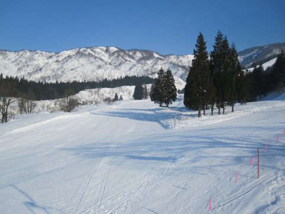
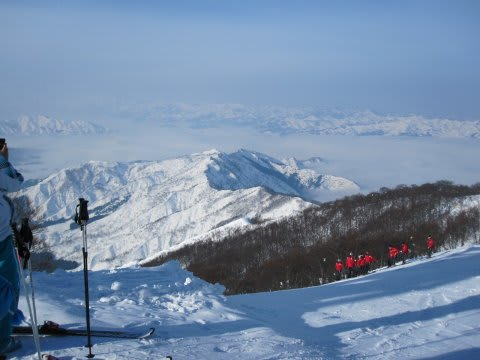
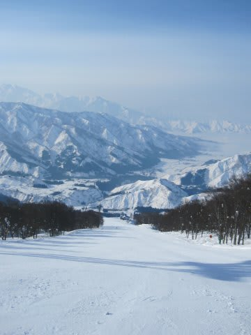
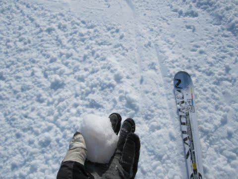
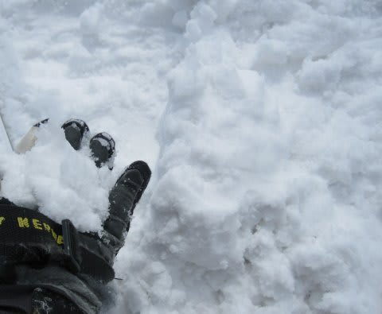
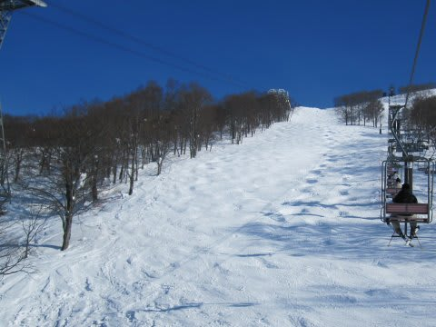
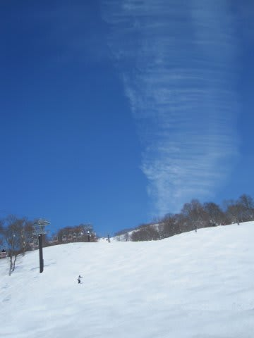
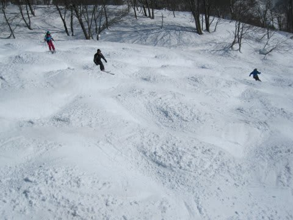
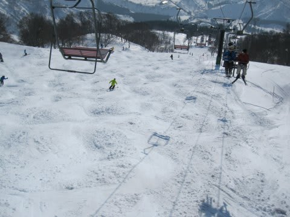
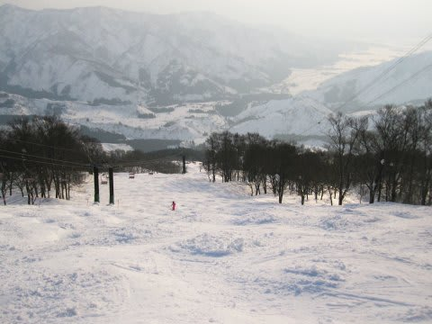

# 2月6日の八海山の詳細レポート

📅 投稿日時: 2011-02-08 01:19:27

🏷️ カテゴリ: [2011スキー滑走日記](ca488c98cfb9169941c3e73770dcefb56.md)

というわけで．

昨日，速報しましたが．

この週末は，日曜日帰りで．

コブをひたすら滑るために，

不整地の聖地（?），八海山へ行ってきました．

朝．

8時にスキー場に到着すると…

ふもとは霧で全く見えないのに，スキー場ベースでは

きれいに晴天！

むふふ．日ごろの行いのよさがここで出たか，

…と，すがすがしい朝日に照らされるゲレンデに繰り出し，

ふもとのリフトを1本滑ってみると…

…硬いよ（涙）

硬い．かたいよ．

カリカリ言ってるんですけど…

どうやら，金曜日の気温が上がった日に雨が降ったらしく，

溶けた雪が冷え込んでカチンコチンに凍っている様子…

…こ，これは．

今は整地だからいいけど，コブ斜面がこんなに硬かったら，

足の3本や4本ぐらい折れること覚悟で滑らないと…（戦慄）

多少の恐怖感とともに，ロープウェーで山頂へ．

ふもとの町が霧の中に隠れてますね～

軟弱者な私は，コブトレーニングという目的はしばし置いておき，

まず整地へ．

今日は珍しく，ゴンドラ降りて左側のチャンピオンコースが

圧雪されているので，まーーーーーっすぐの整地がロープウェー

降り場から第3リフト乗り場まで続きます．

ふもとみたいなアイスバーンだとやだなぁ，と思って

コースに出てみると…

どうやら，山頂付近は雨が降っていないのか，コース上には

数センチの柔らかい雪が載ってます．

下地はちょっと固めだけど，ふもとみたいなカチカチの

アイスバーンじゃない．

よっしゃ，これならいけるか？？？

と，滑り出してみると…

うぉぉっ？？

これはっ！

ジャガイモ畑だ！

氷のころころがゲレンデにいっぱい…

数本ほど，ジャガイモと格闘しながら滑っていると．

9時半ごろには気温が一気に上がり始めたため，

ジャガイモはだんだんマッシュポテトのように

つぶれて行き，柔らかい圧雪状になっていきました．

…っていうか，

なんか，握ると団子状に固まる，完全に春の雪に

なっちゃってるんですが．

…まぁ．このくらいゲレンデが柔らかくなれば，コブもいけるだろう！

ということで，本来の目的のコブ斜面攻略のため，10時半ごろから

エキスパートコースへ．

いつもなら全面コブのエキスパートコースですが．

昨日カチカチで掘れなかったからか，全体的にコブが浅く，

一部ライン的にコブができている状態．

雪が柔らかくなってきたのと，コブが浅いので滑りやすく，

コブトレーニングにはもってこい．

八海山にしては優しいなぁ…

と，晴天の日差しの下，快適に滑っていると．

昼ごろには．

うーーん．

なんだか，すごく暑くなってきたんですが…

先週までの，凍死するかと思う寒さは幻だったのか？？？

今日って，3月下旬だっけ？？

ってほど．

燦々と降り注ぐ太陽と，暖かい空気，コブを滑って温まってくると，

暖かいというより，暑い．

ジャケット要らない…ってくらい．

2月第1週とは思えない暑さなんですが？？？

おかげで，コブも春の雪に．

適度に柔らかく，スピードがそれほど出ない雪なので，

滑りやすいコブになってきました．

しかし．雪が柔らかくなってくるということは．

だんだん掘れて行って，コース全面，コブが育っていきます．

うーーむ．

だんだんとコブが手ごわくなっていくことよ…

夕方には，エキスパートコースは「さすが八海山…」と

うなってしまうほどの全面コブに．

コブトレーニングとしては，これ以上ない状態ですな．

しかし．こんな全面コブの状況というのに．

今回一緒に行った仲間は人類ではなく「コブ大好きスキー猿」

だったので．

「リフト営業残り30分！急げばあと2本滑れるっ！！」

と，ほざいて，丸一日コブを滑り続けた夕方だというのに，

リフト1本分続くコブ斜面をほとんど休みなく

滑り降りていっていたという…

＃人がいなくなったゲレンデで最後まで滑る

＃スキー仲間

…みんな元気だなぁ．

しかし．

新雪が多かった今シーズン，これまであまり本格的に

コブを攻めてませんでしたが．

さすが霊験あらたかなる霊峰八海山，一日滑っていたら，

いろいろつかむところがありました．

とりあえず．

天気は良かったし，

あったかかったけど，おかげで柔らかいコブを滑れたし．

一緒に行った仲間もみんなコブ大好きなスキー猿ばっかり

だったし．

かなり満足の週末であったことよ…
