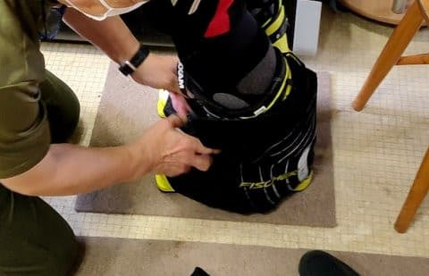

# 長岡のエキップさんで，ニューブーツを作ってみた…番外編

📅 投稿日時: 2021-01-23 13:28:32

ってなことで．

今週末もスキーに行ってないわけですが．

…昨日は，在宅で作業中の深夜12時前後に

知らぬ間に寝てしまい．

今日起きたら昼前でした…（涙）

だもんで，また変な時間に更新！

（一応また今晩もちゃんと更新します）

で．

昨日金曜の志賀高原特派員レポートですが．

朝のうちはちょっと薄日が差すタイミングもあり．

締まり気味のいい感じのシマシマだったようです！

…そして．

平日というのもあり．

やっぱりガラガラ…

午前中は曇り空ながら空も明るく，

ガラガラゲレンデを楽しめたようですが．

午後になると雲が増え始め…

そして，時折ガスっぽい感じになり，

ゴーグルに水滴がついちゃうときも

あったみたいですが．

でも，バーンは締まり気味で．

人がいないので，最後までフラット！

ガラガラの無人バーンを最後まで

かっ飛ばせたようです…

高温＆液体が降る危機が予想されていた今日の志賀高原も，

今のところ雨にはなっておらず．

意外とコンディション悪くないようなので．

これは私の呪い祈りのおかげですね！

ってなことで，本題へ．

長岡エキップさんでのブーツのお話，番外編．

私はREXXAMのブーツをシェル出しして

履くことになり，シェル出しのために

2回，長岡まで行ったわけですが．

一緒に行った某氏は，FISCHERのVACUUMを

購入し．

その場合は，一回の来訪で済んだ…

ということを書きました．

その，某氏のFISCHERのVACUUMのブーツの

フィッティングもかなり手のかかったもの

だったので，こちらもどんな感じだったか，

おまけに書いてみようかと…

まず，某氏も私と同じく，

足の動きや足型を見られて．

これまで履いていたブーツを履いて，

動きの癖などを徹底的に

確認されて…

その後，この某氏も私と同じく

FISCHERのVACUUMを希望していたので．

FISCHERのシェルを履いてみて．

そのうえでまた，正しいスタンスの

確認やら，膝，腰の位置やらを

特殊な傾斜のある板の上で

徹底的に確認されてます．

（動きの癖を本人に説明中）

確認後，本人の希望通り

「これならFISCHERで行けるね」

ということになりましたが．

そのチェック過程で，前のブーツの

インソールが結構いいものだったので，

そのインソールを流用することに

なったのは，すでに書いた通り．

それ以外にも．

「ふくらはぎのボリュームがあるし，

　タング自体の出来は実はREXXAMの方が

　いいから，インナーブーツのタングは

　FISCHERの純正からREXXAMに変えた方が

　いいかも？？」

ということで．

…え？

FISCHERのインナーに，REXXAMのタングって

着くの？？？

と思いましたが．

某氏のこれまで履いていたブーツの

インナーからタングを外して，

FISCHERのタングと取り換え始めましたよ…！

両者ともマジックテープ止めで，

マジックテープのオスメスもちょうど

合っていたので．

なんと．REXXAMのタング付きの

FISCHERインナーが出来上がりました…！

なんて微妙な組合せ…！！

ってなことで．

インナーの調整が終わっても，

まだ調整は続きます．

今度はシェル側の調整です．

まず，アッパーとロワシェルを繋ぐ，

ヒンジ部分の金具と…

アキレス腱部分の金具を

全て外して．

アッパーとロワシェルを

完全分離した状態にして．

アッパーシェルの最適角度を

見極めます…

分かりにくいですが，本来ついているべき

矢印部分の金具が外してあり，

仮止め用の単なるネジで止めてある

ことが分かるかと…

この状態で，ナチュラルに立った状態の位置に

アッパーシェルの位置が決まるように，

ヒンジ部分の金具と，アキレス腱部分の金具．

中心から穴がずれた複数の金具から，

上手く選び出して…

その結果．ヒンジ部分はこんな感じで

中心が上側にずれた設定で…

アキレス家部分は，外側にねじ穴が来る

モノに交換．

これで，脛が最適な角度に

なったようです…！！

本人も，横で見ていた私も．

何が最適なのかよく分からないけど，

鈴木社長の調整に身をゆだねます…

この状態まで調整して，

「これでOK!」となり．

やっとシェル成型がスタート！

まずは調整が終わったシェルを

オーブンで加熱して…

加熱後，先ほどのREXXAMタングの

インナーを履いた足を入れて…

足の位置が正しくなるよう調整し，

バックルを閉めたら…

その後，周りになにやら巻き付けてますね…

この状態で，VACUUMの装置に上がります．

そして，シェルに巻き付けたブランケットから

伸びたホースを，装置に取り付けて…

そして，装置の設定をして．

その後，待つこと15分ほどで，

シェルの整形が終わります！

…これにて，ブーツ完成！

シェルの整形だけでなく．

いろんなところがカスタマイズされた，

スペシャルブーツが完成しました…

FISCHERブーツのシェルからのぞく，

タングのストラップのREXXAMの文字が

オシャレですね！（なんのこっちゃ）

…これも，これだけやってもらって

特別工賃無し．

さらにちょうどいいサイズの型落ちの

シェルがあったので，かなりのお値引き

だったようで…

某氏曰く．

「長岡まで行く価値はある！」

とのことなので．

このスペシャルブーツ，満足のいく

仕上げだったようです．

ちなみに，このブーツを履いた某氏の滑り．

私が見ても，滑りがいい方向に変わったことが

分かるレベルだったので．

うーむ．

やはり，手間暇をかけたいいブーツは良い

と思った，Skier_Sだったのでした…

## 💬 コメント一覧

### 💬 コメント by (レインボー73)
**タイトル**: Unknown
**投稿日**: 2021-01-23 16:21:10

土曜日の志賀高原情報2

居酒屋での昼食のあと、子供が滑ると言うので、がっくりする気持ちを隠して4ロマ3本。雪は湿気でかなりべたべた。いつも志賀の雪で遊んでいる私には耐えられないレベル。

ところが同行の新潟の人曰く『長岡の雪みたい。得意です』

そして驚くのが、前回やっとの思いで手を離して一人滑りができた年小前の３歳の子が、なんとターンまでできちゃったんです。またスキー人口がふえる。

当然今日は残業。明日の重そうな新雪に期待？？？

### 💬 コメント by (かず)
**タイトル**: Unknown
**投稿日**: 2021-01-23 16:56:29

自分も一時期東京にシダスインソール バキュームで作りに行っていたのでこうゆうの大好きです！

WASHはやっぱり違いますね…周辺のパウダーゲレンデが閉鎖で混んだようです  詳しい人全て任せて行くと全然変わる場所です  そのかわりパウダー慣れてない人が一人いると完全ストップです…機会があればぜひ！！

### 💬 コメント by (レインボー73)
**タイトル**: Unknown
**投稿日**: 2021-01-23 20:31:18

そのブーツの某氏ですが、少し前に後ろを滑らせて頂いたのですが、自分が今取り組んでいることが、全部できてる！と、感動させられました。昨年とはやっぱり違います。

### 💬 コメント by (ほっぽ)
**タイトル**: 1/23　志賀高原
**投稿日**: 2021-01-23 22:36:42

Ｓさん

朝からガスって湿った雪も降り、

厳しいコンディションの志賀高原でしたが、

ラストまで滑ってきました。

blogにアップしてあります。

明日は天候と道路状況次第ですが、

多分志賀高原でしょう。

今夜は麓の宿に泊まっています。

ブーツですが、長岡まで行く価値ありでしょうか。

私は過去在住県内のレクザムメインのショップ、

志賀高原麓のショップと２箇所利用してきましたが、

結局今はほぼ自前チューンです。

比較的足が合わないということが無いこともありますが。

次は長岡まで出向いてブーツ選びからお願いしようかな。

私も１回で終わらなかったりして(^^;

今度直接お会いしたときにお話し聞かせて下さい。

http://hoppo.officialblog.jp/

### 💬 コメント by (Skier_S)
**タイトル**: スキーに行かない週末3週目，そろそろツライ…
**投稿日**: 2021-01-24 05:00:26

＞レインボー73さま

今日はちょっと雪が重くなったのですか…やっぱり．

でも，スキーヤーが1名増えたようでうれしいですね~！！！

＞かずさま

あ，今日は志賀じゃないんですね…

そして，ボードブーツにもブーツチューンってあるんですね…やっぱり．

インソール作ってたんですか…

＞ほっぽさま

…私は長岡まで行く価値は十分あると思いました．

滑りが全く変わりました…

また後日，ブーツインプレッションのレポートやりますので，お楽しみに！

### 💬 コメント by (あずま)
**タイトル**: Unknown
**投稿日**: 2021-01-24 23:47:50

なんかー知ってる足ですーー😆

これみたら特に調整も必要性ない足だけど、来シーズンブーツの買い換え考えてるので物欲選手権に夫婦で参加したくなりましたーー

### 💬 コメント by (Skier_S)
**タイトル**: ＞あずまさま
**投稿日**: 2021-01-26 04:35:09

知ってる足…ですよね（笑）．

ぜひ，長岡まで夫婦で揃って行ってみてください．

少なくとも私は今のブーツが史上最高に気に入っています．

