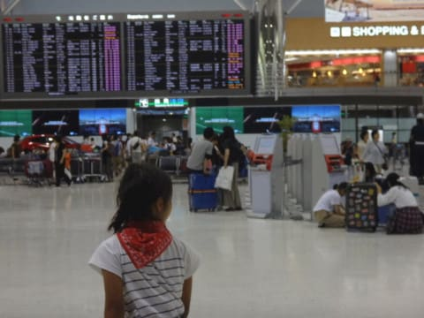
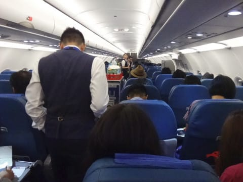
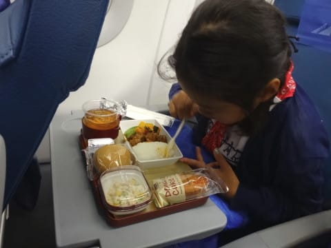
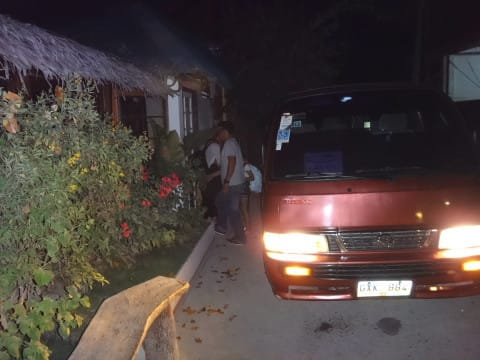

# 2016年8月　子連れで再訪！モアルボアル旅行記その１…いざ，出発！

📅 投稿日時: 2017-08-04 02:47:11

🏷️ カテゴリ: [ダイビング日記](ce3a7a8d424d112fce83ee85c81a0e344.md)

ということで．

8月中旬の，とある日．

いまから思うと，かなり職場がご無体な

状況だった，あのころ…

＃最近は，あの頃よりはかなりマシ

何とか取れた，3日間の夏休み＋土日での，5連休．

休み中に，会社から電話がかかってこないことを

祈りつつ，2度めの訪問となる，フィリピンは

モアルボアルへ出発となったわけですが．

今回利用するフィリピン航空のフライト．

出発が夜なので．

家を昼過ぎに出れば間に合います．

だもんで．

まさか，[前回の座間味の時のようなご無体](ed64b119f037a8b5c038e628d00d6627f.md)で

「ぁんだと？3連休だと…？

　…ふざけるな！

　初日の午前は出社しろ！このボケ！」

ってゆーこと，無いよね！？？

って，ちょっと心配してたけど．

幸い，そんなご無体は無く．

無事朝から出発できそう…（良かった）．

うむ．

ここしばらく土日もばたばた忙しく．

ダイビングショップでいろいろ買いたい

小物も買えずに過ごしてきたし．

時間のある午前中は，ダイビング用品店に寄って，

こんな感じの小物を買い込みましょうか…

（水中カメラのアーム用Oリング）

（レギュレータファーストステージのダストキャップ）

[この記事](ebaed76c573fa874eaa5aae948a48096f.md)で書いたように．

レギュレータのダストキャップの破損は

いろいろやばいので…

とりあえず，無事入手できて一安心！

その後，昼ごろに家を出て．

成田空港へ移動しますが…

娘は9歳にして，早くも10回目の海外旅行か…

なんてことだ．

私が初めて海外に行ったのなんて，

大学卒業してからなのに…

ってことで．

20:30発の，フィリピン航空．

セブ直行便に搭乗．

機体はA321ですな．

そして．

やはりいつも通り．

フィリピン航空の機体は，

機内エンターテイメントが無いですね（涙）．

娘もちょっと残念そうだったけど．

最近は国内線かフィリピン航空ばかりに

乗っているので．

エンターテイメントが無くても慣れっこな娘．

飛行機が離陸したのは，夜9時過ぎ．

いつもなら，こんな時間には寝ている娘ですが．

「機内食！機内食食べる！」

と．

なぜか，すごい楽しみにしているらしい

機内食が配られるまでしっかり起きていて．

嬉しそうに機内食食べてました…

ええ．

夜9時過ぎに，夜ご飯食べてますよ…

大人用のミールはこんな感じですが．

うむ．

日本発の便は，日本で作ってるからか．

意外とおいしいな…

ってことで．

飛行時間4時間ちょい．

食事食べて3時間ほどで，

あっという間についちゃいました，

セブ空港…

いつも通り，セブ空港で日本円から

フィリピンペソへ両替．

1円=0.4359ペソですから，

1ペソ2.2円くらいですか…

一時期に比べ，ペソがちょっと

安くなったかな．

ってことで．

両替が終わったら，もう現地時間の深夜1時近く．

ホテル送迎の車に乗り込み…

夜中のセブ島を走ること，約3時間．

現地時間の朝4時ごろ，ホテルに到着です…

…疲れた…

でも．

まだ終わらない．

明日の朝からダイビングなので．

ダイビング器材を準備しないと…（涙）．

ということで．

今朝ダイビングショップで買ってきた，

ちぎれたダストキャップを取り換えたり

カメラのアームのOリングを交換したり…

その他，ダイビング器材を準備していたら．

なんだか．

もう，朝5時なんですが…（涙）．

明日，朝7時から朝食で，

8時にダイビングショップ集合なんですが．

あと2時間しか寝れないのですが…（涙）．

という感じで．

休日というのに．

遊びに来ているというのに．

いつもの仕事をしているとき並みの

睡眠時間の短さに嘆くことになった，

Skier_Sだったのでした…

＃まぁ，飛行機や車の中でぐっすり寝てたので

＃仕事よりは楽だな
