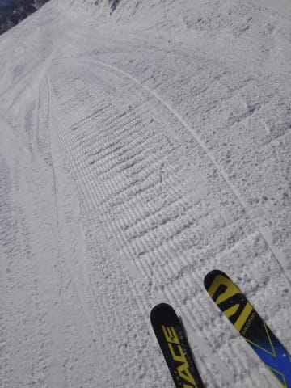
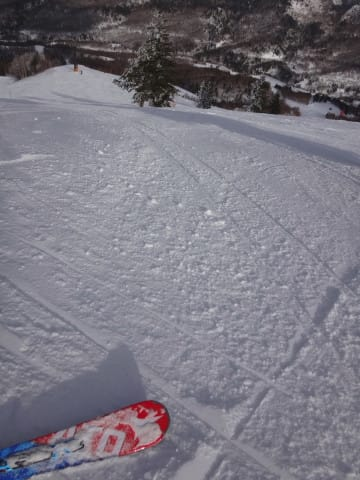

# 2月26日（日）の志賀高原詳細レポート！…木曜雨の影響で雪は固めだったけど，おかげで午後までフラットバーン．まーまー楽しめたかな～．

📅 投稿日時: 2017-02-28 01:20:41

🏷️ カテゴリ: [2017スキー滑走日記](c7d777cecfc91bdf0fa464ad62c6d49ab.md)

うーむ．

今週末は，3月2日から3日の木・金にかけて，

雪が積もりそうで．

で，週末はまた晴れてくれそうなので．

この週末は，いい感じかも…

＃あくまで今の予想天気図のままなら

…と，思っているSkier_Sです．

えー．

で，本日は．

昨日速報した，日曜の志賀高原．

詳細レポートです～．

まず．

朝．

昨日の固い斜面を隠してくれる雪が

ドサドサ積もっている奇跡を期待して，

外へ出てみると…

あう．

やはり，奇跡は起きなかったか…（泣）

積雪はわずか5mmってところでしょうか（涙）

で．

ゲレンデへ出ると…

山頂の気温は-9℃ですか．

まーまーの冷え込みですね．

そして．

山頂は…

うぉぉ！

ドピーカン！

…だけど．

天気はいいけど．

やはり新雪が積もってないので．

ちょいとゲレンデが固そうな気配…（涙）

でも．

滑ってみると．

ところどころ固いところはあるものの．

朝イチは，意外といいではないですか！

ところどころ固いところはあるけど，

結構なハイスピードバーンでたのしめるではないですか！！

と，気持ちよく数本滑ってたけど…

何本か滑って，シマシマが崩れてくると．

あり？

ありりりりり～っ！？？？

げ，ゲレンデが．

ゲレンデ全面が，氷コロコロバーン化

しちゃいましたよ？？（泣）．

そして，午前10時ごろまでは人も少なめでしたけど…

10時を過ぎると．

え？

あれ？

あれれっれれ？？

…そして．

10時半ごろには，ゴンドラ待ちは…

うぎゃーー！

10分弱待ち…（涙）．

久しぶりにこんなに待ったよ…

だもんで，第2高速に逃げると．

こっちはガラガラでしたね～．

で，混みこみ第1ゴンドラも．

11時に戻ってくると…

あら？

ゴンドラ，拍子抜けするくらいにガラガラに…

混雑ピークは，30分くらいだったかな？

そして．

昼休みタイムになると．

コース上も，すごいガラガラになってきましたよ…？

…本日，天気がすごく良かったけど．

その割には気温も昼間で-5℃と低めだったので．

おかげで，ゲレンデの雪が緩まず…

結構固くて，手ごわい感じのゲレンデ状況だったので．

午前中でみんな帰っちゃったのかな？

まぁ，もともと人がぐぐぐぐっと減る，

日曜の午後なので．

昼を過ぎると…

またコース上は，ゴーストタウン化し始めてます…

オリンピックコースは完全貸し切り状態！

＃ちょっと固かったけど

で．

焼額は，ちょいと固めのゲレンデ状況だったので．

焼額から脱出できないという「焼額の呪い」が

かかっている私が←いつも思うけど，なんの呪いだろう…？

ちょっとその呪いを解いて，奥志賀へ足を

延ばしてみました…．

やってきたのは，第2高速ペア沿い．

エキスパートコース．

あれ？

焼額より，雪がいいかな？？

まぁ，ところどころ固いところが

あるものの．

…タイミングによっては，人がいない貸し切りバーン！

これはいいなぁ…！！

と，滑っていたら．

午後2時ごろに．

太陽がうっすら雲に隠れて…

あら？

雪が舞ってきましたよ？？

…これは，アイスバーンが隠れるほど

積もってくれるか？？？

…って期待したけど．

当然，そんな積もるわけはありません（泣）．

じきに晴れて…

をを！

人が減ってるよ！

これは…

ホントに完全無人バーン化してますね…（笑）

ということで．

タイミングを選べば誰も滑ってない

状態だった，エキスパートコースを

何本かいただいて…

そして．

やはりホームゲレンデが焼額なので．

午後3時ごろにはちゃんと焼額に戻る，律儀な私．

いやーーー！

焼額のGSコースも貸し切りじゃないですかっ！！

誰もいないじゃないですか！！

ちょっと雪は固めだけど…

というか，かなり固いところも

あるんだけど（ちょっと涙）．

固くて，普通の人は手ごわいと思うだろうけど．

…でも．

そのおかげで．

夕方まで，全くコブになることなく．

コース全面完全フラットバーンをキープ！！

[コブコブ地獄の先週](e55977ec006f9e36e1649bc00625f1970.md)と真逆だよ！

素晴らしい…

リフトストップまで，ここまでの

フラットバーンをキープするって…

そうそうないことだよな～…

ちょいとゲレンデは固めではあったものの．

完全ツルツルアイスバーンというわけでもなく，

ある程度エッジの引っ掛かりもある，ザラッとした

感じの雪だったので．

エッジが手入れしてあって，固いのが好きな人なら．

結構なスピードで飛ばせるバーン状況なので．

そこそこ楽しめるなぁ…

と，思いつつ←あなたはどんなバーン状況でも楽しいんでしょ

…いつもの16:30のリフト終了まで，

しっかり滑り続けた，Skier_Sなのだった…

でも．

やっぱりこの時期．

もう少し柔らかい雪で滑りたかったかな～…

## 💬 コメント一覧

### 💬 コメント by (Goku)
**タイトル**: Unknown
**投稿日**: 2017-02-28 08:51:00

二日間、お世話様でした。

硬めのコンディションでしたが、楽しかった～！

ナイターは皆でワイワイしながらで、特に楽しかったです。

また、来週ヤケビで。

### 💬 コメント by (Skier_S)
**タイトル**: Gokuさま
**投稿日**: 2017-03-01 03:57:06

土日はお世話になりました～！

おかしな4人組が揃ったナイターは

にぎやかで楽しかったですね（笑）．

今週末はコンディション良さそうです～！

また今週末！

