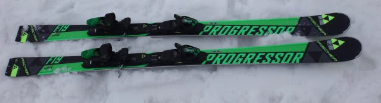

# 再開！2016シーズンモデル，スキー試乗レポート第14回…FISCHER編その２

📅 投稿日時: 2015-04-22 01:39:47

🏷️ カテゴリ: [スキー板試乗](c0bd8048615710cee890e403a36cc9a2b.md)

えー．

まだ続きます．

2016シーズンモデルのスキー板の試乗インプレッション．

本日は，フィッシャーの2機種です．

では，どうぞ～！

○FISCHER RC4 Worldcup SC Racetrack 165cm

基礎小回り．

[前回のSUPERIOR PRO](e9b0347050b82960c3f6598f32982dbb8.md)より

一つ上の，基礎用小回りのトップモデルになります…

RACETRACK自体は去年から変わっていないみたいですね．

履いた感じは…

結構いいですね～．

トップからテールまでのしっかりしたグリップと，

比較的元気な感じの板の張り．

ばね感が強く，粘りがあるフレックスの板です．

踏み込むと適度な反力でたわんでいき，

乗り手が仕掛けるたわみ量のコントロールで

半径が作れます．

ずらすことなく，しっかりとしたたわみ＆グリップによる，

エッジにきれいに乗っての小回りで回っていけます．

この時，板にばね感があって圧が溜まる感じがあり，

さらにそこそこ速い返りがあるので，

溜まった圧をテールに抜いていく小回りができます．

小回りはすごくいい感じ．

荷重ポイントはセンター，わずかにトップ寄り．

フレックスにたわみ止まり感が有り，

しっかりした強さがあるので，

あまり強く仕掛けなければ，ある程度大き目の

ターンサイズも作れます．

小回りベースのゲレンデ履きオールラウンドとして，結構良さそう…

○FISCHER PROGRESSOR F19 TI Racetrack 163cm

オールラウンド．

RC4シリーズ（大回り用RC，小回り用SC，オールラウンド用SUPERIOR)

より，一つ下のラインとなるPROGRESSORシリーズ．

このPROGRESSORの最上級モデルで，

Tiのメタルがしっかり入った板になります．

サイドカーブは複合ラディウスらしく，

トップ側16m，テール側12mみたいですが…

今回の柔らかめ春の雪では，結構いい感じですね～

センター75mmと幅が広いので，柔らかいザブ雪でも

浮力を感じ，楽に滑っていけます．

フレックスはRC4 SCほど強くありませんが，

フレックスの粘り，返りの強さ，ばね感といったところはSCと近い

気持ちよさがあります．

SCと同じく，この板も適度なばね感で，たわみ量が

コントロールしやすい板です．

トップのエッジグリップがしっかりしていて，

まずトップのグリップで板の向きが変わり，

そのあとにテールのたわみでしっかりターンが続く感じで，

操作性もGood．

170cmだと思って履いたのですが，あとで写真を

見返すと，163cmだったようですね…

履いた感じ，振動吸収性も強いからか，結構な安定感もあり，

そこそこのスピードでも耐えるので，170cmだと信じて履いて

違和感がなかったほど．

163cmでも小回りスペシャルになることなく，長めの

ミドルまで問題なくいけます．

普通にゲレンデで履く分にはロング～ショートまで問題ないかな．

…RC，PROGRESSORともに，結構いい板です．

いい板なんですが…

もう少しこのデザイン，何とかならんか…
