# 2019年8月，4度目のモアルボアル・小6の娘Cカード取得1周年！その12…午前中のダイビング2本目は，カメさんパラダイス

📅 投稿日時: 2020-08-11 00:28:40

ということで，

つい先日，1年点検でスバルディーラーへ

行ってきて，新型LEVORGの情報を

もらってきたわけですが…

そのほかの情報として，Gokuさんがコメントして

くださったように

「10月更改の次期C型フォレスターでは，

　2.5Lは無くなります．ガソリン車は全て

　LEVORGと同じ1.8Lエンジンになります」

「LEVORGよりもフォレスターの方が

　実車の到着が早いと思うので，

　1.8Lエンジンにまず乗ってみたいなら

　フォレスターの方が先に試乗できると

　思います…」

とのことで，次のC型フォレスターも

どうなるか興味津々ですね…！

さらに同じく10月には，

「インプレッサにもe-BOXERが載ります」

という，XVとインプレッサのE型への

年次更改も行われる予定で…

「なんでこんなに一気に全部モデルチェンジ

　するんですか？」

と聞いたところ．

「燃費規制上の問題で…」

とのことらしく．

2020年9月からのWLTCモードでの

排ガス・燃費測定義務化に合わせて，

みんなモデルチェンジすることに

したようです…

なるほど．

それで，各車の燃費を良くするために

LEVORGの2L廃止，

フォレスターの2.5L→1.8L化，

インプレッサのe-BOXER追加…

等も同時に行うわけですね…

ってなことで．

車系の余談の後は，本題の

ダイビング旅行記です～！

ーー

ということで．

本日朝イチの1本目が終了して，

ボートの上に戻ってきましたが…

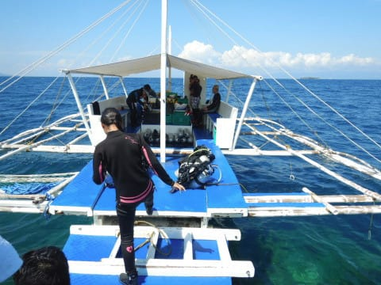

2本目までの水面休憩時間確保のため，

ボートをちょっと移動させて，

休憩タイムです…

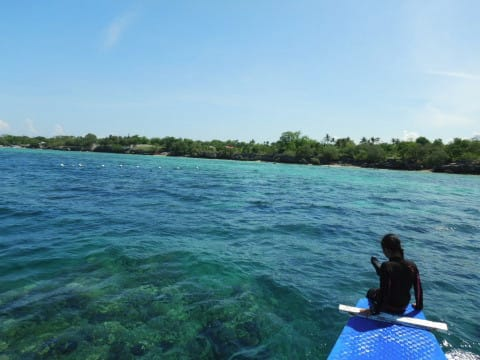

休憩タイムは，みんなでボーっと

海を眺めて過ごしてましたが．

この南国の太陽に照らされた，

ダイビングの合間のくつろぎタイムも，

バケーション感たっぷりで大好きです…

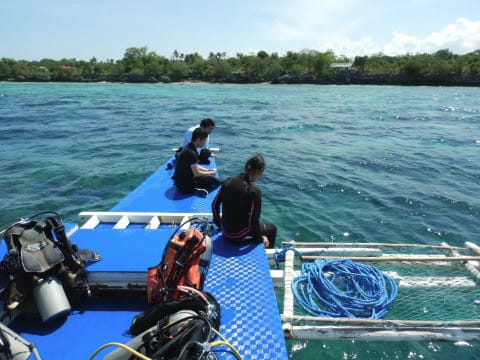

のんびりタイムの後は，2本目のポイントへ

移動開始！

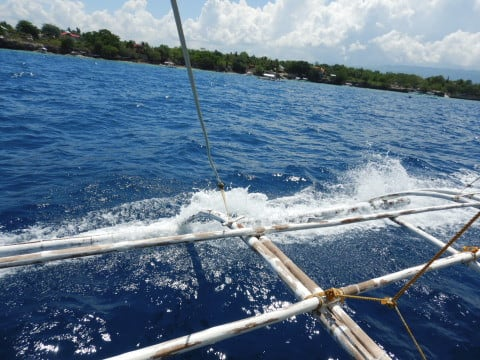

2本目のポイントは，

場所はショップを挟んだ反対側なので，

来た道を戻り，さらにショップの

前を通過して．

さらにボートで走ること，20分ちょい．

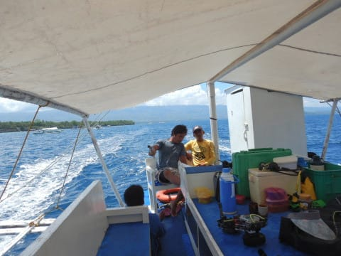

やってきたのは「トブレサンクチュアリ」．

1本目の「トンゴサンクチュアリ」と同じ，

漁業が禁止されている禁漁区なので，

どちらもポイント名に「サンクチュアリ」

とついていますが…

ここも，海がきれいですね～！！

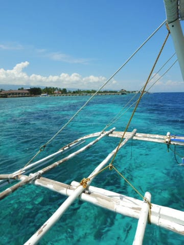

ってなことで．

2本目のブリーフィング．

この2本目も，さっきの1本目と同じ

チーム分け．

我が親子3人組は店長の小見山さん

ガイドのようです…

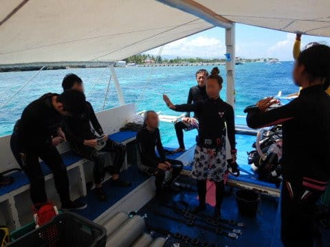

ってなことで．

いざ2本目へ，エントリー！

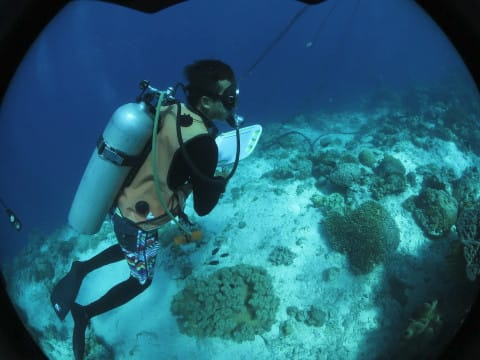

エントリー直後に，いきなり目の前に

出てくるアオウミガメさん…

もう，昨日からウミガメはおなか一杯

ってほど見てますが．

娘も私もまた写真撮ってます(笑)

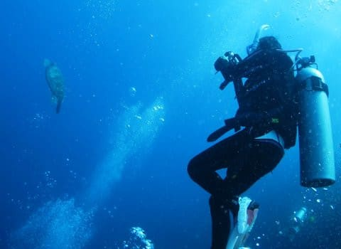

また，ドロップオフの壁沿いを流して

行くと…

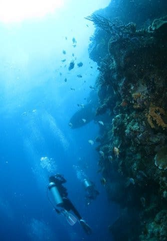

ガイドの小見山さん，娘にいろいろ

見せてくれてますが…

チャコールダムゼル，

直訳すれば

「墨のスズメダイ」って感じですか…

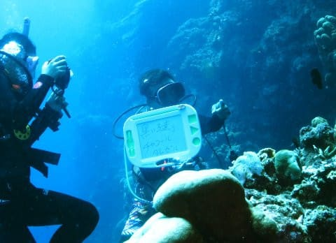

見せてもらったものを，必死に

撮影する娘．

…ちょっと離れたところから撮影

しているけど，ちゃんと写ってるかな…？

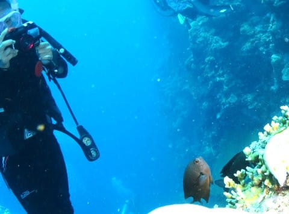

また，次も何か見せてもらってる

ようですけど…

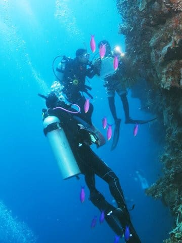

これは，おめめが真っ赤なアカメハゼですね…

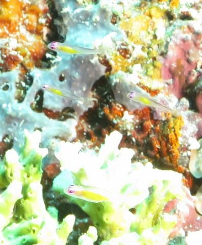

スケルトンボディに，ワンポイントのような

赤い目がきれいです．

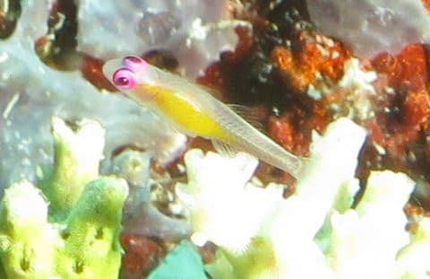

こちらの青くメタリックに

輝いてるのは，ルリスズメダイの仲間，

スプリンガーズダムゼルですかね…

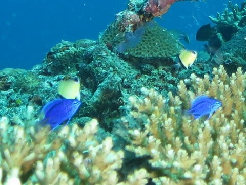

ガイドの小見山さん，さらにいろいろ

娘に見せてくれてるようですが…

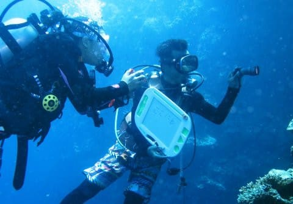

今度は，ニシキフウライウオ！

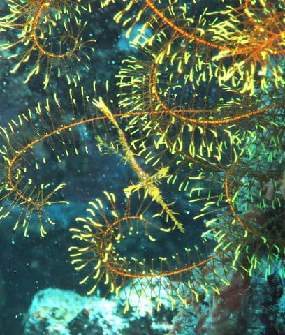

さすが店長の小見山さん，次から次へ

いろんなものを見せてくれます…

で．

さらに泳いでいくと．

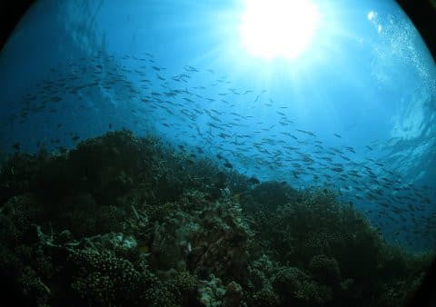

また，岩の陰に何か見つけたようですが…

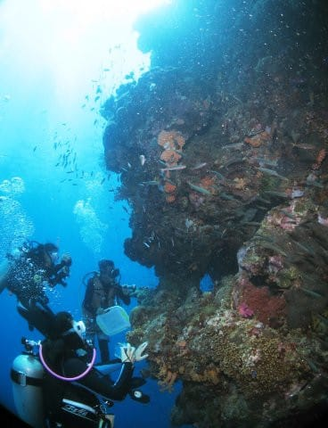

…うわ．

また，まるまると太った，

アオウミガメがいますね．

相変わらず，ダイバー無視状態で

くつろいでいるこの貫禄…

そして．

この2本目．

これから後に，私がかつて見たことが

ないようなウミガメ祭りが

まだまだつづくのだった…

（ダイビング2本目，まだまだ続く）
