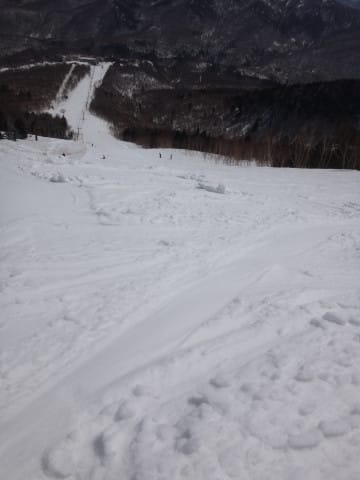

# 4月29日，GW初日の志賀高原は…朝は晴天だけど，雪は緩み気味．午後はいきなり雪！重くて前が見えない（涙）

📅 投稿日時: 2017-04-29 22:21:00

はい．そうです．

ゴールデンなウイークが，ついにやってきました！！

＃私は一日前に突入してましたが…

ということで．

ほとんどの人にとって，GW初日の今日．

志賀高原はどんな感じだったか．

早速レポートに行ってみましょう…！

まず．

本日朝も，凍結も何もないドライな道路を，

快適にのぼってこれた志賀高原．

朝イチは奥志賀スタートとしますが…

をを！

かねてより噂には聞いていましたが．

奥志賀高原，GWの次の週まで延長営業

するようです！（ぱちぱちぱち）

…でも，第2，第3ペアのみか…

ゴンドラが動かないのがかなり残念．

＃積雪量的に，十分行けそうな気がするんだが…

ということで．

奥志賀ゴンドラに乗ると…

いやーーーー．

本日も晴天ですなっ！！！

…でも．

そのおかげで，

山頂の気温は，朝8時ですでに+6℃ですか…（涙）

おかげで，山頂のゲレンデは…

早朝営業をやっていたというのもあり．

朝8時には，もうかなりやわらかい，板が

潜っていく感じの雪で．

…ちと残念な感じ…

＃朝イチの一の瀬はカチカチだったらしい…

＃硬いのがいい人は，西斜面で朝日をあびない

＃一の瀬がいいかな

だもんで．

ゆるゆる雪のゴンドラ側，ダウンヒルコースは

1本だけにして．

ペアリフト側，エキスパートコースへ！

こっちもやわらかめだったけど．

東向きで朝日を浴びるゴンドラ側より，

北側のこっちの斜面のほうが多少緩みが

少なく．

結構気持ちよく飛ばせるよ！

朝のうちは人も少ないし…

柔らかいバーンだったけど，

かなり快適に大回り可能！

そして．

今シーズンは．

日が差してても，張り付く雪にならず．

第2ペア下側の緩斜面も，板がちゃんと走る！

いやーー．

ちょっと雪が緩めだけど．

ひどいコブになってしまうような，

新雪のように板が潜ってしまう

ざぶざぶではないので．

今シーズンは恵まれてるな～．

…しかし．

暑いというほどではないにしろ，

気温は高く，

雪はかなり緩みはじめ．

さらに，ゲレンデの人が増えてきたので．

午前10時近くには…

あら…

やっぱり，雪が荒れ始めましたか…（涙）

10時半を過ぎると…

あぁ．

もう，大回りは厳しい感じですね…

＃でも意地で大回りしてたけど

そして．

12時ごろには．

雪はねっとりクリーミーな，かなり

重くて疲れて滑りにくい雪になってしまい…

そろそろ疲れてきたなぁ…

…

…という，そのとき．

あれれれ？

ゲレンデにはまだ日が差しているのに，

いきなり空がどす黒い雲に覆われてきましたよ…

…と，思ったら．

降ってきました．12時半ごろ．

パラパラと…

それが，なんと．

雨ではなく，雪です！

なんと！

こんな高温の昼間に．

雨ではなくて，雪が降ってきましたっ！！

…で．

このとき．

一気に気温が下がっただけではなく．

一気に風も強くなったので．

何度もゴンドラが止まるようになり．

さらに，午後1時過ぎに案内放送で…

強風で，第2高速ペアとゴンドラが天候回復待ち

という案内が…（涙）

そして．

さらにそのあと．

なぬ！？？

13:30から，ゴンドラ・第2高速ペア・第3高速ペア

が全部運休？？？

ががががががーーーん．

これは…

速攻で一の瀬に移動だ！！

…ということでやってきた

一の瀬エリア．

こちらは，風もそれほど激しくなく．

穏やかですな…

正面バーンは，この時間になっても結構フラット！

午前中は，かなりバーンが硬かったので．

まだそれほどひどく荒れてないようで…

…うむ．

バーンコンディションは，奥志賀よりいいかも？？

パーフェクターコースも，

取りつき部の土がかなり広がったものの…

でも，今日は圧雪が入って，

午後2時でも，結構フラットでいい感じ！

と，一の瀬を楽しんでいたら．

…なんだか．午後3時ごろ．

いきなり雪が激しく降り始めてきたのですが！？？？

かなりの勢いで降り始めてきたのですが？？？

GWの午後に，こんな勢いで雪が降って

いいのだろうか…！？？

…ただ．

この雪．

決して嬉しくはなく．

かなり湿った雪なので，ウエアにつくと

びしょ濡れになるし…

そして．

板の滑りが激烈に悪いんですけど…（涙）

さらに．

視界は悪くなるし，

そのうえゴーグルに張り付いて，

さらに前が見えないし…（涙）

雪はもう，水を吸った重い雪と積もった雪の

まだらで，強烈に滑りにくいよ（泣）

この雪．

一見きれいな新雪に見えますが．

板で1cm掘ると，下はこんな感じ．

滑りにくい…（涙）

ということで．

あっという間になんだか冬の景色になってしまった

一の瀬．

濡れるは，ゴーグルに張り付いて前は見えないは，

前が見えないのに雪が新雪と水を吸った雪のまだらで

滑りにくいは…

さすがの私も休憩を取ってしまうほどだったので．

今日の午後の，この雪が．

今シーズンの一番の試練だったかもしれません．

しかし，雪が激しかったのも1時間ほど．

午後4時の，リフト営業終了間際．

をを！

雪がやんできました！

日が差し込んできましたよ！

…雪は相変わらず滑りにくいけど．

でも．日が差したラストのゲレンデ．

かなり滑りにくい雪質だったけど．

また，夕日が山々を染めるラストまで，

しっかり滑り込んだのでした…

いやー．

しかし．

雪が降ってる間でも，気温は+3℃程度だったのに．

なんでこんな気温で，雨じゃなく雪になったのか…

うーん．

大きな声で言えないから．

小さい声で言うけど．

また天気予想を外してしまったようです…（涙）

PS.本日の夕方の雪で，道路はウェットになっています．

　明日の早朝冷え込むと，そのまま凍っているかもしれない

　ので，朝早くは十分ご注意を…

## 💬 コメント一覧

### 💬 コメント by (Seeker)
**タイトル**: 午前中
**投稿日**: 2017-04-29 23:54:37

午前中、ありがとうございました。お別れした途端、雨雲が…。なんか不思議な力を感じた瞬間でした。

明日は暑くなりそうですね。きっと朝からザブザブの雪を覚悟でエキスパグルグルの予定です。

### 💬 コメント by (KENKEN)
**タイトル**: 座間味にて
**投稿日**: 2017-04-30 07:24:45

昨日から夏モードに入りました。

天気はいいのですが、座間味の水温22℃。

体感的にはスキーより寒く泣きそうでした(T^T)。

但し、なんとマンタ(2枚)と遭遇。

興奮しまくりでした。ε=ε=(ノ≧∇≦）ノ

あと2日楽しんで帰ります。

Sさんも春スキー堪能下さいm(._.)m。

### 💬 コメント by (Skier＿S)
**タイトル**: あしたは…雨？？
**投稿日**: 2017-04-30 21:28:19

＞Seekerさま

昨日＆今日の2日間，ご一緒いただき

ありがとうございました～！

今日はあれからもエキスパグルグルされて

いたんでしょうか…

またこれからもよろしくお願いします～！

＞KENKENさま

そちらは完全夏モードのようですね…

しかし，座間味って，マンタポイントなかったと

思うので，たまたま通過したマンタを目撃，

というパターンですか？？

あと2日間，楽しんできてください～！

