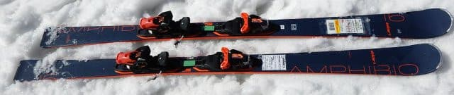
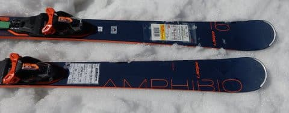
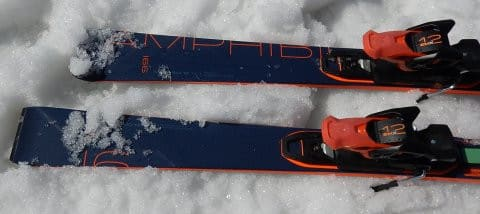
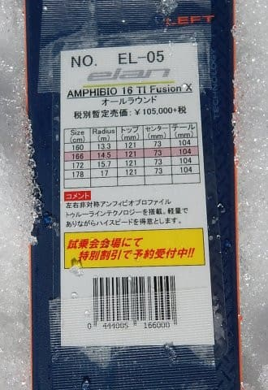

# 2020シーズンモデルのスキー板，試乗レポート…ELAN編その２

📅 投稿日時: 2019-06-17 00:23:56

🏷️ カテゴリ: [スキー板試乗](c0bd8048615710cee890e403a36cc9a2b.md)

ってな感じで．

超久しぶりに，スキーにも行かず．

仕事もしなくていい週末．

…すごい久しぶりに，娘と一日遊びに

出掛けていたのですが．

娘がまだ喜んで父親と一緒に遊んでくれることに

ちょっと一安心している，Skier_Sです．

いや，スキーには結構一緒に行ってるんですけど．

最近は娘の方が速くて置いていかれることもあり．

あんまりゲレンデで一緒に滑ってないので…（涙）

…しかし．

娘も小学校6年生．

もう母親と同じくらいの身長になってしまい．

靴のサイズなんかはもう母親より大きく

なってしまったので．

そろそろジュニア服やらジュニアの靴では

サイズが合わなくなってきました…．

来シーズンは娘のスキー板とブーツを買わなくては

ならないのだけど．

ジュニアの靴＆板ではもうダメかも…

大人用の板とブーツだと，高くつくんだけ

どなぁ…（泣）←自分用は高い道具を買っているのに，娘用はケチるのか？？

ってなことで．

娘の道具代はケチろうとしているのに．

自分用はいい板を履きたい…という

欲望のままにいろいろ試乗してきている

わけなので．

今日も行きます，2020シーズンモデルの

スキー板試乗レポート．

本日は，ELAN編です．

ってなことで．

試乗レポート，Go

○ELAN AMPHIBIO 16 TI FusionX 166cm

オールラウンド．

ELAN独自の，左右非対称形状の板である

AMPHIBIOシリーズ．

3シーズン前までは，競技用も左右非対称の

AMPHIBIO形状でしたが．

昨シーズンからはAMPIBIOシリーズのみが

左右非対称になったようです…

で．

AMPHIBIOシリーズは，8，10，12，14，16，18…と，

6種類ラインナップされるようですが．

今回試乗したのは，上から2番目のモデルの「16」です．

長さが166cmで，サイドカーブが14.5mという．

ショートもできる長さだけど，サイドカーブは

ミドルっぽい感じで．

ギンギンな小回り板ではない，オールラウンドな

サイドカーブの板ですね．

滑ってみたところ…

春の午後の緩んだ雪が蹴散らされた荒れた

コンディションでも，板が叩かれたり

暴れたりすることなく，すーっと滑らかに

滑り降りられます．

かなり振動吸収性がいい感じ！

荒れた斜面では，結構いいかも…

で．

さすがアンフィビオ形状なので．

角づけをしていくだけで，非常にきれいに，

内足も揃った感じで，

パラレルのカービングで回っていきます．

サイドカーブに乗ってきれいに

円い弧を描いていきます．

何もしなくても，角を切り替えるだけで

すいすいターンする感じ．

昔のアンフィビオ形状時代のSLXだと，

ここで強制的に小回りに入っていくんだけど．

さすがにこの板はサイドカーブがそこまで

きつくないので．

板なりに滑っていくと，ミドルターンっぽい

感じのカービングに入っていきます．

フレックスも意外と強いので，

スピードが上がって行っても，

小回り強制マシーンにはならない感じ．

ゲレンデで滑るにはちょうどいい感じの

中回りくらいの半径で，きれいに丸く

回っていきます．

荷重ポイントは，比較的後ろめかな．

山回りで，かかとの後ろに荷重していく感じ．

板のアウト側がロッカー形状ってのも

あって．

ロッカーっぽい懐かしい乗り味ですね…

今から考えると，ちょっとクラシカルな

乗り味だけど，

何にしろ角づけをするだけで，きれいに

左右が揃ったレールターンのような感じで

かなり深い弧が描けていくし．

意外とフレックスは強く，スピード耐性も

十分．

…ズラシのコントロールはあんまりやろうとは

思わないけど．

ズラすこともできるし．

結構レベル高い人が，普段の気楽なゲレンデ履きとして

使うには，ありな板かも…

## 💬 コメント一覧

### 💬 コメント by (炎の北海道民)
**タイトル**: Unknown
**投稿日**: 2019-06-18 20:46:43

こんばんは。

私もこの板を試乗しましたが、軽快な操作性と自然なたわみを感じられて好印象でした。仰るように意外とフレックスもシッカリしてるんですよね。ELANは地味に良いなぁと感心しました。ELSN SLXはショート板では一番良かったです。

### 💬 コメント by (Skier_S)
**タイトル**: ＞炎の北海道民さま
**投稿日**: 2019-06-19 01:07:24

ELANのSLXは履けなかったんですよ…

ちょっと残念．

ELAN，いい板なので，基礎用と謳ったDEMOモデルを作って，

技術選に選手を送り込んだりして，もう少し基礎シーンに

売りこめば，もう少しメジャーになる気がしてます…

### 💬 コメント by (musi)
**タイトル**: Unknown
**投稿日**: 2019-06-19 06:35:00

雪のある時期は毎日、場合によっては日に2、3回も覗きに来ているのに、すっかりご無沙汰してしまっていて、なんだか申し訳ないムシです。三年生の息子は、早くもスキーに一緒に行ってやる感が出始めていて、涙目なのです。

成長は嬉しいですが、さみしさもありますね。

私のスキーの技術は成長しないのですが。

### 💬 コメント by (Skier_S)
**タイトル**: Unknown
**投稿日**: 2019-06-20 08:51:00

>musiさま

もう一緒に行ってやる感まんまんですか…

ちょっと寂しいですね。

うちは焼額朝礼メンバーに子供がたくさんいるので、

子供同士で滑るのを楽しみにして、喜んでついてきてくれます。

そのかわり、子供が誰も滑ってないとテンションだだ下がりですが…

