# 12月21日の志賀高原は…惜しい！昨日の湿雪が，惜しすぎる！

📅 投稿日時: 2014-12-22 01:42:10

🏷️ カテゴリ: [2015スキー滑走日記](c09ea645cfc085f86dfcd80f49599dd89.md)

ってことで．

日曜も志賀高原で滑っていたわけですが．

朝の天気は，曇り．

…前日からの積雪は．

意外と少なく，このくらい．

10cm無いくらいですね…

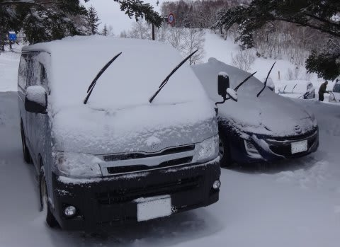

昨日の湿雪をカバーしてくれるほどの積雪は期待できないか…

残念．

そして．

今日は．

ついに．

今シーズン初の，焼額第1ゴンドラへ！

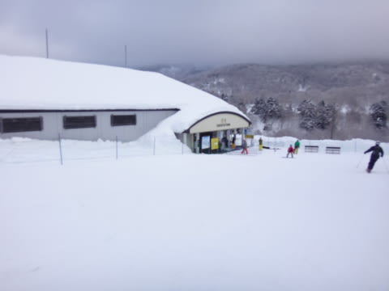

いやー．

久しぶりの第1ゴンドラ！

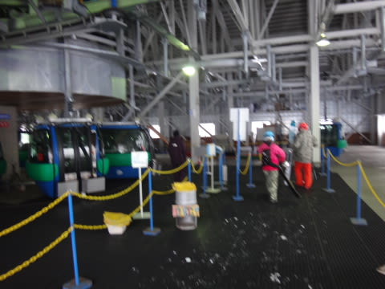

この案内板も久しぶり！

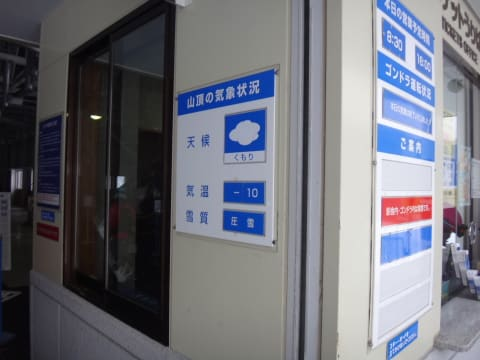

そして…

第1ゴンドラと言えば，この温度計．

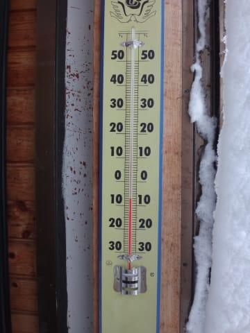

朝の気温はマイナス7度と，この時期としては

平均的なところか…

で．

朝イチの天気は，うっすらと日も射し…

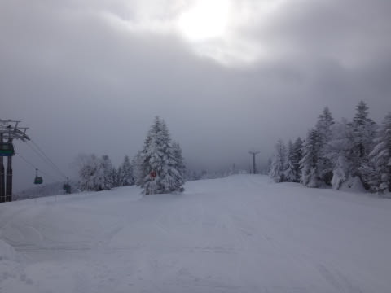

そして，ゲレンデの雪質は…

こ，これは…

…これは，最高ではないか！

昨日の湿雪の影響は，ほとんどないよっ！

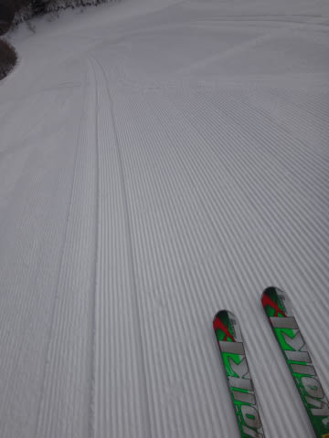

もう，やっぱり焼額第1ゴンドラの，

朝イチは最高！！

うはははは！

帰ってきたよ～！

第1ゴンドラっ！！

と，雄たけびを上げながら滑っていたのも，わずか3本ほど．

その後…

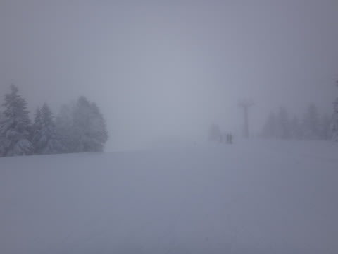

あれれ．

ガスってきちゃった…（涙）．

そして．

午前10時過ぎには．

娘も出動してきたので，

一の瀬方面で娘と滑りますが…

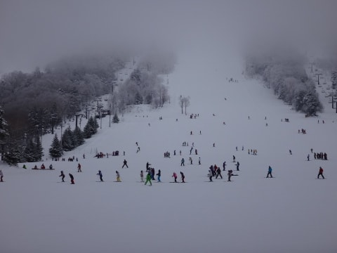

一の瀬は，修学旅行生で混んでるよ…

なので．

私にしては珍しく．

寺子屋方面へ移動してみますが…

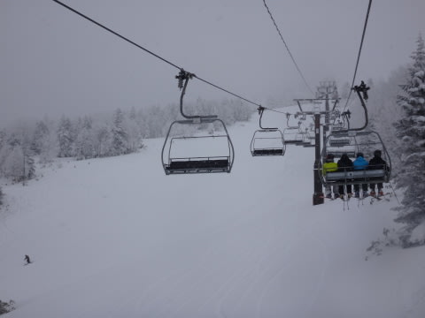

おお！

さすが，寺子屋方面，ガラガラ！

雪質もいいぞ～！

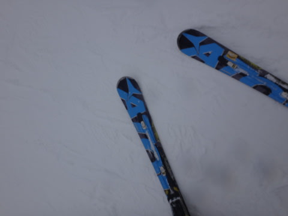

と，コース脇の新雪へ突っ込んでみたところ…

あれ？新雪なのに，板が潜っていかない…

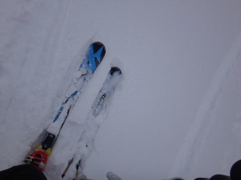

あれれれれ…

なんだ，これ？

完全に，クラストしてるんですが…

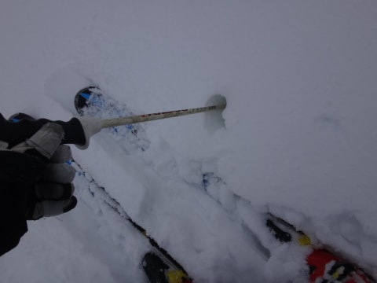

寺子屋でも，昨日の湿雪の影響が大きかったのか．

昨日の湿雪が積もったと思われる部分が，薄い層状に凍っています…

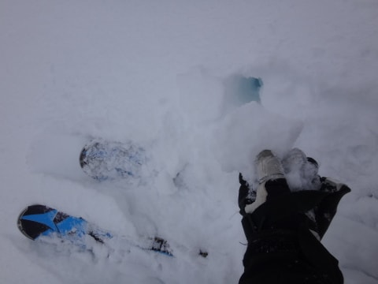

…残念．

昨日まではコースわきのパフパフが

楽しめたけど，今日はコースわきの非圧雪部分は，

全面クラスト状態…（涙）

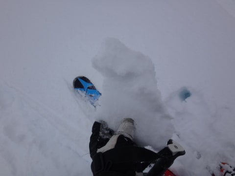

まぁ．

ついでなので．

東館山～ブナ平へ移動してみましょうか．

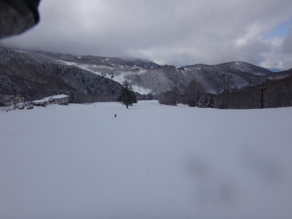

…なんだか．東館山の途中から，斜面がアイスバーンっぽく

なっていき．

ブナ平では，かなり硬いコロコロやピステン跡が

いっぱい出てきちゃったんですが…（残念）

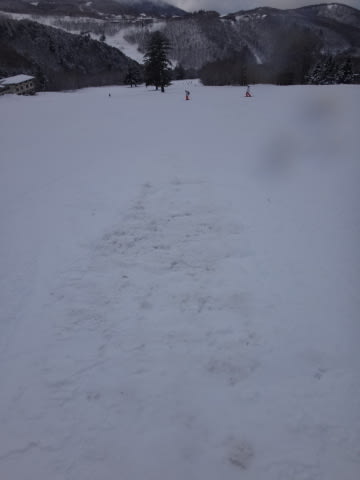

なんだか．

このあたりの標高では，昨日は完全に雨っぽかったみたいで．

リフトの手すり，しずくがそのまま凍ってました…

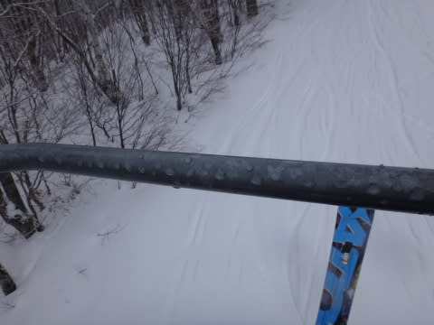

うーーむ．

焼額はぎりぎり雪だったので，朝イチの第1ゴンドラは

雪質最高だったけど．

かなりきわどい感じだったんだな…

って感じで．

終日曇り空の天気だった，本日．

標高の低いところはイマイチの雪質だったけど．

一の瀬から上の圧雪バーンは，雪質も良く．

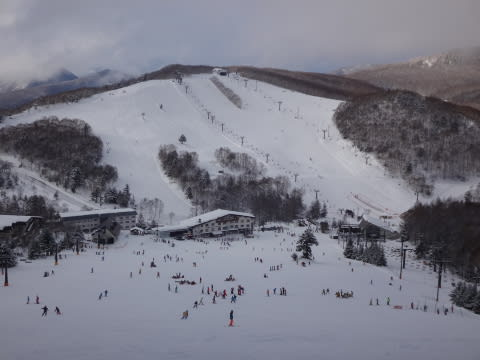

娘は今日も

「帰りたくない～！まだ滑る～！！」

と訴え続け．

…薄暗くなる，リフトストップまで滑り続けたのでした…

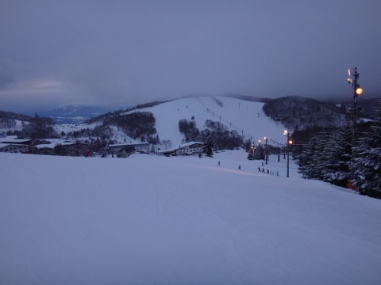

しかし．

午後4時半の，ホントのほんとの最後の1本まで

リフトに乗り続けられると，だ．

帰宅が深夜になっちゃうんですが…（涙）．

## 💬 コメント一覧

### 💬 コメント by (aqura)
**タイトル**: Unknown
**投稿日**: 2014-12-22 07:14:31

やはり、お嬢さんと一ノ瀬でしたか。焼額山の駐車場にレガシィがなかったもので…。焼額山はほぼ１日くも雲ってガスでした。あっ、私が食事中だけ、綺麗な青空がレストランから見えました(。>д

### 💬 コメント by (Skier_S)
**タイトル**: aquraさま
**投稿日**: 2014-12-22 22:49:33

娘と一緒に滑ってました～

一の瀬→寺子屋→東館山→ブナ→東舘→一の瀬

って感じのツアーで，娘は焼額に近寄らず（涙）．

私は焼額滑りたいのに…

明日はいい天気になりそうですよ！

