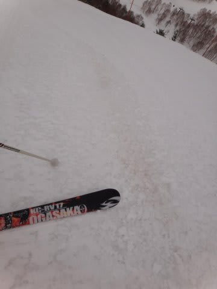
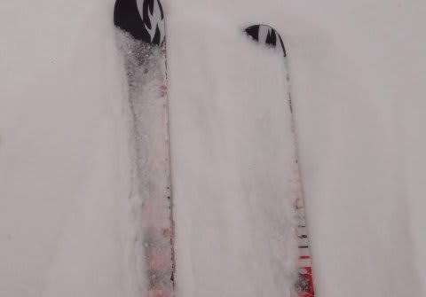
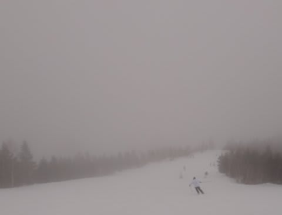
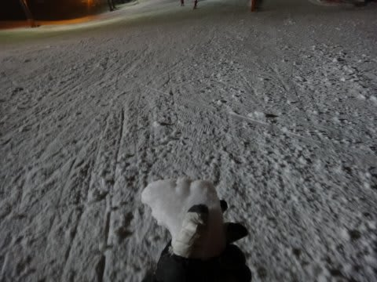
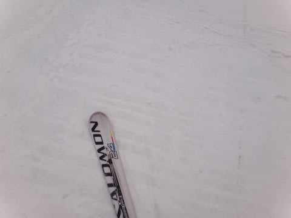
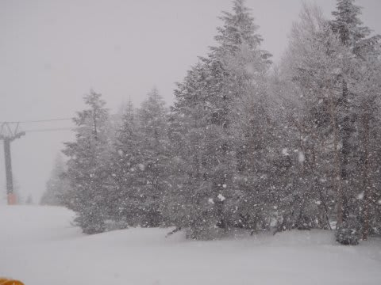

# 3月24，25日の志賀高原の状況速報

📅 投稿日時: 2012-03-26 00:54:48

🏷️ カテゴリ: [2012スキー滑走日記](cca3a0e9524e0203150f790b1fc3c71ad.md)

ということで．

9週間連続の志賀高原ですが．

この週末の焼額の状況をとりあえず速報です．

あーー．

土曜は．

朝，信州中野インターを下りると雨．

志賀高原のかなり上に登って雨がやっと雪に変わったくらいで，

スキー場はかなり湿った雪が降っており…

先日の雨の影響で，ゲレンデはしっとりと水を吸った雪の

上に，湿った新雪．

昼前になると気温が下がり，雪も小ぶりになりましたが．

気温が下がったおかげで，湿った雪が凍りつき．

急斜面ではアイスバーン様のお出まし（涙)．

緩斜面では，完全ザラメ化です．

ガスで視界は悪いわ，アイスバーンだわで

かなりデンジャラスなゲレンデでした…

端的に言って，あんまり楽しめない一日でした(泣）．

ナイターも，氷のころころが大量にばら撒かれた

じゃがいも畑状態．

うーーーん．

残念な一日だった…

日曜は，

気温は冷えたものの．

積雪はそれほどなく，

全体にアイスバーンちっく．

でも，うっすら数cm乗った雪が，何とか

ゲレンデコンディションを救いましたね…

日曜は昼間も気温が上がらず．

曇ったり時々雪がちらついたりの天気で日も射さず．

この時期にしては，雪が一日緩まずに済みました．

午後からは雪が結構降り出し，

この時期にしてはかなり良い雪質の雪で．

緩斜面のアイスバーンを隠してくれました．

うーーーん．

帰る時になって，かなり強く降っていたので．

明日は最高になりそうなんだけどな～．

…一日遅いよ(;_;)

## 💬 コメント一覧

### 💬 コメント by (マルハバ)
**タイトル**: Unknown
**投稿日**: 2012-03-26 18:02:32

シーズンイン前にコメさせていただいた

“Ｓプロ＆サロモンＸ3”の海・山両用オヤジです。

実は私も24日25日と志賀に行ってきました。

〇十年ぶりの志賀高原でした。

24日は学生時代の所属クラブのＯＢ杯ということで

寺子屋でポールを張っておりました。

午後から急激に気温が下がりはじめ、バーンコンディション

は良好だったのですが強風の中、まぁ～寒かったです（汗）

翌25日は早朝の降雪＆ガスもじきに晴れて、

念願の焼額を午前中いっぱい満喫しました。

青いゴンドラでスラロームバーン等を数本滑りましたが

Ｓさんがホームゲレンデとして通っていらっしゃるだけあり

面白いとても良いスキー場でしたね。

最後に志賀に行った時、まだ焼額はなかった（爆）

ので感動はひとしおでした！

実はＳさんがいないか？と

滑走中キョロキョロしてました。（笑）

過去の画像からご愛用マテリアルは把握してましたが

残念ながらそれらしい人物には出会えませんでした。(涙）

今シーズンも残り僅かとなりましたが

こちらのブログの天気予報記事はとても参考になりました

志賀ではなく他のスキー場ですがかなり助かりましたよ！

来期も期待しております。

長文のコメ失礼いたしました…（謝）

PS.

お嬢さんのスピードへの強さはすごいですね！

将来いいアルペンレーサーになりますよ、きっと！

### 💬 コメント by (Skier_S)
**タイトル**: 焼額にいましたか！
**投稿日**: 2012-03-27 01:33:22

焼額は広いですし，人も多いですから…

発見できる可能性はひくいだろうなぁ，と思います…．

しかし，以前行ったときにまだ焼額が無かったんですか．

私が生まれて初めて志賀に行ったときには，すでに焼額があったので

焼額が無い志賀高原は想像もつきません…

私の今シーズンは，まだあと3ヶ月くらい続きます．

まだまだ天気予想もスキー場レポートも続きますので，お楽しみに！

