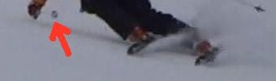

# 激戦の2017スキーシーズンを終えて，死に絶えていった我がマテリアルたち…

📅 投稿日時: 2017-07-12 02:13:04

🏷️ カテゴリ: [スキー雑談](c1f9d2cb7478308da16419928ea3945e9.md)

というわけで．

激戦だった今シーズンが終わったわけですが．

ええ．

やはり．

シーズンで4000kmくらい滑ってしまう私．←シーズン滑走「距離」で表す人はそうそういないと思う…

酷使に耐えかね，いろいろなスキー道具が

死に絶えていくわけで…（涙）．

とりあえず．

今シーズン死んでいったマテリアルの代表は．

実質[1シーズンももたなかった](e27e2a7149d362e76794896614d0f18f3.md)，[根性無しの'16SX](e922ef4eede2bd4d2b900bd4bf1b03156.md)でしょう…

…それも，単にヘタッたどころか．

今シーズン末には，[エッジが剥離](e47d1e19d01c13226c42e0d2378bfd4e1.md)して

しまったという…（涙）

なんと，ヘタるのが早いことよ…！（泣）←これだけ酷使されたのに根性無し扱いされて，むしろ板がかわいそうなのでは…？？

そして．

スキーグローブも，

シーズンで800回以上のゴンドラ乗り降りに

酷使されるわけなので．

二つあるうち古いほうは，もう，

ゴンドラ乗り降りで板を持つときに，

板のエッジでボロボロに切れてしまい…

何とかテープでぐるぐる巻きにして

使い続けていましたが…

（親指，人差し指，中指にテープが巻いてある）

これはもうダメですな…（泣）．

そして．

スプリンググローブも酷使のために穴が開き…

さらに．

ストックリングは擦り減っていき．

…って，他人に言うと

「ストックリングって，減るの！？？」

と驚かれますが．

逆に私は，

「皆さんはストックリング，減らないんですか！！？」

と，聞いてみたいところ…

みなさん，滑るとき，ストックは

引きずらないんですか…？？

…私は派手に引きずりすぎなのかもしれませんが…

そして．

スキーパンツにも穴が開き…

まぁ，スキーパンツのこの部分．

こんな感じで，エッジで飛ばされた雪が

もろにぶつかる所なので，

私のスキーパンツは，大体2シーズンで

ここに穴が開いて死んじゃいます（泣）．

ってことで．

今シーズンも．

歴戦の勇者（？）が，激戦に耐えかねて，

次々死んでいきました…（合掌）．

まぁ，板は['17SXがあるからいいとして](eda7898d5cb5580b1871f3cbef83241ac.md)．

そう．'17SXがあるからいいとして．

…スキー板以外のマテリアルを買いに，神田へ行かねば…

そう．板は買わなくて済むはずなんですよね．

板は，'17SXがあるから，買わなくていいはずなん

ですよねっ！！！←自分に必死に言い聞かせている

## 💬 コメント一覧

### 💬 コメント by (yama)
**タイトル**: 物欲選手権?
**投稿日**: 2017-07-12 05:37:20

まさか、この時期に物欲選手権ですか？先日ダイビング用品と同時にスキー用品や板も買ってしまったのでしょうか。(^^;

### 💬 コメント by (まいる)
**タイトル**: マテリアル
**投稿日**: 2017-07-12 06:55:55

Sさん、お疲れさまです(^^)

ずいぶん、マテリアルがぼろぼろになりましたねー

私もグローブがダメになってます。

補充は秋の神田スポーツ祭りまで待ってみてはいかがでしょうか？

### 💬 コメント by (しんちゃん)
**タイトル**: v.s.物欲？
**投稿日**: 2017-07-12 22:08:15

娘さんのグッズも揃ったし、いよいよＳ様ご本人の物を揃えますね～(笑)

小回り・大回り・太板の3本時代に突入するのか？

本当に板以外のマテリアルのみになるのか？

物欲選手権ネタの始まりですね。

'17SXポチった時はあっけなかったので、今回どうなるか期待しています。

### 💬 コメント by (Skier_S)
**タイトル**: ストレスが物欲に向かっている…！
**投稿日**: 2017-07-13 02:55:54

>yamaさま

いや…

最近異常に成長が早く．

今買っちゃうと，シーズンまでに大きくなっちゃうだろう

わが娘ですから．

娘のスキー用具は，シーズンイン直前に

買いに行くことにしました…

だもんで．この週末は，結局娘の海用具だけ

買い出しに行ってきました…

とりあえず，危険な街で物欲にさらされずに

済んでます（笑）

＞まいるさま

もう，スキー道具の消耗が激しすぎます…

秋の神田スポーツ祭り，私のシーズンイン後

なので，なかなかいくチャンスがなくて…

一度行ってみたいと思っています．

＞しんちゃんさま

ホントに必要な理想を言うと，小回り，大回り，太板，

コブ用，石ころ踏んづけてもいいシーズン終盤用の

5セットになるのかと…

グローブもパンツも買わなくてはならないので，

いろいろ散財しそう…

そして，車も13万kmを超えて，どこまでもつのやら…

### 💬 コメント by (YUMI)
**タイトル**: 発見の手掛かり（目印）だったのに・・・（困）
**投稿日**: 2017-07-15 14:17:05

Sさぁ～ん、お久しぶりです。

あの、可哀想なスキーパンツがSさん発見の決め手でした。

奥ゴンに乗った時、なにげに眺めていると次に（次発、上向き）乗る人の可哀想なスキーパンツを発見！「あっ！Sさんだぁ～」って。

来シーズンは何を目印に・・・？

プリン色の可愛い♪カメラでしょうか。。。　　

Sさん探しのハードル上がったなぁ～。。。

・・・ところで、Sさんは南半球には滑りに行かれないのですか？

水色のパウダースノーと湖を見下ろすゲレンデが・・・

### 💬 コメント by (Skier_S)
**タイトル**: YUMIさま
**投稿日**: 2017-07-15 23:04:06

お久しぶりです～！！

しかし，あのスキーパンツが発見の目印だったとは（笑）

ウェアのジャケットは3シーズン目突入予定で

変わりませんし，スキーパンツは，また同じ黒色を買うと思うので

（汚れが目立たないので，長持ちする）

ウエアの見た目は全く変わらないはずです…

また同じウェアを目印に探してください～！

ちなみに，昔は南半球に滑りに行きましたが，

今は海に潜るようになってから行かなくなりました．

なんてったって，高いんですよ…

南半球スキーは（涙）

