# 再び圧雪車に乗ってみた…今度はステアリング仕様のPB600に乗ったよ！

📅 投稿日時: 2019-01-18 03:17:02

えー．

[1月2日の志賀高原レポート](ee498a85981363c52a7ec92f94005fde9.md)で．

圧雪車の中からの写真があったことに

気づいた人が多かったようですが．

…そうです．

昨シーズンに引き続き．

今シーズンもまた，焼額スキー場が

開催している，

圧雪車乗車体験に行ってきました～！

この，圧雪車乗車体験．

[こちら](http://www2.princehotels.co.jp/page.jsp?id=108331)に案内がありますが．

焼額スキー場が小学生向けのイベントとして

やっているもので．

基本的には参加者は小学生に限定されています．

今回，Skier_Sが

「小学生です～てへ」

と，歳をごまかして参加したわけではなく．

わが娘がどうしても圧雪車に乗りたい，というのに

保護者としてしかたなくついて行ったことにしたのです！

で．

[昨年に乗った](ea23b31f14dd30fcd4173de7d0496ef2e.md)のは，ピステンブーリーの

PB400でしたが．

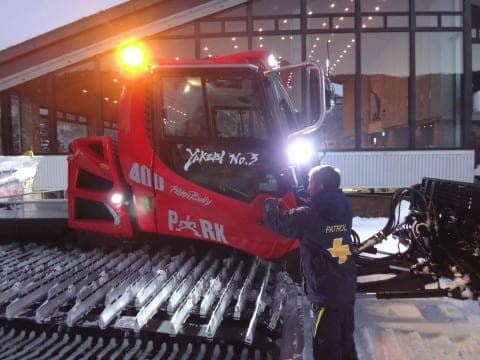

今年乗ったのは，PB600でした～！

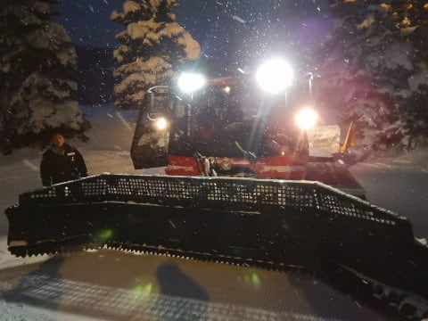

カミンズ社製370馬力ディーゼルターボ

エンジンを備えるPB400に対し．

上級モデルとなる，メルセデスベンツ製

400馬力エンジンを備えるPB600．

さて，その違いや如何に？？

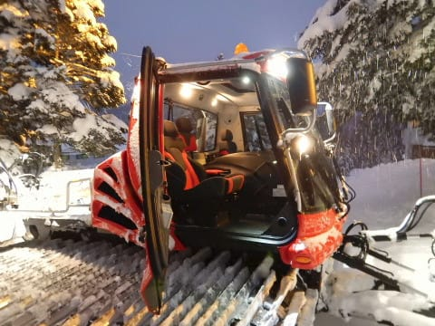

ということで．

さっそく助手席に乗り込み，

通常営業終了後の17時から，

ナイター営業開始の18時までの

圧雪作業に同行するわけですが．

まず，プリンス東館前を出発した圧雪車は．

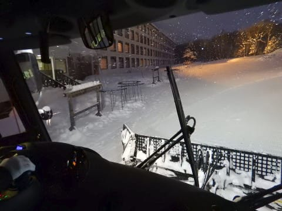

ナイター営業を行う，第3高速リフト沿い，

イーストコースに向かって進みます．

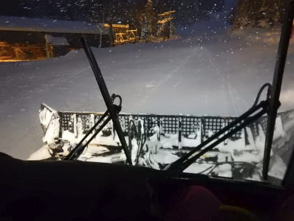

振り返ると，自分たちが走った後ろが

きれいに圧雪されてますね～！

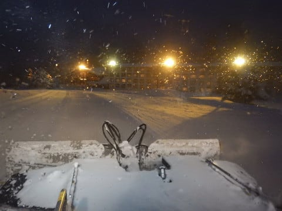

しかし，前回も思ったけど．

圧雪車のフロントガラス．

足元のブレードまでしっかり見えるような，

かなりの大きさ．

すごい視界がいいです…

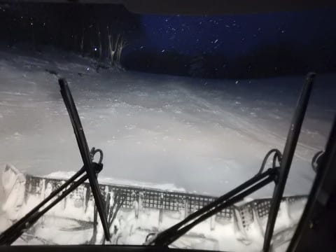

この巨大ガラスに熱線が入っていて．

さらにワイパーも，ブレードアームに

エンジンからの熱水が供給されて

凍らないようになってるし．

フロントガラスには，雪や氷が貼りつかない

ようになってます…

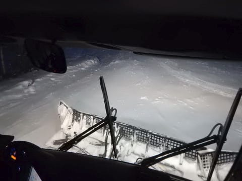

とりあえず，圧雪車はコースを何度も往復し，

昼間にスキーヤーに荒らされた斜面を，

ピカピカ圧雪に仕上げていきますが…

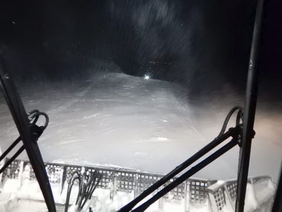

ブレードで雪を削るのは，なるべく

登りの時にやるようにして．

斜面の下に落ちていきがちな雪を，

斜面の上にもっていくようにするのが

基本操作だそうです…

ふーむ．

なるほど…

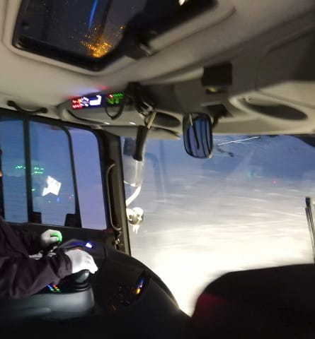

ってな感じで．

概ね均し終わった後．

今度は圧雪の隙間を埋めていき…

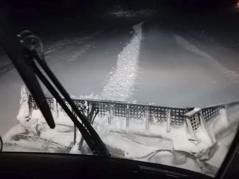

さらに，圧雪間の段差をもう一度走り，

丁寧に圧雪間の段差をつぶしていきます．

うーむ．

焼額クオリティ！

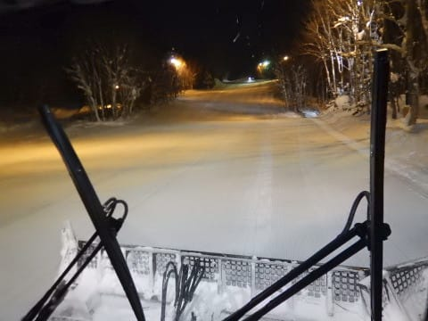

圧雪車の最高速度は時速20km．

…意外と遅いですね…

で．

圧雪作業は，大体時速10kmほどの

スピードで，丁寧に進めていきます．

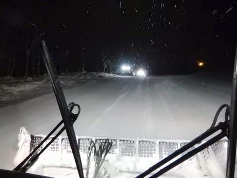

この日は第4ロマンスのサウスコースも

貸し切りナイター営業をするようで．

サウスコースとイーストコース，

合わせて4台の圧雪車が出動中です．

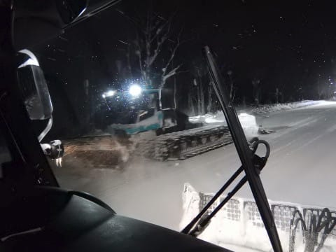

行違ったのは，キャビンが緑色の，

大原の圧雪車ですね．

今回のオペレーターさんは．

私を圧雪車マニアだと見抜いたのか．

1時間弱の圧雪作業中，かなりいろいろ

細かいところを教えてくれました．←子供むけイベントなのに，

子供をさしおいて父親が楽しんでいることがバレバレ

曰く．

焼額は8台の圧雪車があり．

5台がピステン，3台が大原．

ピステンのうち，3台がPB600で，

2台がPB400だったかな？

さらに，1台がウインチ付き仕様．

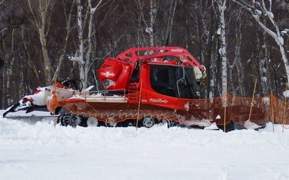

（焼額のじゃないけど…ブナ平にいた，ウインチ付きピステン）

焼額だと，オリンピックコースの急斜面．

昇り降りの補助と，急斜面でも圧雪圧を

しっかりかける目的で．

坂の上にワイヤーを固定して，

ウインチを使い，このワイヤーにぶら下がる

形で圧雪をかけて行くわけですが．

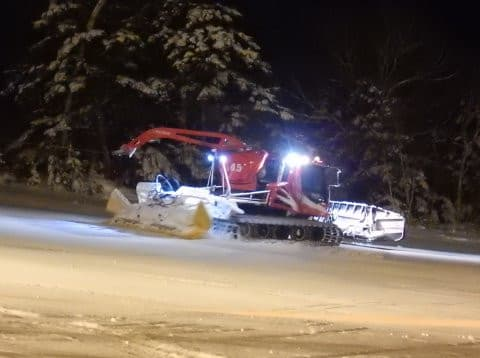

（この写真も焼額のじゃなくて，一の瀬ファミリー正面バーンをウインチで圧雪中の写真）

しかし．

やっぱり，急斜面の下りは，結構真下に

落ちていくような感覚で怖いようです…

ちなみに．

ワイヤー長は2km程度と，むちゃくちゃ長いようで…

そして．

前回乗った圧雪車は，前進・後進や

方向転換などの制御は，左手側にある

レバー＆ダイヤルで操作でしたが．

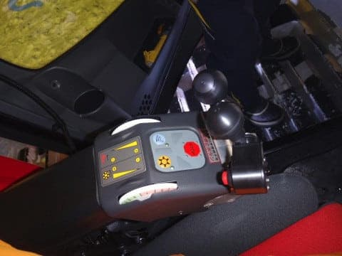

今回乗った圧雪車は，ステアリング仕様．

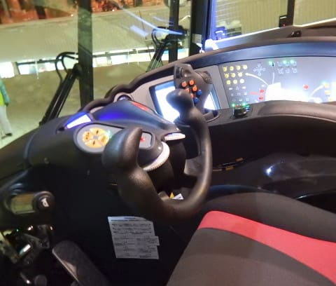

ちなみに，ステアリング仕様の場合は，

このダイヤルを回して，スピードを調整します．

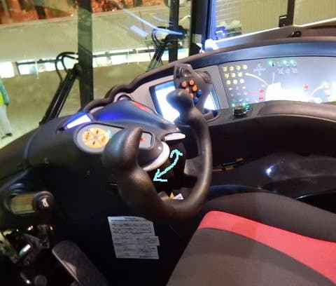

よく見ると，オペレータさんは，

運転中に頻繁にこのダイヤルに指を

かけて，速度を調整してますね…

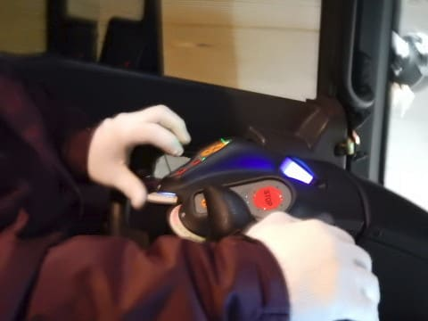

ちなみに．

右手側のダイヤルは，ミルの回転速度

制御だそうです．

そして．

PB400も，PB600も，レバー仕様とステアリング仕様の

どちらでも選ぶことができるようで．

今回はおまけで，PB600のレバー仕様の車両も見せて

もらいました…

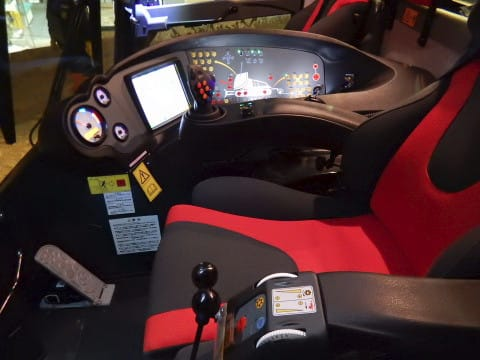

S「レバーとステアリング，どちらが運転しやすいんですか？？」

オペレータさん「うーん…好き好きだよね…」

ということで．

特にどっちがすぐれているわけでも無いようです．

ちなみに，PB400と…

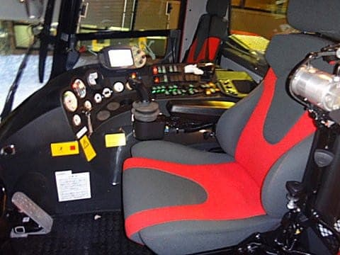

PB600の運転席を比較すると．

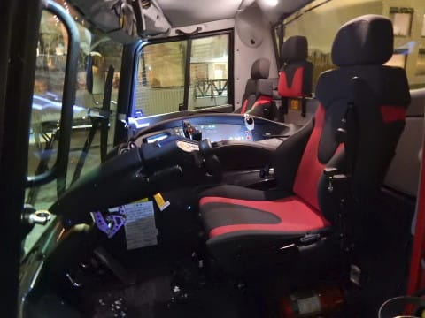

シートは両者同じですが．

PB600の方は，真ん中に補助席があり．

3人座れるようになってるところが

大きく違いますね…

さらに，コンソールは大きく違っていて．

PB400は，割とクラシカルなメーター＆スイッチと，

小さな液晶パネルが着いてる感じですが…

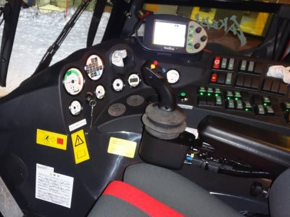

PB600は，大きなタッチパネルと

グラフィカルな操作パネルで，

シンプルな感じ．

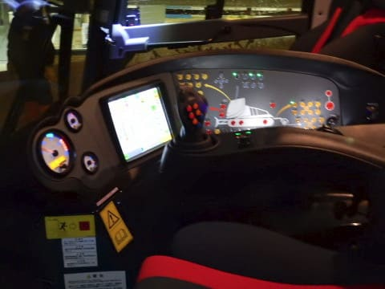

このタッチパネルで，ミルを雪面に

押し付ける圧力なんかを操作するようです．

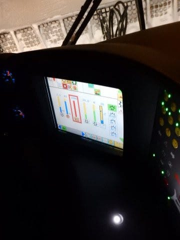

そして．

ブレードをコントロールするスティックも．

PB400は，操縦桿のようなジョイスティックタイプ

ですが…

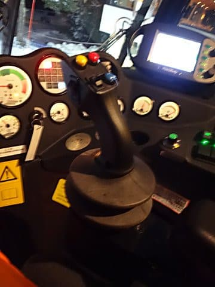

PB600は，この角度で見ると良く分からないけど．

手のひら全体が乗せられる，幅広のレバーに

なっていて，ちょっと高級な感じ．

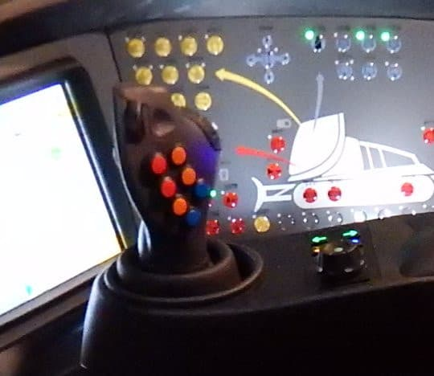

S「PB400やら600やら，レバーやらステアリングやら，

　いろんな仕様が混ざってますけど…

　どれに乗ってもすぐ運転できるんですか？」

オペレータさん「うーん．しばらく運転してれば

　慣れるので，作業はできるけど…

　でも，大体誰がどれに乗るか決まっているので，

　違う仕様に乗ることはあんまりないですね」

ってことのようです．

という感じで．

子供より大人の方が興奮してしまうこと

請け合いの，楽しい1時間でしたが．

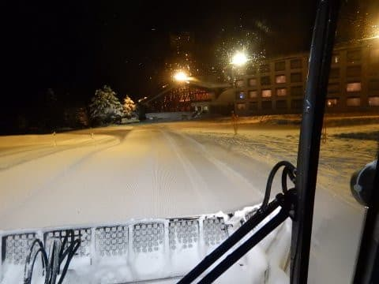

S「今度は，早朝の圧雪作業もぜひ乗ってみたいですね～！」

オペレーターさん「…朝は，過酷ですよ…（しみじみ）」

と話されていたので．

…圧雪作業って．

過酷なんだろうなぁ…

ってなわけで．

圧雪作業の後は．

自分たちで圧雪をかけたシマシマバーンを

思いっきり楽しんだのでした～！

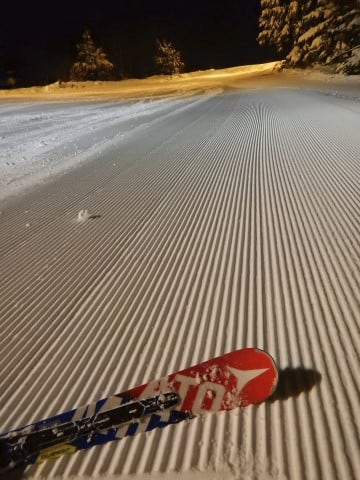

でも．

…このシマシマの陰には．

圧雪車オペレータさんの，

努力と苦労があるのです…

## 💬 コメント一覧

### 💬 コメント by (かず)
**タイトル**: Unknown
**投稿日**: 2019-01-18 21:55:03

今週お休みのようなので　積雪20cmほどでしたヤケビ非圧雪は底付きでしたよ　奥志賀は終日ゴンドラ運休でした

### 💬 コメント by (なるなる)
**タイトル**: 羨ましいです
**投稿日**: 2019-01-18 22:23:13

自分も乗ってみたい!!

大人向けの体験もやってよ!と思いましたが、まぁよく考えると、オッサン2人で圧雪車に

乗っても気まずいような…

オペレータさんも気を使うだろうしし、この企画やはり小学生が居ないと無理なのかなと、

なんか納得しちゃいました笑

### 💬 コメント by (Skier_S)
**タイトル**: 今週末は滑りに行けず（涙）
**投稿日**: 2019-01-18 23:47:33

＞かずさま

やっぱり，20cm程度でしたか…

もう少し積もってほしかったのですが．

予想通り，奥志賀ゴンドラはダメだったんですね．

明日はちょっとは穏やかな天気になります．

日曜朝の積雪も，あんまり大したことなさそうです．

日曜の昼間は，そこそこ降ってくれそうなんですが…

昼間に降られても，って感じですね．

月曜朝も20cmくらいの積雪かな～．

＞なるなるさま

私も，大人向け体験欲しいです！

「有料でも参加者いるんじゃないですか？」

と聞いたら，

「いるでしょうけど…そんなに多くないでしょうね」

って感じでした．

でも，乗ってみると面白いですよ～！

### 💬 コメント by (musi)
**タイトル**: 元気ですよね。
**投稿日**: 2019-01-27 23:03:08

sさんは、色んなメンテやら、PCいじったりと、幅広いストライクゾーンと、それを実現するスタミナが共存してて羨ましいです。

野球団のミーティングやらで、東京待機だった自分は、イジイジと過去の徒然読み返しながら、今更コメント投げてみました。今度圧雪ツアー申し込んでみよう。まずは、息子への協力要請だな。

### 💬 コメント by (Skier_S)
**タイトル**: musiさま
**投稿日**: 2019-01-28 01:46:13

…確かに，私が興味を惹かれる範囲はかなり広いです(笑)．

実は，まだこのBlogに書いてない趣味もいくつかありますし．

ぜひ今度，圧雪車搭乗体験やってみてください．

かなり面白いですよ～！！

