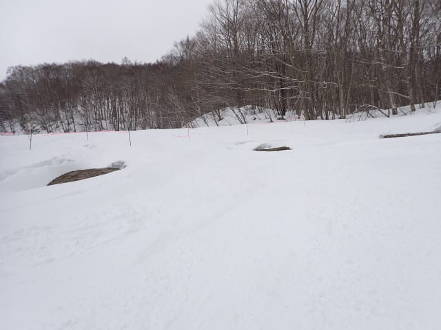

# 2025/3/29(土)の志賀高原スキー場は…朝はガリガリ氷の上に新雪5cmの冷え冷え雪降り．午後遅くから晴れてコンディション回復傾向！

📅 投稿日時: 2025-03-30 00:05:37

🏷️ カテゴリ: [2025スキー滑走日記](cacd3fbf84d4a679ee61a5894c3f95e14.md)

ってなことで．

本日も志賀高原で滑ってたわけですが…

…積もりましたね．意外と．

予想より多めで，ゴンドラ営業開始まsでに，

5cmからそれ以上積もった感じでしょうか…！

とりあえずこんな感じで，

運が良いと5cm以上積もる

という，運が良いほうでスタートした本日．

まず，朝の志賀高原の上り坂が，この積雪の

ために上林チェーンベースから先は完全な雪道で…

途中息絶えたのか，路上でチェーンを

着ける人もいるレベルで．

予想以上に積もったな…という感じ！

（帰りの時間には，蓮池から下は積雪は無くなって

ましたが…）

で．

いつも通り，8:30の通常営業開始前の焼額

第1ゴンドラに並びますが…

天気も悪いからか，先週までに比べると，

待っている人はぐっと減った感じ．

そしてあさイチゴンドラで山頂に上がると…

山頂の気温は-8℃！

久しぶりのトップシーズンレベルの冷え込み

ですよ！！

久しぶりの冷え冷え雪のゲレンデだ！！

…と思って喜び勇んで飛び込んだけど．

今週から朝圧雪ではなく，夕方圧雪になった

焼額．

一見，いい感じの冷え冷え新雪が乗っているように

見えますが．

雪が積もる前の夕方に圧雪され，シマシマのまま

カチカチになった圧雪の上に今朝の新雪が

乗った感じで…

板がめちゃくちゃ走るカリカリの上に，

ちょっと重い雪が10cmほど乗っているという，

かなり手ごわいコンディション…（涙）

新雪が積もってから圧雪されていれば

かなりいいコンディションだったはずなのに．

新雪が積もったのは圧雪の後だったので…

数多くの人がカリカリでツルッといった後に

新雪に足を取られてもんどりうつという，

結構残念なコンディション（泣）

朝に降り始めた新雪は全く圧雪されてないので，

人が滑っていくと，簡単にカリカリバーンの

表面から新雪が削りとられるので…

しばらくすると，ところどころ氷のシマシマが

顔をのぞかせてきて．

氷のシマシマとモサモサ雪が入り乱れる，

バランス感覚の限界にチャレンジ！バーン

と化してきました（泣）

まぁ．

こんな状態だったので，滑る人も少なく…

ゴンドラも一番混んだ時間でこの程度．

今日は第3高速も第4ロマンスも動いてない

ので，唯一動いているのが第2高速リフトだけ

だったのですが．

このリフトも終日全く混みませんでした…

で．

雪のコンディションも難しいし．

一ノ瀬方面もそれほど混んでないだろう…

ということで，焼額の結界を知らぬ間に

乗り越えて，気づくと一ノ瀬方面へワープ

してましたが…

一ノ瀬ファミリーや高天ヶ原も，下地が

かなりガリガリの楽しくないバーン（泣）

そして，あと3日で営業が終わる東舘も西舘も，

全く人がいない無人バーンですが…

特に西舘は，ここ数日の超高温で地面が温まり，

下から雪が解けて，ゲレンデのど真ん中に

穴が開いてますよ…！！！

それも1か所じゃなく，数か所並んで

ゲレンデのど真ん中に穴が開いていて．

…雪が多い今年でも，確かに3月末で

ゲレンデ終了もやむ無しかな…

という感じで，もう終わりげな雰囲気が

ゲレンデに漂ってました…（涙）

そろそろ今シーズンの営業終了の東舘ゴンドラに

シーズンのお別れを告げてきましたが…←って言っても，今シーズンこれ以外は1回しか乗ってないよね？

もう，完全飛び乗り状態のガラガラです…

まぁ，カリカリ＆モソモソの東舘をぐるぐる

しようという人は全くいないと思うので，

ガラガラなのは納得ですが…

そして．

さらには寺小屋まで遠征してみますが．

寺小屋も基本的にはカリカリバーン．

でも，まだ寺小屋は上に乗った

新雪が冷えて雪質が良かっただけ，

滑りよかったかな～！

で．

寺小屋を滑っていた午後2時ごろ…

曇りベースの時々晴れ，という予想が

やっと効果を発揮してきたのか，

青空が顔をのぞかせてきました…！！

そして．

ちょうど焼額に戻ったころ…

いい感じに晴れてきましたよ！！

さらに焼額は…朝のモサモサがいい感じに

踏まれて圧雪になり．

ところどころガリガリバーンが出てきては

いたものの．

雪質がいい感じの圧雪バーンになっている

じゃないですか…！！

いや…日が射してきたし，雪は冷えてイイ感じ

ですよ！！

これ，結構楽しいっ！！

うむ．

今日は朝から昼にかけては残念だったけど…

ラスト2時間は，ここしばらくの夏スキーの

陽気と違う，冷え冷え雪の圧雪を太陽の下で

滑ることができて．

…これ，ラストは意外と良かったんじゃない？？

…という感じで．

今日もリフト営業終了まで，

しっかり滑り倒してきたのでした…

今日の午前中はちょっと残念な感じだったけど．

今日は終日気温も低かったし．

この冷え冷え雪が圧雪されれば，明日の

朝イチは，冷え冷え圧雪バーンでそこそこ

いい感じになるんじゃないかな…？？？

…昼頃にはカリカリの下地が出てきて，全面

アイスバーン祭りになる可能性もあるけど…

ってなことで．

明日も志賀高原で滑ってます～！

## 💬 コメント一覧

### 💬 コメント by (しんちゃん)
**タイトル**: Unknown
**投稿日**: 2025-03-29 22:06:50

一ヶ月ぶりにヤケビで滑りました。

昼からの参戦となりましたが、いいときに来たなと思いました。日が差すときもあったし、終わりの方はパノラマ・サウス、白樺は楽しかったですね。

ヤケビ仲間の皆さんとも会えて、一緒に滑れて楽しさいっぱいでした。

### 💬 コメント by (Skier_S)
**タイトル**: Unknown
**投稿日**: 2025-03-29 22:30:16

>しんちゃんさま

今日は朝イチより昼過ぎが正解だったのかもしれません…

いいタイミングで到着だったのかも(笑)

明日は朝イチのバーンはまぁまぁ良さそうなので、明日も午前で帰るというのは、

行きも帰りもいいタイミングの可能性が…

