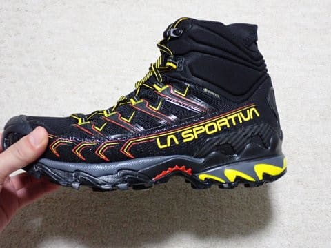

# 山歩き用の新しい靴，La Sportiva Ultra Raptor2 mid GTXを買ったよ！その1

📅 投稿日時: 2023-07-12 02:46:46

ってなことで．

6月最終週でスキーシーズンも終わった

ようなので．←いまだに終わったと納得できてない

ぼちぼち山歩きを始めようか…

と，先週から山歩きを始めたわけですが．

その，山歩きの大事な相棒だったこいつ．

[昨シーズン購入して，かなり気に入って
いた](e8ed26550fe8244ab29595105f7fa0ea8.md)HOKAのSpeedgoat MID GTX．

こいつは，わずか4か月使っただけの昨年10月に，

[ソールがはがれてお亡くなりになった](e91cda3f43c16339f6913c78164bf7052.md)

わけで…（涙）

で．

[販売店のありがたい対応で
全額返金してもらえた](e6d8d0cbeb661cece1a838efadaa9fbfe.md)ので，次の靴を

買おうと思っていたのですが．

まぁ，一応[6000円の格安のトレランシューズ](e09ce4608981626e322bfedadbced1697.md)を

買ってはみたものの，[どちらかといえば平坦な
トレイル向けの靴っぽくて](ecb25856da7e6ee729ee2fefd2c4a167f.md)，テクニカルな

山道よりロードに近い道でスピードが乗る

感じだったし．

本格的な山道に対応した，山歩きに使える

ミッドカットで防水の靴が欲しいよね…

と，山歩き用の次期主力戦闘機を探して

みたところ．

前回，HOKAのSpeedgoatを買うときに対立候補

だった，La SportivaのUltra Raptor mid GTX．

こいつがマイナーチェンジして，今は

Ultra Raptor2 Mid GTX

となったようなので．

もともと，HOKAを買うときにこいつに

しようかどうしようか悩んだくらい

だったこともあり，

今回，HOKAのソール剥がれで返金された

お金を元手に，Ultra Raptor2 Mid GTXを

買ってみました～！！

かねてから名機の誉れ高いトレランシューズの

Ultra Raptorをミッドカットにして，

ゴアテックスで防水にしたこのモデル．

HOKAより100g近く重いけど，

それでも普通の山用の靴に比べれば

かなり軽量で，走ることもできるという，

ファストハイクには最適な靴．

とりあえず，山歩きを再開した先週，

早速試し履きとして，

手軽な陣馬山でデビュー戦を実施して

来ました～！

…といっても．

仕事が忙しすぎて，午前中しか山に

行く時間が取れず，10時には家に

帰ってこれる近場にしか行けなかった

ので…（涙）

行ってきたのは，小仏バス停奥の

小仏Pスタートの陣馬山往復ルート．

ヤマレコで見ると，標準コースタイムは

7時間6分と長めに見えるけど…

せいぜい標高差800m程度で，距離も

往復16㎞くらいのお気楽コース．

履きなれてない靴を試すには，ちょうど

いい感じですね…

ってなことで．

いざ，試し履きへ出発！

…ってところまで書いて．

一番重要なレビューを書くところで，

すでに文字数も長くなったし．

あまりにも眠くなってしまったので，

すみませんがレビューは次回…

いや．ホントにここ数日睡眠時間が短くて，

今日くらいは午前3時前に寝たい…

（続く）

## 💬 コメント一覧

### 💬 コメント by (スシネコ)
**タイトル**: Unknown
**投稿日**: 2023-07-12 15:19:11

この陣馬山ルート、昔、中学校１年生の遠足がこれでした。（地味な学校ですよね・・・）

私はヒルとクマが出ない山しか登れないので、今年の夏は「筑波山３往復コース」の連チャンで体力づくりします。

p.s.このコース、ヒル出ましたか？

### 💬 コメント by (m&t m)
**タイトル**: Unknown
**投稿日**: 2023-07-12 18:41:20

小学校の時の登山は３年連続景信山でした。毎年１位争いをしてました💨

逆に、東京都民なのに高尾山は登った事がありません😅

### 💬 コメント by (Skier_S)
**タイトル**: 関東では有名な山なんですね…
**投稿日**: 2023-07-13 01:50:17

＞スシネコさま

そうなんですね…

関東ではメジャーな遠足ルートの山なんですね…！

地方出身の私は全く知りませんでした．

長野県民は，中学校とかで岩菅山登ったりするらしいですが，関東でも山登りするんですね…

陣馬山は何度も登ってますが，ヒルが出たことはありません．

丹沢みたいに鹿がいないので，割と安心だと思ってます．

＞m&t mさま

景信山，3年連続で行くくらいメジャーな山なんですね…

毎年1位争いってすごいですが，スタートは小仏のバス停から上るんですか？

だとすると，舗装路も結構歩くし，そこそこ距離がありますね…

