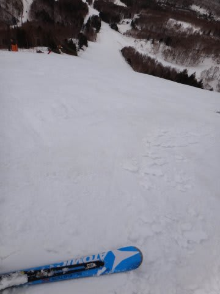

# ショック…今シーズン3度目の転倒…（涙)

📅 投稿日時: 2013-04-19 01:14:57

えー．

なんだか．

現在の予想天気図だと，日曜は午前から「雨」になる可能性が出てきました…(涙)．

まだ予想のばらつきがあり，低気圧が少し南にずれると雨が降らない可能性もあるので．

まだ分かりませんが…

やっぱり，この週末は土曜が狙い目ですね～．

さて．

本題．

基本的に，あんまりスキーで[転ばないのが自慢](ee5275dde0fb9f9bec07df8fb15accd90.md)の私．

＃[昨シーズンは3回転んだ](e1f02536e653f68df450d63e910d0872d.md)けど…

今シーズンは11月，12月に1回ずつというハイペースで転んでしまったあと．

1，2，3月は転倒なしですごしていたんですが．

悲しいことに．

4月に入って，今シーズン3度目の転倒をかましてしまいました…(泣）．

それは，先々週．

焼額オリンピックコースの，荒れ荒れ春雪で小回りしてたとき．

谷回りでトップが激しい段差に突き刺さって，板が外れてしまい．

…普通なら，片足の板が外れたくらい，転ばずにこらえるところが．

なぜか今回はこらえきれず．

1-2回もんどりうった上，

雪面と熱－－－－－い抱擁を交わしてしまったのでした…

ぐはぁ．

久しぶりの雪面との熱い抱擁であったことよ…

…幸い，誰も見ていない！

この場を早く立ち去らねば…っ！

…良かった．

誰も見ていなかったようだな…．

と，安心して．

ゴンドラに乗ったところ．

ゴンドラに乗り合わせた人「…見てたよ．…オリンピックコース…」

私（どきーーーーーーーーっん！！　

　　ぎょえええええっ！！

　　み，見られたっ！？

　　転んでるところ，見られてたっ！？？)

　　「…え？み…見てました？？」(動揺)

乗り合わせた人　「見てたけど，すごかったねー」

私「…は，はぁ…ちょっと…恥ずかしいところで…(恥)」

乗り合わせた人　「あの荒れた斜面，よくあれだけスピード落とさないで小回りできるもんだ」

私「は？」

乗り合わせた人　「かなり滑り込んでるみたいだけど…地元の人？」

私「え？いえ…某K奈川県民ですが…」(こ，転んだところ見てたんじゃないのか？）

乗り合わせた人　「あの滑りは○△×■▼…(転んだところを見ていたのではなさそうな内容)」

私　(び，ビビらせやがって～！タイミング良過ぎじゃー！絶対転んだところ見られたって思っただろ～！)

ということで．

どーやら転んだところは見られてなかったようですが．

…あまりにも悪いタイミングで，人を驚かすような会話はやめましょう(汗）．
