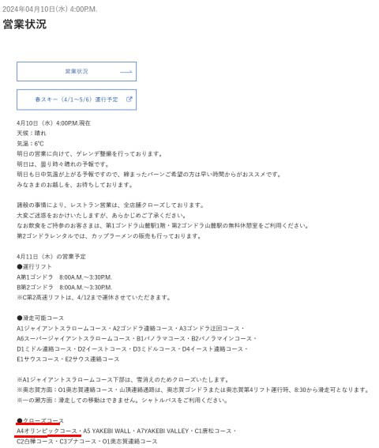
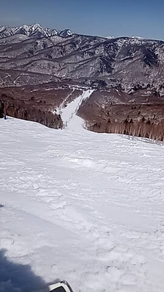
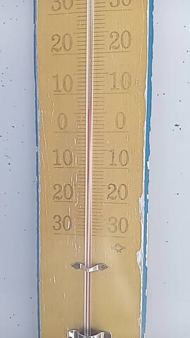

# 4月13，14日の週末の志賀高原スキー場の天気は…土日とも晴れ！でもまた気温がすごく上がって，朝からザブザブ雪っぽい感じ…

📅 投稿日時: 2024-04-11 01:55:18

えー．

昨日の火曜に雪が積もった志賀高原

でしたが．

やっぱり月曜夜～火曜朝にかけての

土砂降りで雪解けが進んだようで．

焼額の明日木曜の営業予定を見ると，

オリンピックコースがクローズに

なってますね…（涙）

先週はまだそこそこ雪が積もって

いるみたいに見えたオリンピックコース，

もう終了ですか…（泣）

（[焼額山スキー場ホームページ](https://www.princehotels.co.jp/ski/shiga/winter/)より）

ちなみに明日・明後日の平日は

焼額は第2高速が運休で，

第1ゴンドラ，第2ゴンドラのみの

営業です！

木・金はレストランも全部クローズ．

食べ物を持ってきてないと

お昼ご飯難民になるので，ご注意を！

そして，週末は第2高速が動きますが…

この土日で第2高速と唐松コースは

今シーズンの営業終了です．

第2高速リフトが滑れるのも，

今週末で今シーズンラストですね（泣）

ってなことで．

水曜の本日も，特派員から写真が送られて

きましたが…

水曜は焼額は定休日なので，奥志賀の写真が

送られて来ました！

でも，本日は晴天高温で，朝は硬かった

のかもしれませんが，昼間はザブザブ

雪だったようですね…

まぁ，気温が+5℃を越えて，

それで強烈な日差しがあれば，

残念ながら完全に春の雪ですね（涙）

そして．

これから週末までは，気温が下がる気配は

全くないです…（泣）

でも，まぁ雨が降らないだけマシかな．

とりあえず，今週末までの志賀高原の

天気を天気図から予想してみますが…

今週はクリティカルな日が続き，今日は

ちょっと早く寝ないと死にそうなので，

解説抜きで予想結果だけ記すと．

11日(木)：終日晴れ．朝から高温．

　朝はわずかに締まっていればラッキー．

　午前から雪はザブザブ．

　最高気温は+10℃くらいまで上がり，

　午後のバーンは荒れ荒れ．

12日(金)：朝は曇り．

　この日も朝から雪は緩め．

　この日も+10℃近くまで気温が上がり，

　午後は日も射すのでザブザブ荒れ雪に

13日(土)：終日晴れ．

　早朝からプラス気温で，氷点下に

　落ちないので早朝から雪は緩め．

　早朝スタート時はまだ締まり気味の

　ザラメかもしれないけど，すぐに緩む．

　通常営業の時には完全に4月の雪に．

　昼前には強烈な日差し＆+10℃を

　越える気温で，雪は板が潜るくらいの

　ザブザブ雪になり，かなり荒れる．

14日(日)：終日悲しいくらいの晴天．

　早朝から気温が高いのもあり，

　朝からかなりゆるゆるの雪．

　通常営業開始時にはかなりザブザブ．

　あっという間に雪は荒れていく．

　最高気温は+10度を越えて暑い．

　強烈な日差しで雪は悲しいほど

　ダメになり，荒れていく．

…という感じで．

週末は天気が良くて暑いくらいなので，

ゲレンデサイドでBBQでもやったほうが

いいような，

スキーをやるより日向ぼっこを

するにふさわしい天気になります…

うーん．

3月は良かったけど．

この4月はダメだ（泣）

3月25日ごろ現在までずっと

平年比+3ー4℃が続いてきたし．

これから4月22日を過ぎるまで，

さらにひたすら同じように平年比

+2～5℃くらいの高温が続きそうで．

平年比+3～4℃の高温が1か月続く

という悲しい感じになってます…

あぁ…

せめて平年並みなら，

GWまで問題なく持ってくれる

雪の量になったのに．

なぜここにきてこんなに高温が

続くかな～（激泣）

やっぱり，世の中の物理現象を操作して

+10℃で水が凍るようにしないと

いけないのか…？？←そんなことできないから．いつもこの時期，おんなじこと言ってないか？？
