# 今週末は3連休！2020/1/11,12,13の志賀高原スキー場の天気は？…12日は気温が上がって危険だけど，吹雪いたり荒れたりせず．逆にいえばドカ雪もなし

📅 投稿日時: 2020-01-09 00:06:22

🏷️ カテゴリ: [スキー天気予想](c6554f5c3c106093b511a8daae23757e8.md)

えー．

大体の方がお察しのように．

昨日は夜，帰宅後即死してました．

いつも通り，気づいたら床で寝ていて，

朝になっていたパターンでした…（涙）

昨年から，帰宅後床で死んだようにねてしまい，

更新できないパターンが増えてきましたが．

そういう場合も，

かなり仕事がご無体なんだなぁ…

と，暖かい目で見守ってやってください．

ってことで．

昨日はコメント回答もできずスミマセン…

で．

本日ですが．

やはり，予告した通り．

すごい荒れ荒れ天気の雨だったようです（涙）

焼額は，強風のため朝から第1，第2ゴンドラと

第3高速リフトが動かなかったようで…

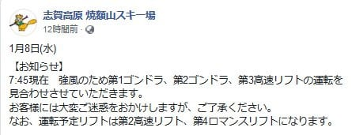

（[焼額山Facebook](https://www.facebook.com/yakebitaiyama/?hc_ref=ARQ6m4COkYn9JZRe34CY9GjJHawjuZ_H3LtCrjQbW0LVhBMQA1uAPDnxg7s8TWmwpOU&fref=nf&__xts__[0]=68.ARALPQjpR2z1oVb4k_-Ws06G-SF5zBVbiptCB9zo5uIgxJR03yIkLIjYeFJcIWaw6m64xFpHTAEHJ2jlFIQNgGyriYAHVU-Yr9aK7vP3Qbaq6Eu7dmnr8hoyhIGiS5W2jRBqk6Pmd6zHkK9HY_mJzjkLEFCUsC7GP5HSCvA-lPMA3CfVudZb8iXcCmdQtVpw-ToVLCu-sJPxYSvlW9iHyQXnD4XixZ7N3wDIooYtA6aqWrXdmFsAPql-rkjM0CM1CnpzfEmb-eU-UO3wLzaVaWfXb7RravolxKfOkEoMYvei9As7bJnq2PSu2ZRKiviqKdkbOXUP9u5HUAiG24GsSQ&__tn__=kC-R)より）

奥志賀もゴンドラが止まり．

雨だったようです…（涙）

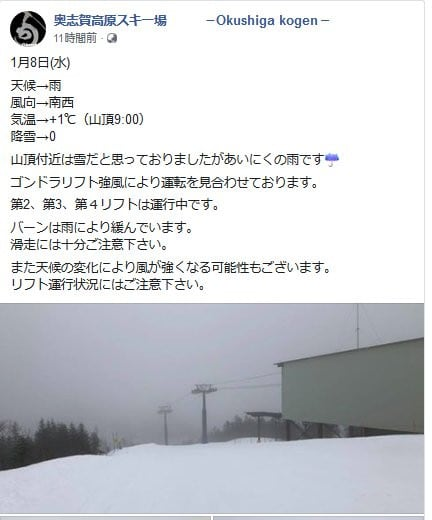

（[奥志賀高原スキー場Facebook](https://www.facebook.com/okushiga.kogen/posts/1479577078859262?__xts__[0]=68.ARA7pO6t_L_yplZPp3P4l4tUwol9l1nrtHqF1huacjp5NCQKAII0umM-BpwALCTs1sm2-cd_2d22oPwBs8I6GwLbO2auaSK1W2Dz9jNywMKL6J4mW42MlPFF0IJgtcSmOo3sLOAyS2zphwzaOsIdwIXGMUcmLZPUjNBozio0uJMW5qYBZplZ9rTj66KbhD8IAVcnTaE_llALUDFSYB-N7mCOqiY9dt1reHuryy9i51l7WIH2wprEYT75KBpA7P9t_-YECwD3tgjldVwQLzbwEUPHYJ6QIzNpTQt7IzoEMqSZeCxKt0_edqnTvA7uBgpGS7Ga4ry1dEaS2_IGsnXiM9cMEA&__tn__=-R)より）

ちなみに，志賀高原は

昼頃一瞬晴れたようですが．

気温は+7～8度まで上がり，

朝から午後まで，ひたすら雨が

降り続けたようで．

ダメダメな一日だったみたいです（涙）

そのため，焼額ではオリンピックコースの

雪が薄くなり，明日は圧雪できなくなって

しまったようで…（激涙）

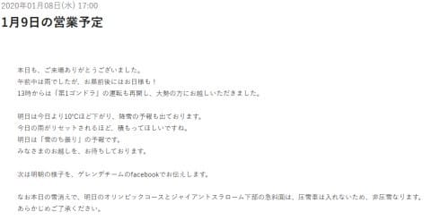

（[焼額山ホームページ](https://www.princehotels.co.jp/ski/shiga/winter/)より）

あぁ…せっかく1月5日の雪で，かなり

復活したゲレンデも，またダメになって

しまったか…（泣）

8日の夜9時ごろでも，まだ志賀高原の蓮池は

気温がプラス（涙）

とても志賀高原の1月の夜の気温と

思えなかったのですが．

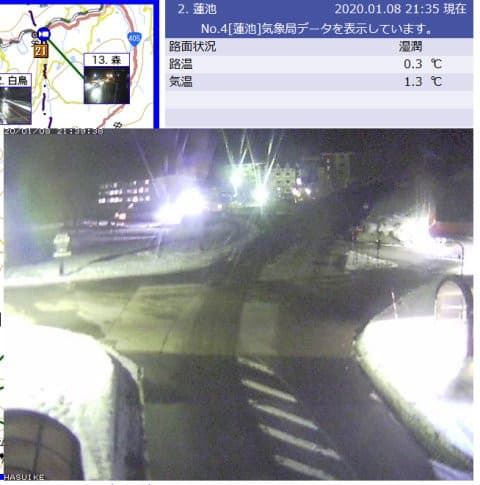

（[北信建設事務所ホームページ](http://hokushin-camera.org/)より）

しかし．

午後11時半ごろには，雪に変わって，

かなりの勢いで積もっているようです！

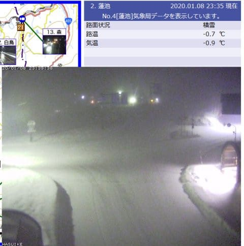

よし！！

このまま明日まで，積もり続けて

くれますように…っ！！

たぶん．

明日，9日の朝まで降り続けます！

積もります！

かなりの雪が積もるはず！！

20～30cmほど積もってくれると信じる！！

だもんで．

この週末は，ゲレンデ状況は回復

しているはず…っ！！

明日9日ははおそらく，重めながらも

パウダーが楽しめるはず…！

ってなことで．

9日（木）の850hpa気温図を見てみると．

…うむ．

赤い0℃線は志賀高原の南まで

下がってくれてます．

朝は-5℃以下まで下がりそうで．

大丈夫です．

9日朝は，降れば雪です！

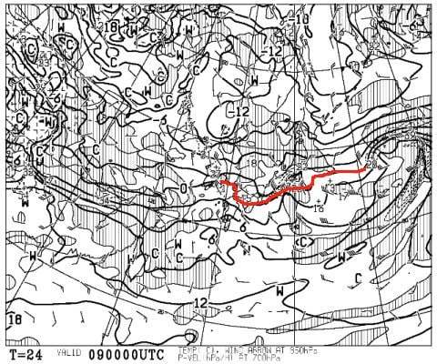

で．9日の地上天気図は．

日本海側に降水域がかかっているので．

志賀高原にも，そこそこの積雪がありそう！

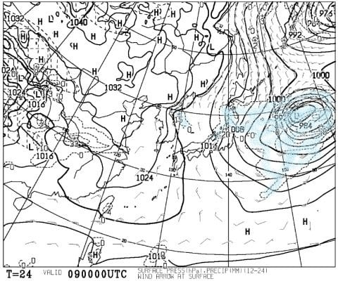

うむ．

明日の朝までに，20～30cm積もってくれれば，

解けた雪のダメージが回復してくれるはず…っ！！

とりあえず．

9日は終日雪がぱらつく，そこそこ冷えた天気に

なりそう．

で．翌10日（金）．3連休の前日ですが．

850hpa図を見ると…

この日も，水色も-6℃線が志賀にかかる

レベルなので．

いい感じの冷えた一日になりそう！

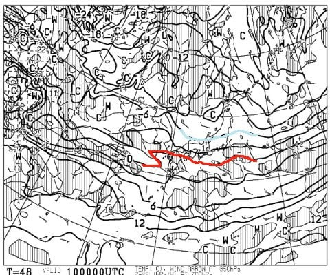

この日の地上天気図は，うっすら日本海側に

降水域が予想されているので．

志賀は，積もらないけどパラパラ雪が舞う

程度の天気かな～．

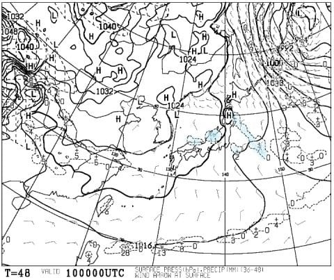

そして3連休初日，11日（土）の850hpa気温図ですが．

この日も，水色の-6℃線が志賀高原に近づいて

いるので．

そこそこの冷えの一日ですね．

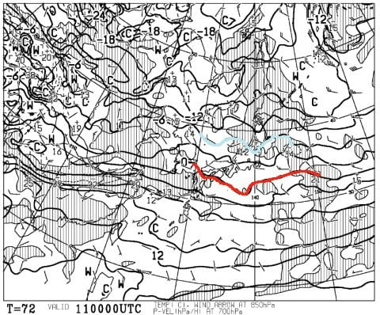

地上天気図を見ると．

降水域が志賀高原にかかってないので．

この日は晴れたり曇ったり，

時折雪がぱらつく…という天気かな．

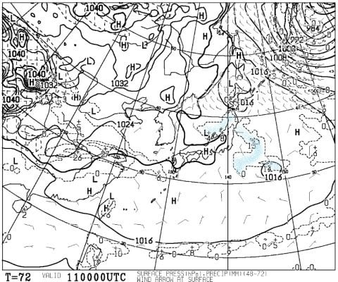

次は3連休2日目，12日の850hpa気温ですが．

うーむ…

やっぱり微妙…

赤い0℃線はギリギリ志賀より北に

あるのですが…（涙）

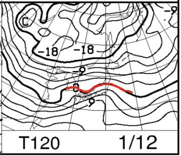

でも．

この程度であれば，

標高が高い志賀はおそらく雪．

雨にならないレベル．

これよりわずかにでも北に行くと，

志賀高原でも麓付近は雨になりかねない

ギリギリの感じです…

で．12日の地上天気図は．

うううううーーん．

微妙．

これも，微妙っ！！

志賀高原はギリギリ降水域に

入っているので…

夕方過ぎには，雪が降り始める

感じかな．

でも，降りは弱いのでそれほど

積もらない感じか…

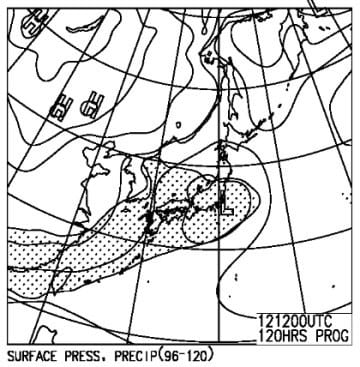

…そして，3連休最終日，13日の850hpa気温図ですが．

うううーーむ．

こいつも微妙．

これもギリギリ，志賀高原より北に

0℃線がいますね…（涙）

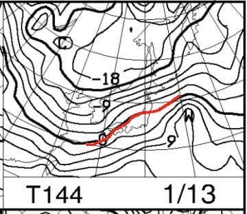

でも．

この日の地上天気図を見ると．

降水域は志賀高原にかかってないので．

液体が降る危機はなさそうかな…

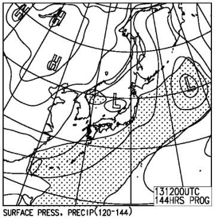

…ってなことで．

まとめると

9日（木）：朝はそこそこの冷え込み．夜中から降り始めた雪が

　20～30cm積もる．非圧雪ゲレンデは重めのパウダー．

　圧雪ゲレンデも，柔らかい圧雪の上に新雪が数cm乗っている．

　終日-5℃程度の気温で，曇り時々雪が降る天気．

　午後に向かって，ゲレンデはちょっと荒れ気味になっていく．

10日（金）：朝は結構な冷え込み！でも，朝までの

　積雪は限りなく0．おそらく積もっても1cm．

　でも，朝イチは柔らかい，最高のシマシマバーン！

　終日冷え冷えで，天気は曇り時々晴れ間も．

11日（土）：朝は-7℃程度といい感じの冷え込み．

　あさイチはいい感じの最高圧雪バーン！

　終日天気は曇り．ただし，時々日も射すかも？

　昼間も気温は上がらず，せいぜい-5℃程度まで．

　いい感じの冷え冷えデー！

　でも，10，11日とまともな積雪が無いので，

　午後はゲレンデが凸凹に荒れていき，

　表面の雪がはがれたところは雨で固まった

　硬い下地が出てきそう…

12日（日）：昨晩からの積雪は0．

　朝はそこそこの冷え込みで，この日も

　あさイチのシマシマバーンは最高！

　あさイチは日も射しているかもしれないけど，

　すぐに曇っていく．

　南岸低気圧の接近とともに気温が上がり，

　午後には0℃近くまで上がる．

　天気は終日曇り空．

　やはりこの日も午後になると，急斜面では

　下地の硬い雪が出てくるか…

　リフト営業が終わる頃に，湿った

　雪がぱらつきだす．

13日（月・祝）：朝までの積雪はうっすら数cmのレベル．

　この日も朝イチはいい感じだけど．気温は高め．

　終日0℃前後．

　天気は終日曇りになりそう．

　午後に向かってだんだんゲレンデが

　荒れていき，

　この日も昼ごろには下地の硬いのが

　出てくる…

　

という感じでしょうか…

9日以降は，ひどい雨になったり吹雪いたりは

しなさそうですが．

その代り，ドカドカ雪が積もることもなさそうな

感じです…

うーむ．

吹雪いてもいいから，ドカドカ雪が降ってほしいっ！！

## 💬 コメント一覧

### 💬 コメント by (しんちゃん)
**タイトル**: 雪ごい
**投稿日**: 2020-01-09 01:31:05

平日の間にドカ雪が欲しい。

「天然雪の3連休」と期待していたので、12日も何とか冷えたままであってほしい。

願いが天に届くよう、フレフレ踊りを踊り続けておきますね(笑)

### 💬 コメント by (Skier_S)
**タイトル**: ＞しんちゃんさま
**投稿日**: 2020-01-09 03:11:56

夜遅くにコメントお疲れ様です…

とりあえず，明日9日の朝までにどれだけ積もるかが勝負．

そのあとはそれほどの積雪量が期待できないので…

とりあえず，今できるのは，3連休も雪になるように

踊るだけです…

### 💬 コメント by (若杉勲72)
**タイトル**: Unknown
**投稿日**: 2020-01-09 18:07:15

即死から無事に甦ることができましたでしょうか？

本日木曜日の志賀高原情報です。

レインボー１号隊員red.3号隊員yellowの２名が、あまりの楽しさに、あと一本の囁きに負けて、不覚にもレインボー(にじ)に遅刻してしまいました。

これだけで、いかにじょうけんがよかったか、ご理解頂けるでしょう。

### 💬 コメント by (なるなる)
**タイトル**: Unknown
**投稿日**: 2020-01-09 20:15:56

昨日の志賀高原ですが、朝から雨は降っていましたが、それほど荒れず強風では

なかった印象です。

高天ヶ原・一の瀬のクワッドは、残念ながら?朝から普通に動いていました。

少し修行して帰るつもりでしたが、11時～14時頃は嘘のように晴れて帰れなくなり、

何で自分はずぶ濡れで滑ってるんだろうかと…w

まぁ、雪は激しく減り、茶色い所が増えて春スキーのようでした。

今日は良かったようで、3連休も良い雪で滑れると良いですね。

### 💬 コメント by (Skier_S)
**タイトル**: 全然積もってない（涙）
**投稿日**: 2020-01-10 06:47:34

＞若杉さま

積雪5cmでも，レインボーに遅刻するほどコンディション良かったんですね！！

ちょっと安心しました…

この3連休，5cmずつでいいから毎日つもってくれれえばいいのですが…

ブッシュは大体隠れてるのでしょうか？

＞なるなるさま

8日の志賀高原，焼額ゴンドラ2本と第3高速，

奥志賀ゴンドラは止まったのですが．

山頂以外はそれほどの強風ではなかったのですね…

でも，ずぶぬれでの滑走お疲れさまでした．

このBlog読者の方は，どんなコンディションでも滑る方が

多いですね（笑）．

3連休は危惧された雨も降らずに済みそうなので，

なんとかいいコンディションになってくれることを

祈るばかり…

