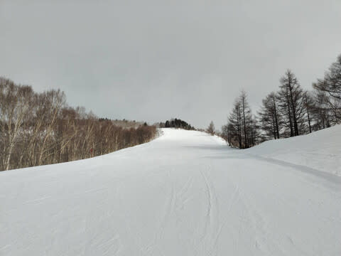

# HEAD純正フォーミングインナー付きHEAD Raptor WCR3（フレックス150）を履いてみたインプレッション

📅 投稿日時: 2024-02-02 03:16:11

本日…というか，もう日付が変わって

昨日の木曜の志賀高原．

朝は10cm程度の積雪があるんじゃ

ないかと予想したところ．

特派員情報では，あさイチの積雪は極めて

薄く，1㎝もなかったようです…（ちょい泣）

気温は-5℃と，昨日の高温の危険は終わり，

無事冷えてくれたようですが．

でも，朝のうちはガスで視界が悪かったよう

です…

ただ，南向きの唐松・白樺方面はガスが

切れて薄日が差すタイミングもあった

ようで．

さらに，雪はいい感じで締まった圧雪で

かなり良かったみたいなので…

まぁ，あさイチの積雪量以外は

大体私の予想通りかな？？

とりあえず．

今週末の土日も，平年並みの冷え込みで

コンディションは良さそうですが…

うーん．日曜は運が良ければ晴れそうと

思っていたところ，だんだん晴れ要素が

弱くなっていってますね…

日曜も終日曇りかな？？

ってなことで，本題へ．

今回，[物欲選手権に敗れ](e05737a8e31c770fa09305653a9f0b66c.md)Getした，

HEAD純正フォーミングインナー

（国内一般販売無し，エキップさんが

特別に輸入したもの）を入れた

フレックス150のRaptor WCR3

[こちら](e582ef39b85579afa798005dfc6029c34.md)にブーツの作成レポートを書きましたが…

早速このブーツを履いてみて，数日間滑って

みたので．

そのインプレッションを書いてみようと

思います…！

とりあえず．

結論を先にひとことでまとめると．

全人類，フォーミングインナーを買え

という感じです…

いや．

高いんですよ．フォーミングインナー…

そうそう簡単に手を出せるものでは

ないのですが．

でも，履いてみると…

全人類がフォーミングインナーを買うべし

としか言いようがないです．

快適です．

素晴らしいです．

いやーーー．

これまで悩んでいた，私の足首の細さに

起因する，足首のホールドの甘さ．

これまでも，エキップさんチューンで

それ以前とは比較にならないほどの

足首のホールド感が得られるように

なっていたけど…

フォーミングすると，

それでもホールドが甘かったのか

と，思いっきり気づかされる，

ぴったりのフィット感．

きつくないのにぴったりという，

まさに自分用に作られたシンデレラの

靴のよう…

ただ，あまりにもピッタリすぎて，

リフトに乗るときにバックルを

緩めておかないと，時間が経ったとき

しっかり締め付けられすぎて，足の

感覚がなくなってくるほど…

そして．

今回，このブーツは．

アキレス腱部分のビスを1本から2本に増やして，

フレックス150に強化してみたわけですが．

うーん．シェルそのものは同じだからか，

滑ってみて，フレックス140と150の違いが

そこまで大きく変わらない感じですね．

硬すぎるブーツは反応が早すぎて

扱いにくかったり，疲れたりするのでは…？

という心配も最初はあったけど．

実際に履いてみると，

寧ろインナーがぴったりフィットして，

ブーツを適切に操作できるからか…

これ以上ブーツが柔らかいと

ちょいと柔らかすぎるかも？

まだブーツが硬くてもいいかも？？

…というくらい．

これだけブーツがしっかりしていて，

かつ足にフィットしていて，カント調整が

完璧だと…

内足と外足の膝を入れる方向を気にするとか，

足を返す足首の内がえし，外がえし

（よく回内・回外と混同される…[この論文](https://jssf.jp/medical/download/parlance2.pdf)参照，

　図面も[https://jssf.jp/medical/download/parlance2.pdf](https://jssf.jp/medical/download/parlance2.pdf)より引用）

とかも全く必要なく．

ただひたすら，板の上からまっすぐ踏む

運動だけすればよく，難しいことを

考えなくても滑れるし．

そして，強い横Gがかかるようなターンでも

ブーツがつぶれることなく，筋力で横Gに

耐えずともブーツが横Gに耐えてくれるので，

横Gをブーツに伝えるだけで簡単に曲がって

くれて…

前も書いたけど．

ある程度のハイスピードで滑る人は，

硬いブーツを履いたほうが，絶対に楽に

滑れます！！！

ただ，ぴったり調整されているブーツなら

いいけど．

カントやら何やらがぴったり調整されて

ない硬いブーツだと，ブーツが硬い分

自分の思った方向に踏み込めなくて，

その調整に力を使って疲れて悲惨なの

かも…

とりあえず．

ぴったり調整された硬いブーツは

疲れません！！

それどころか，スピードを出していくと，

むしろ柔らかいブーツよりずっと楽に

滑れます…！！

そして．

ブーツがしっかりしている分．

ハイスピードの怖さも減ります！

スピードを出したときでも，ブーツが

スピードに負けず，素早く板を動かせる

ので…スピード耐性も爆上がり．

これでいて，フォーミングでホールド感が

半端なく，さらに足の細かい動きが極めて

正確にシェルに伝わるので…

意外にも，低速のコントロール性が高い！

ゆっくりしたプルークやシュテム系の動きでも，

つま先の動きに正確に対応して板が反応

するので．

これ，低速でもすごいいい…

ってなことで．

フレックス150のブーツは持て余すかな？

と思ったけどそうでもなく．

むしろフォーミングのおかげで扱いやすく，

かなりいい感じ！！

とりあえず，このブーツを履いてから

滑りのキレが一段上がった感じで，

今シーズンの私の滑りを見た人は，

昨シーズンからちょいとだけ滑りがレベル

アップしてると思ってくれてるんじゃない

でしょうか…

それは本人が上手くなったんじゃなく，

ほとんどがブーツのおかげです～！

ムチャクチャ気に入りました～！！

…しかし．

このお値段のブーツ，もうそうそう買えないな…

## 💬 コメント一覧

### 💬 コメント by (スシネコ)
**タイトル**: Unknown
**投稿日**: 2024-02-02 12:01:57

ﾒﾓﾒﾓφ(・ω・*)　

最近もっと硬いブーツが欲しいなぁ、って思っていたところ、あの師匠からも購入okが出たんですよ

  ٩(ˊᗜˋ*)و

マニアックな世界を覗いて見たいような・・・どんどんレジャースキーヤーから離れていく気がするような・・・・

### 💬 コメント by (レインボー76)
**タイトル**: Unknown
**投稿日**: 2024-02-02 22:28:49

ネコちゃんは急速にうまくなっているから、この際、一気にのぼりつめるチャンスかも。

私なんぞ、この十数年、伸び悩んでいて、今年になってわかってきて、一気にブレーク(自分感覚)。スキーって分かってくると、今までがなんだったかって、その間のロスを思うよね。

### 💬 コメント by (愛読者)
**タイトル**: Unknown
**投稿日**: 2024-02-02 23:41:22

私も、他社のでフルフォーミングしています。高速で滑れる環境でないので高速をのぞいての部分で同感です。ただ、履き慣らしをしないでデビューさせたので初日は、きつ痛いで修行でした。慣れても滑り終わる度に第4バックまで緩めて、滑る前にまた締めるのが必須なので同行者と滑る時には、この間待たせることになるのが欠点ですね。

あと、ボトムアップしていないヘッドブーツのうらが、ただの平面が多くトイレに行く道中の片斜面の雪上だと横ズレして怖くないですか？私、ボトムアップでの対策は、過去の経験からずらしにくい印象があり苦手なもので。

### 💬 コメント by (Skier_S)
**タイトル**: 今週末もいい週末になりそう
**投稿日**: 2024-02-03 00:20:37

＞スシネコさま

スシネコさんはもう一つ硬めのブーツでも十分行けると思いますよ~！

私と同じく，硬さが違うブーツを履き分けましょう(笑)

＞レインボー76さま

レインボーさんも上手くなっている気が…

今までなんだったんだって思うかもしれませんが，この上手くなっていく過程が楽しいのですよ！

＞愛読者さま

私も滑り終わったらバックル緩めて，滑り始める前に占めてます～！

でも，リフト乗るのと同時に緩め，リフト降りて滑りながら締めているので，

待たせることはありません(笑)．

HEADブーツ，確かにソールは無茶苦茶滑りますよね…

その代わり，ソールに雪がつきにくくて板が履きやすいのでむしろ重宝してます．

