# 焼額の向かい側に見える，あの岩菅山に登ってきた　その4

📅 投稿日時: 2016-10-18 02:04:03

なんだか．

気のせいでなければ，

今週，Yetiがオープンするような気がするのだが．

…でも．

まだ全くスキー用具の準備をしてないし．

シーズンインの心構えができてない今日この頃．

皆様いかがお過ごしでしょうか．

…ってところで．

昨日はほとんど徹夜で，今日は死にそうに眠いですが．

とりあえず，昨日更新できなかったので．

今日は，岩菅山登山レポートの，ラストです…

---

ということで．

無事，裏岩菅山のてっぺんにたどり着き．

念願の，「岩菅山＆裏岩菅山山頂から焼額を眺める」

という経験を終えた後は…

そう，あとは下山するばかりです．

やってきたルートを逆走し，岩菅山にもどりますが…

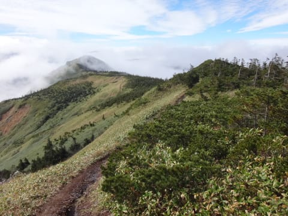

うむ？

なんだか．

行きの時よりも，ガスが増えてきた気がするのだが？？

向こうに見える岩菅山頂が，ガスに覆われ始めて

いる気がするのだが？？

とりあえず，コースタイム30分で

岩菅山山頂に戻るわけですが．

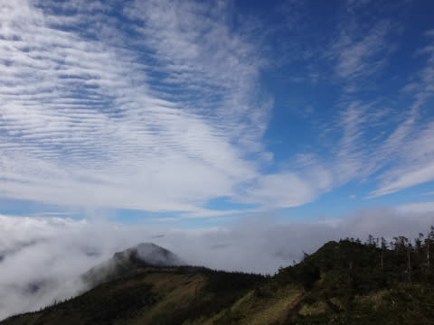

…山頂も雲がかかり始め，

下界は全く見えなくなってきました…

そして．

岩菅山頂まで戻ると．

…をを！！

なんてことだ．

全く下界が見えない…

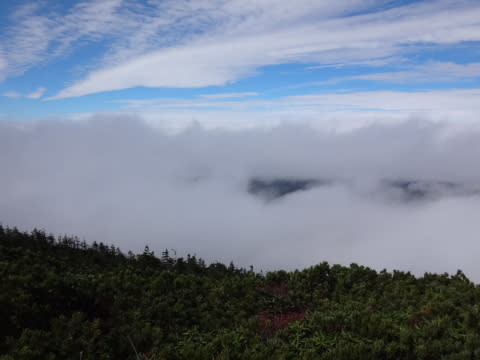

北アルプスが見えないどころか．

目の前の焼額山すら隠れてしまっているじゃないですか！！

…これは．

やはり．

絶妙なタイミングで登頂したらしいなぁ…

登頂10分前に山頂のガスが晴れ．

その後，裏岩菅到着まで，周りが見えたものの．

下山開始すると下界がちょうど

見えなくなってくるという…

これは．

神に祝福されていると言えるレベルだな！←違うから．

そんなわけで，岩菅山頂から，急な下りの斜面を

望むと…

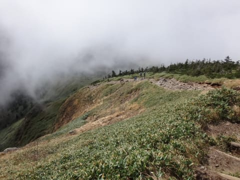

うげ．

下山コース途中から，ガスの中か…！？

と，思ったけど．

下山すると，私が下山しただけ，ガスも一緒に

下に下りていき．

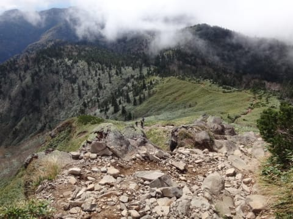

あれだけ近くに見えていたガスに

全く巻き込まれなかったばかりか．

振り返ると，山頂がきれいに見えるという…

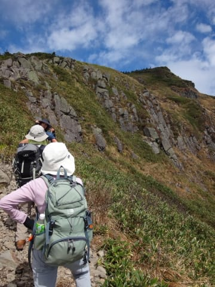

…あれだ．

やはり，私は．

神に祝福されているに違いない！←だから，違うから．

…ってことで．

後は登った時の逆ルート．

山頂から20分ほどで，ノッキリの

分岐点まで到着し…

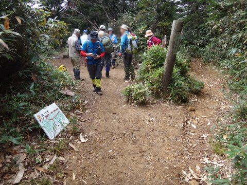

そこから，こういう道を下ること1時間．

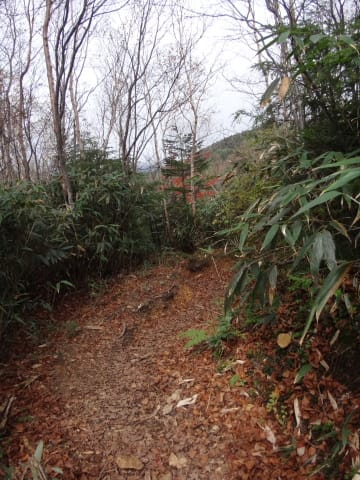

最後は階段が続くコースを降りていくと…

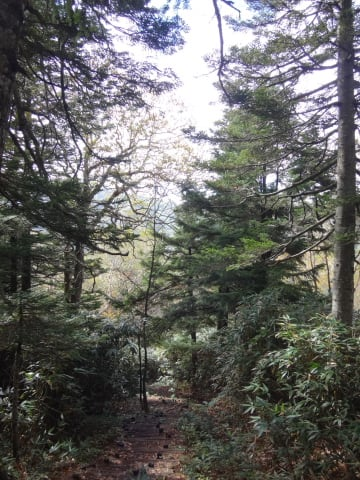

山頂から1時間20分で．

アライタ沢の流れにぶつかります…

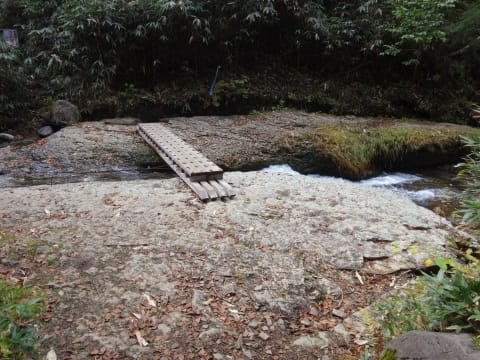

この沢を渡って．

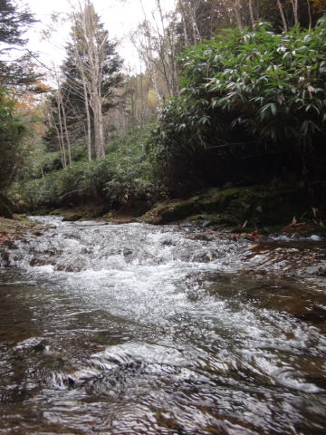

沢を渡ったあとは，紅葉がきれいなコースを歩く，

お散歩的なほぼ平坦路．

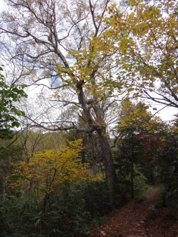

ゆっくり紅葉を愛でながら…

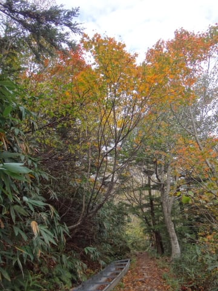

のんびりと歩いていると…

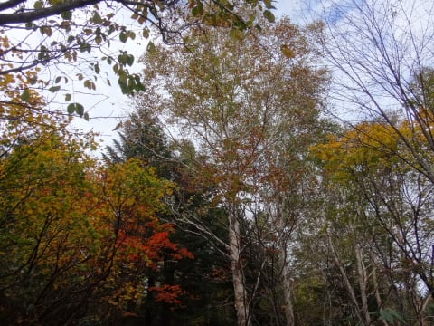

アライタ沢を渡ってから30分くらい．

無事，駐車場までもどってきました…

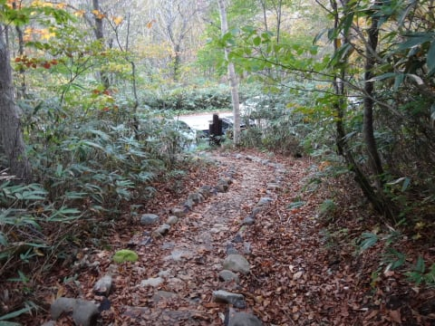

ということで．

朝7時過ぎ出発で，12時過ぎに到着，

休憩含んで，往復5時間．

いやーー．

山頂からの景色はいいし，結構

満足の岩菅登山でした！

…しかし．

下山後，奥志賀高原で開催される，紅葉フェスタに

参加しようと，奥志賀までやってきたところ…

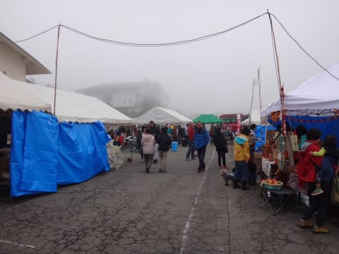

下山直後から，かなりガスが出始めており．

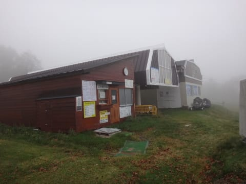

志賀高原全体，真っ白になっちゃいました…

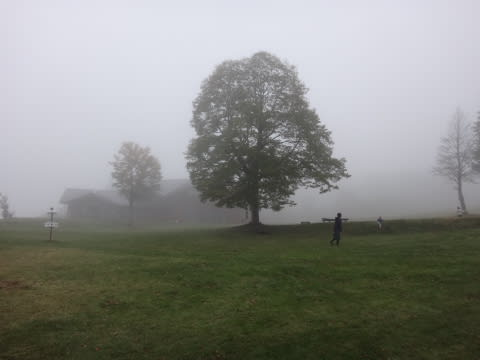

いや．

しかし．

ホントに私が登山している間だけ，ぴったり

晴れてくれたかんじですね～

やはり，私は．

神に祝福されているに違いないっ！！！！！←違うから．絶対違うから
