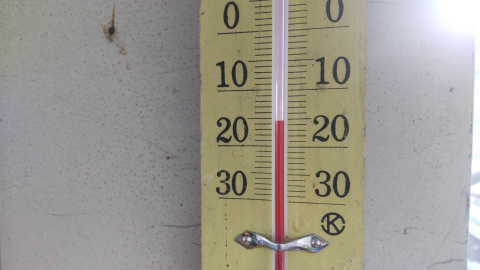
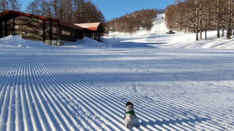
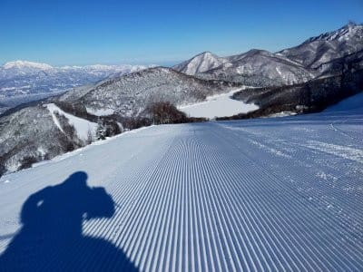
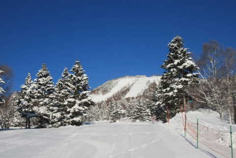
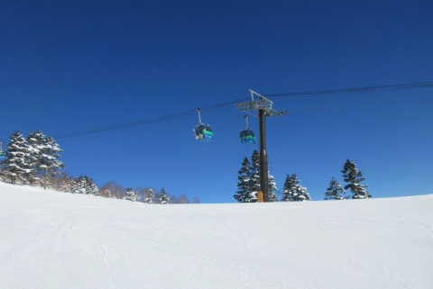
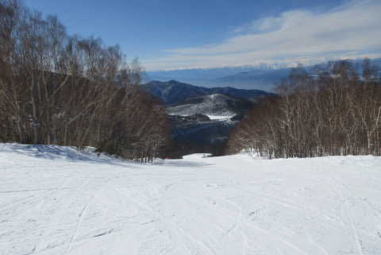
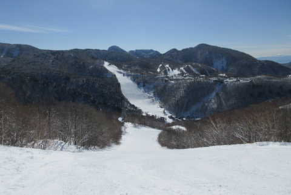

# 今週末は久々に土日志賀高原へスキーに行く予定！…だけどやっぱり19日は終日雨．なぜ私が行く週末に限って…（涙）

📅 投稿日時: 2023-02-18 00:08:48

🏷️ カテゴリ: [日記](cc4b5682fb7b8b144980957a978653fb0.md)

ってなことで．

本日も志賀高原特派員から写真が

送られてきましたが…

おこみん特派員によると．

今日も朝から晴天！！

そして気温も-16℃と冷えてて…

さらにゲレンデがシマシマと来れば…

なんとも最高のコンディションじゃ

ないですか！！

そして．

おこみん特派員以外の特派員によると…

サンバレーもあさイチからシマシマ！！

で．

焼額もあさイチは快晴で，かなり

締まり気味の良い雪だったみたいですが…

10時ごろから焼額のGSコース上は，

ちょっとコロコロが出てきたみたいです（涙）

うーん．

昨日新雪が積もったばかりだから

コロコロが出ないと思ったんだけど…

ちなみに焼額，GSコースはコロコロが

出たけど，白樺やパノラマは良かった

というレポートもありました～！

で．

寺小屋に移動すると，こちらは最高

だったみたいで．

さらに西舘も，人がいないしエッジが嚙む

快楽バーンで良かったみたいです…

ってか，写真見ても誰も写ってないし，

貸し切りバーンでいい感じですね…！

で．

今日は夕方までガラガラで，コンディションも

良く，楽しめたようです…

いいなぁ…

今日滑れた人は最高だったろうなぁ…

で．

これからの天気ですが．

18日(土)：朝は晴れ！

　気温は-6℃程度．

　あさイチは締まったシマシマバーンで

　いいコンディションで滑れそう！

　でも，だんだん気温が上がり，昼間は

　0℃近くまで上がるかな？

　でも，昼には雲が増えて曇り出すので…

　気温が上がっても雪はそれほど

　悪くならず．

　午後は曇って気温があがるけど，

　いいコンディションで一日滑れるかな．

　夜に雪が降り始めるが…

　深夜に雨に変わっていく(涙)

19日(日)：朝から雨．そこそこの雨．

　深夜から降り続ける雨．

　せめてもの救いはザーザーぶりではなく，

　パラパラと降る程度の雨ってことかな…

　でも，レインウェアを着ないと辛い

　レベルの雨．

　風はそこそこ強いが，ゴンドラが止まる

　ほどではないかな．

　雪質は朝から水を吸った雪．

　期待してはいけない．

　午後3時から4時ごろに，雪に変わって

　行くかな…

　とりあえず，かなり悲しい天気の一日

…って感じでしょうか．

そして．

翌20日からはまた冷えて雪が降って

ゲレンデは回復に向かってくれそうです．

なぜ，久しぶりに私が土日とも滑れる

週末を狙ったように雨…(泣)

とりあえず，今週末志賀高原でお会いしましょう！

## 💬 コメント一覧

### 💬 コメント by (a-island4138)
**タイトル**: Unknown
**投稿日**: 2023-02-18 13:05:54

滋賀高原行けるだけでも、羨ましいですね。　まだ諦め切れないゆうさんです🚗　またレポート楽しみにしておりますね🎿

### 💬 コメント by (3年前から読ませてもらってるものです)
**タイトル**: Unknown
**投稿日**: 2023-02-18 17:07:51

14時ごろからヤケビタイは雪がちらついてましたが、液体回避できてますか？

### 💬 コメント by (ヒータロゥ)
**タイトル**: Unknown
**投稿日**: 2023-02-18 20:10:30

本日ヤケビナイター参戦しましたが、ギリギリ雪でした。ウェアは濡れる感じにはなってしまいます。

### 💬 コメント by (Skier_S)
**タイトル**: 今，志賀高原は雨…
**投稿日**: 2023-02-19 00:43:11

>a-island4138さま

志賀に行けるだけありがたいです…

ぜひ，何かの機会に志賀高原へお越しください！！

＞3年前からよませてもらっているものですさま

ナイターまではギリギリ個体キープでした…

ナイターも一瞬，限りなく液体に近い個体が降りましたが．

12時半過ぎの今は，残念ながら液体が降っています(泣)

＞ヒータロゥさま

あれ！？？？

ナイターいらっしゃいました？？？

全然気づきませんでした…

### 💬 コメント by (富山県民)
**タイトル**: Unknown
**投稿日**: 2023-02-19 05:57:50

金曜日はスキー日和でしたね。

平日に快晴で週末が天気が悪いと虫唾が走ります。

### 💬 コメント by (Skier_S)
**タイトル**: ＞富山県民さま
**投稿日**: 2023-02-20 01:00:47

残念ながら，日曜はかなりダメな感じでした…（泣）

なぜ，週末に限って…（涙）

ただ，今週末は気温が低いのに晴れそうです！！絶好のスキー日和かも…

### 💬 コメント by (a-island4138　ゆうさん)
**タイトル**: Unknown
**投稿日**: 2023-03-02 22:52:31

sさん雨☔なんか引いちゃいますよね😢　それでも志賀高原は志賀!!　羨ましいです!　3/5ナニコレ床屋で出演しますので良かったら観てください✂

### 💬 コメント by (Skier_S)
**タイトル**: ＞ゆうさんさま
**投稿日**: 2023-03-03 01:25:42

やっぱり雨は辛いですね…

3/5，テレビで出るんですか？？

残念ながら，志賀からの帰り道なので直接見れませんが…

録画してみます

