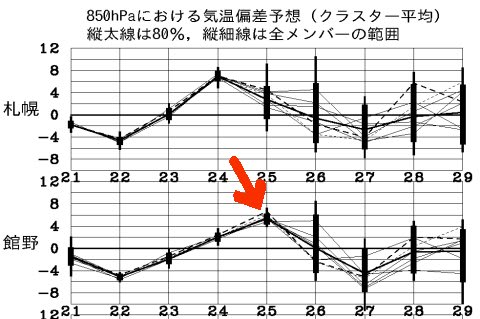
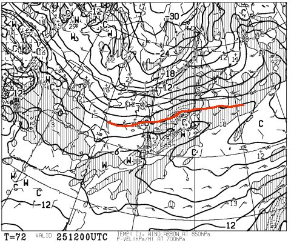
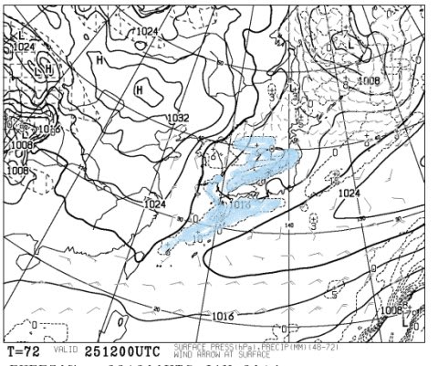
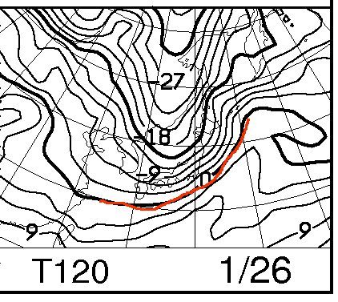
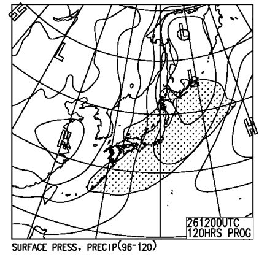
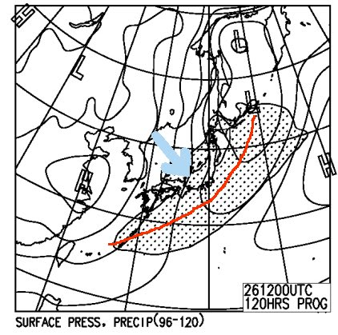

# この週末の志賀高原の天気は…うむむむ．微妙…標高が低いところはちょっと危険かも？

📅 投稿日時: 2014-01-23 02:35:48

うむむむむっ！！

な，なんだ，これはっ！

そして，このBlogの愛読者なら，下の図の意味も分かるはず…

そう．

ここしばらく，冷えひえの日々が続いてきましたが．

25日土曜日の気温は，例年より6度近く上がってしまい（涙）

そしてついに，850hpaの0度線が，志賀高原より北まで

上がっちゃう日が来ました…っ！（泣）

そーです．この状態で降れば．

雨になる可能性が…っ！！

この状態で，降れば…

が．

みなのもの，ちょっと安心するのだ．

今のところの救いは．

こーんな感じで．

水色に塗った，25日に降水がある部分．

…志賀高原はぎりぎり，避けてくれそうで．

この予想図が正しければ，信州は昼間に降らずに済みそうなのだ．

＃あくまでこの予想図のまま…ならば．

で．

25日の夜には志賀高原でも降り始めそうなんだけど．

降り始めが夜なら，気温は低いので，雨になる危険性は避けられそう…

んで．

26日はこんな感じで，ぐぐっと冷えた空気が入ってくるので

雨にはならず，冷えたいい雪が降る，

雪質回復の一日になりそう…！

26日の日曜日，地上予想図はこんな感じなので．

…天気図を見慣れた人なら，心眼で見れば

こーゆー赤線の位置に，寒冷前線が見え，この後ろに

矢印で書いたような寒気の吹込みが透けて見えるはず．

…上の図の赤線が，さっきの26日の850hpa気温図の…

この赤線とだいたい同じ位置にあり，寒冷前線の後ろに冷たい

空気が入っているのが読み取れるかと…

ということで．

寒冷前線通過前は湿った雪or（運が悪ければ）雨，

通過後は冷えた雪…

となるわけで．

この寒冷前線の通過が夜中～早朝ならば，信州では

雨にならずに済みそう，というところ．

なので．

土曜日：午前中は晴れてるかも．基本的には曇り．妙に暖かい．ヘタすると，

　　夕方にはかなり湿った雪がちらちらと降るかも…

　　標高の低い，新潟の海に近いようなスキー場では午後に

　　ぽつぽつ雨が降る可能性…

日曜日：雪．前線通過後はかなり冷え込み，冷えたいい雪が降る．

　　　前日が雨になった場合，下地が凍ってないことを祈るばかり…

って感じですかね～．

うーむ．

土曜日．

雨にならないように，祈っておこう…

## 💬 コメント一覧

### 💬 コメント by (いか)
**タイトル**: Unknown
**投稿日**: 2014-01-24 21:03:38

今日は、白馬も大変暖かかったですね…。志賀は融けてないといいですね！

暖かかったですが、やっとこさ晴れたので(2日間、ガスの呪いがかかっていました)、朝イチリーゼンを本気で楽しむことが出来ました。

Volkl Code178もやっと本領発揮させることができました！飛ばすときには頼もしいですね。

### 💬 コメント by (Skier_S)
**タイトル**: いかさま
**投稿日**: 2014-01-24 23:27:42

やはり，暖かかったですか…

でも，晴れたようでよかったですね！

Code speedwall，大回りでは最高の板かと．

朝一リーゼンにはもってこいですね！

