# 2013年9月　子連れタイ・タオ島ダイビング旅行記　その10…初日午後のダイビングは…びみょ～．

📅 投稿日時: 2013-10-16 01:01:22

🏷️ カテゴリ: [ダイビング日記](ce3a7a8d424d112fce83ee85c81a0e344.md)

えー．

今週末オープン予定のYetiですが．

[HP](http://www.yeti-resort.com/news/2013/10/yetifreerun-mtfuji-snowboarders-festival2013.html)によると．

「気温上昇及び天候不良により大会コースを造成する

雪を確保できないことが予想されるため

10月19日に予定されておりました大会日程を…(略)…

延期させて頂きます。」

…ってことで．

どうやら．

ここしばらくの「夏かっ！？」

って言うほどの高温と．

この季節外れの台風のダブルパンチで．

雪の造成に苦労しているらしいですね…

オープンそのものが延期にならないよう，祈るばかり…

っつーことで．

本題へ．

---

というわけで．

船は，午後の1本目のポイントに到着したわけですが．

外洋にいける午前中は激荒れだったのに．

外洋に行かない午後からは．

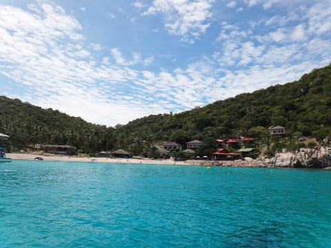

…こんな感じで天気もすっかり回復し．

これだけ海が穏やかになるとは．

…

…やはり，呪われているのかも…

まぁ．

午後の1本目を潜ってみますが．

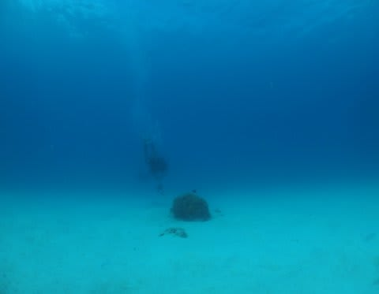

こーんな感じのポイントで．

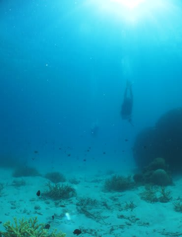

ちょっと寂しい感じ…

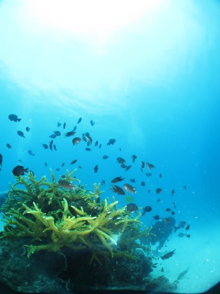

ところどころ，サンゴのついた小さな根があるけど…

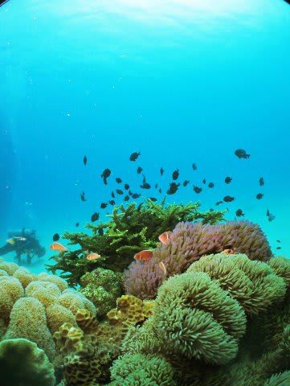

…みんな，魚が黒っぽいんですよね…

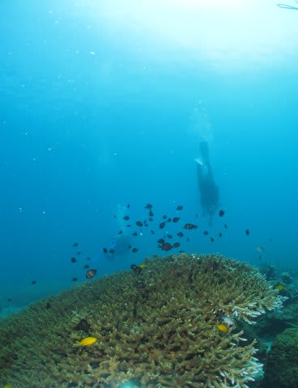

本来，きれいなツートンカラーのフタスジリュウキュウスズメダイも，

なぜかこの海だと，黒っぽくなるという…

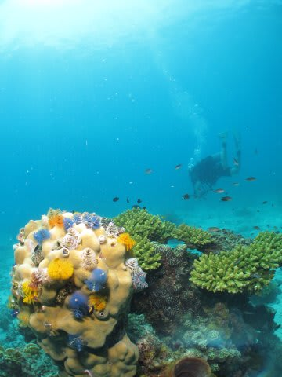

色があるのは，イバラカンザシくらいか…

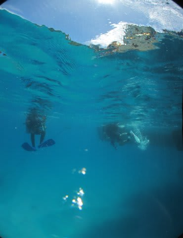

ってことで，Exit.

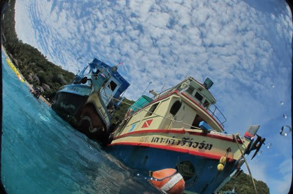

1本目を終了したら，船は2本目のポイントへ移動．

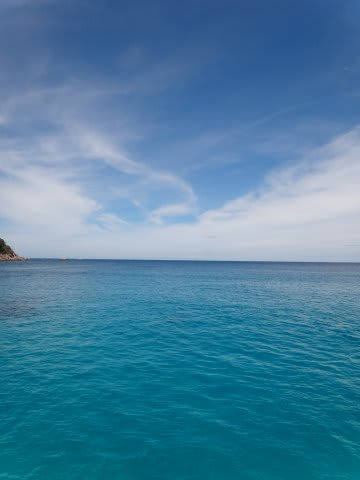

2本目のポイントに到着しますが…

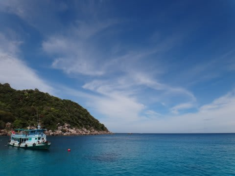

午後のポイントは，当然沿岸部なわけで．

…沿岸部しか潜れない午後に限って．

悔しいぐらい，いい天気だなぁ…

…なぜ，外洋に出れる午前がこんな天気にならないの…(涙)．
