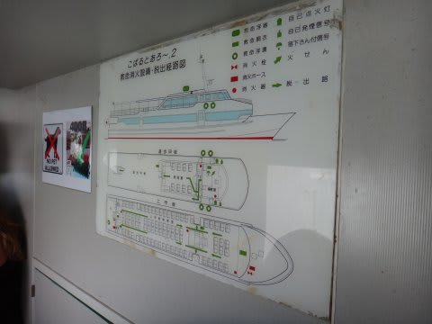
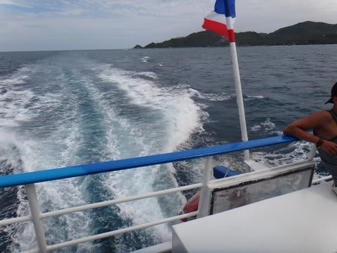
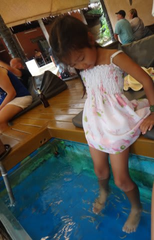

# 2013年9月　子連れタイ・タオ島ダイビング旅行記　その32…そうだ，象さんに乗りに行こう

📅 投稿日時: 2013-12-03 01:02:45

というわけで．

昨日はスキーレポートで．

もう12月にも入っているというのに．

…まだ，タイの子連れ旅行記，続くのだ…

…しかし．

タイのダイビング旅行記の次には，11月3連休のダイビングレポートが

続くので．

…一体，いつになったら夏＆冬のミックスモードが解消されるのかな～？？

＃来年の夏までミックスモードのままだったりして…

では，タイ旅行記，ラストスパート！

----

ということで．

ジンベエを見ることなく帰国する日になってしまった

わけですが．

…帰国する今日．

サムイからの飛行機は夜7時発なのに．

タオからサムイまでの船は，朝9時半発で，昼過ぎには到着しちゃうので．

昼から夕方まで，サムイでかなりの待ち時間があるんですね～．

だモンで．

娘が「象にのりたい～」と言っていたのもあり．

昨日の夜のうちに，今日の午後．

「エレファントトレッキング」込みの観光ツアーに

申し込んでおきました．

…この申し込み．

ダイビングショップで受け付けてくれます．

ってことで．

帰国する日の朝8時過ぎ…

6泊を過ごした部屋を後にして，

ホテル前から車に乗り込み，車で5分ほどのタオの港へ．

ここからこの船に乗って，サムイへ向かうのですが．

あれ？行きの船とは違うなぁ…

でも．

この船も，日本の船の中古みたいですね．

…こーゆーパネルがそのままのこってるんですが…

午前9時半に，出航！

タオ島を後にします．

さよなら～．タオ島！

でも．この島に来た目的だったジンベエ，見れなかったなぁ…

娘はキャビンで熟睡中…

時刻表では2時間ちょいのところ，行きと同じく

3時間以上かかって，サムイ島到着．

サムイ島の港から，車に乗って10分ほど．

象さんトレッキングの場所に着きました．

象さんに乗る時間まで，多少あるようで．

お昼を食べようかと思ったら…

この施設には食堂がないのか…

どうしよう？

とおもったところ．

すぐそばにコンビニが．

うーむ．

タイは日本と同じように，どこにでもコンビニがあって便利だなぁ…

で．

時間になったので．

象さんに搭乗！

プラットフォームみたいなところに登って…

象さんの背中についている椅子に乗り込みます．

…結構高い！

で．

こーゆーところを歩き回ります．

うーむ．

人間4人を軽々と乗せて運んでしまうとは，

象さんというのは，パワーがあるなぁ…

とりあえず，娘は大喜びでした．

ここでは，他に象さんのショーやら…

お猿さんのショーやら…

ドクターフィッシュなんかもあったけど．

まぁ，このあたりは田舎の見世物小屋って感じで，

ちょっと寂しい感じ…．

一通りこーゆーところで時間をつぶして，

帰国のためのサムイ空港へ向かったのですが．

旅行後，娘に「なにが一番面白かった？」

と聞くと．

娘「象さんに乗ったこと～」

という答えだったので．

娘にとってのこの旅行のヤマ場は，5日間過ごした海じゃなくて．

わずか20分の象さんトレッキングだったのね…

と，思わずにいられない両親なのだった…
