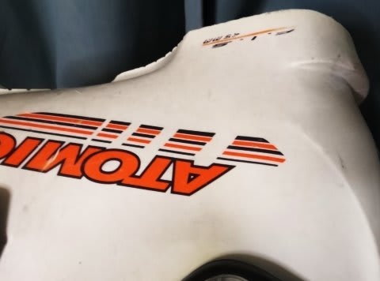
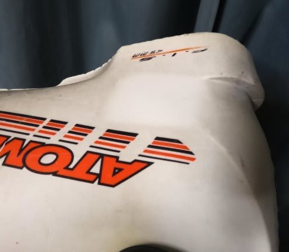
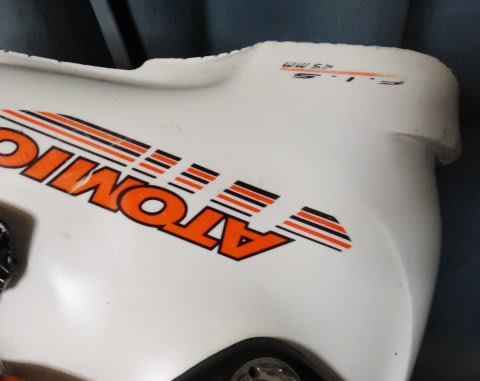
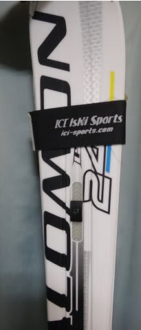

# 白いSALOMONブーツと板の汚れを取るには…

📅 投稿日時: 2011-06-14 01:52:36

で．

新しく買ったSALOMONブーツと．

今シーズン使っていた，SALOMON 24hours LM．

どっちも白いので．

…雪が汚れまくっている春スキーをすると．

すごく黒ずんでみすぼらしくなってきます…（涙）．

そういうときは．

[k2hiko先生](http://blog.goo.ne.jp/k2hiko/)に教わった，この技を．

どこにでもある，メラミンフォーム．

いわゆる，激落ち君とか，そういう名前で売ってるやつです．

これが，効くんですね～．

汚れまくっているブーツですが…（今回はATOMICブーツに登場いただきました）

一部，激落ち君でこすってやると…

真ん中が，なんと！まるで新品のような輝きに！

（このあたり，深夜の通販番組風に）

で，全体をこすると…

白い輝きが全体に戻ってきました！

すばらしい！新品と見分けがつきません！（それは言いすぎ）

で．

ブーツだけじゃなく，板も磨いてみましょう…

5月のかぐら，1-2回滑るだけで，かなり茶色く着色されていた

我がLM.

…磨く前の写真をとってなかったし，この写真じゃわかりにくいんですが．

かなりきれいになりました～．

メラミンフォーム，白い板にも効きますね～．

満足．

板もぴかぴかきれいになったので．

これで，来シーズン．

板を買わなくてもいい気分になってきました…．

（と，自分に言い聞かせる）
