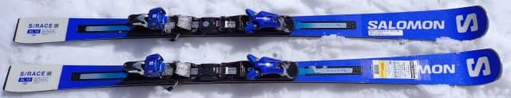
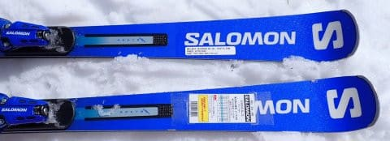
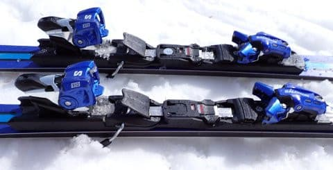
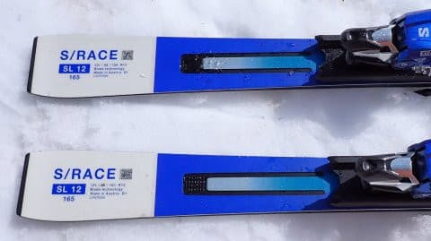
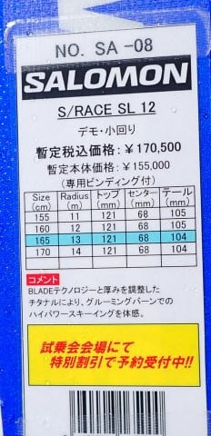

# 2025シーズンモデルのスキー板，試乗レポートその16…SALOMON S/RACE SL12

📅 投稿日時: 2024-06-21 02:11:17

えー．

本日も，2025シーズンモデルのスキー板の

試乗レポートですが．

前回のその16までは，3月上旬に焼額で

開催された，かなり冷えた新雪が積もった

コンディションで開催されたエキップさん

試乗会での試乗レポートでしたが…

今回からは，4月6，7日に開催された，

アルペン・スポーツデポさんの試乗会で

試乗した板のレポートになります…！

この2日間．

昼間の気温がかなり上がり，4月下旬なみの

ザブザブになりましたが（涙）

5日の朝早いうちと，6日の午前中だけは

結構締まったいいコンディションで

試乗できたかな…

ってなことで．4月の試乗会のレポートの

第1弾は，エキップさん試乗会では出てこない

サロモンの板．

この板は，朝のうちの比較的いいコンディションで

試せましたね～…

では，試乗レポートです！！

〇SALOMON S/RACE SL 12 + X12 GW 165cm

基礎小回り用．

昨年からほぼ変更なしと言うらしい，この板．

基礎小回り用としては，

SL PRIME 

SL PRO

SL 12

SL 10

というラインナップの，下から2番目に

なりますか…

比較的優しめのモデルとなるので，

ビンディングも優しめのTLビンディングが

ついている，このSL12ですが．

履いてみたところ…

ものすごく滑りやすい！！

それでいて，結構しっかりしていて，

かなりの上級者まで満足させる

しっかり感．

滑りやすさを生んでいるのは，

キレとズレのどっちも使える，対応幅の広さ．

ズレを使える板と聞くと，グリップが

弱くて攻められな板だとお思いでしょうが，

そうじゃない．

エッジグリップもかなりしっかりしており，

朝の結構硬めの一ノ瀬正面バーンも

気持ちよく切っていける，キレキレ感も

ありながらも，ずらしもしやすい．

攻められる板はグリップが強すぎて

ずらしがやりにくい…

というのが普通なのに．

私が不満を感じないほどのしっかり

グリップ感がありながらも，ズレにも

入れやすく．

ずらしていった中でも，板がきれいに

旋回しながらズレていってくれるので，

しっかり足場があるズレを作って

行けます．

かなり高度なレベルでキレとズレを

使い分けられる板で，どっちも気持ちよく

滑れます．

フレックスがSL PROなどに比べると

柔らかく，たわみが素直にきれいに出るので，

かなりの急斜面まで，深いカービング小回りで

攻められるし．

板なりに乗っていけば，そんなに回りすぎる

こともなく，返りもビュンビュン来るというより，

比較的優しい感じなので，中回りくらいの気持ち

よい回転弧でたわみに乗ってカービングできるし．

いや…自由度がかなり高い！

スピード域は，私がホントのトップスピードを

出すと，ちょっとだけ弱いかな…

と感じるけど，そんなスピードはゲレンデでは

出す人はそんなにいないだろうから．

トップスピードでガンガン滑り続けるわけでなく，

急斜面・緩斜面，フラットバーンから荒れたバーン

まで，いろんな斜面をズレやキレを交えながら

滑っていきたい…

という目的には最適！

これ，ゲレンデ小回り用としてはかなり

無敵な板じゃないでしょうか…

ガツガツトップスピードで攻め続けるという

人じゃなければ，この板さえあれば，

何でもできる…と思えるような，万能板だと

思いました．
