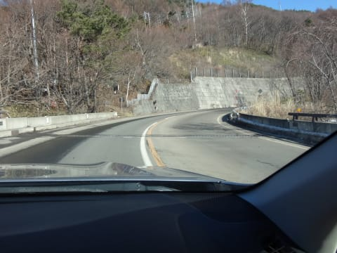

# 1月3日，正月休みラストの志賀高原，詳細レポート…とても1月と思えない状況なんですが（泣）．

📅 投稿日時: 2016-01-05 01:17:19

🏷️ カテゴリ: [2016スキー滑走日記](c70c67ed5248e9432b899dcd5747048bb.md)

ということで．

正月休みが終わってしまった，Skier_Sです．

昨日，速報モードをお届けしましたが．

本日は，1月3日の志賀高原，詳細レポートをば…

えー．

まず，この日．

…朝，志賀高原に登る途中で…

は，はぇえ？？

上林のチェーンチェックを通り過ぎて，

坊平橋を過ぎても，道に雪がないんですが…っ！！？？

ってか，完全ドライなんですがっ！！？

1月でこんなことがあっていいのか…（涙）．

で．

いつも通りの焼額に着くと…

…すっきり晴天のゲレンデがお出迎え．

…あぁ．

いいんだよ．晴れなくて．

晴れなくてもいいから，もっと雪を…（涙）．

スキー場で，ここまで晴れが恨めしく思えたことが．

かつて，あっただろうか…（泣）．

で．

第1ゴンドラにのって，山頂へ行ってみますが．

第1ゴンドラ側，GSコース．

山頂付近は，まだ雪もあっていい感じだけど…

コース途中は…

あら．

やっぱりダメか…（嘆）

でも．

焼額のスタッフは，涙ぐましい努力をしているようで…

この写真の左側から雪出しして，右側コースに

雪を寄せてコースを何とか維持しようとしています．

そしてさらに…

今日も人力での雪出し作業．

…

…お疲れ様です…

これらの努力にもかかわらず，全面石ころ

バーン化してしまっているGSコース（残念）．

なので，GSコースを避けて，

第2ゴンドラ側のパノラマコースへ行ってみますが…

かなり強い日差しで，気温も余裕でプラスの本日．

雪は大変良い感じで溶けていき…（悲）

なんだか，ダマダマに固まった，

3月くらいの感じの雪になってきてます（涙）．

で．

この高温＆日差しのおかげで．

人工降雪がない山頂付近は．

…うむ．

まぁ，避ければ避けられるレベルだけど．

…パノラマコースもやばいか…

そして．

1ゴン側がまともに滑れないので．

今日も2ゴン側のパノラマコース，

人が集中しています…

ああ．

ダミだ．

ダミだよ，こりは…（したたり落ちる涙）

ということで．

焼額を生息地とする私が，ホームゲレンデを捨てて

奥志賀へ移動っ！！

をを・

北斜面の奥志賀は，まだ雪がまとも…

と，思いきや．

奥志賀ゴンドラ，ダウンヒルコースも…

あり？

ありりりりりり？

コース上の急斜面部分，石を踏まずに

下りるのは困難な感じ…（残念）．

まぁ．

そのせいで．

奥志賀ゴンドラは，焼額第1ゴンドラと同じく，

待ちなしの飛び乗り状態．

…でも．

もう一回乗る気にはならないや…

で．

奥志賀でも，第2高速ペア側，エキスパートコースへ！

ほう…

ここは，北斜面だけあって．

気温は高いとはいえ，雪質は比較的良いではないですか．

わずかにブッシュが出ているところはあるけど，

この程度．

…そして．

ゲレンデはガラガラ！

…ちょっと雪が固めではあるものの．

横手・熊の湯を除けば，ここが一番まともじゃないかな？？

…しかし．

このリフト乗り場の掲示．

なんだよ～っ！！

気温プラス6℃だぁ？？？？

ありえない．

なんてことだ．

1月の志賀高原で，プラス6度の晴天って…

信じられん．

3月下旬レベルだよ，これ…（泣）．

ってことで．

ありえない高温にもかかわらず，北斜面で

比較的雪が良かった奥志賀をしばし堪能して，

夕方に焼額に戻ってくると…

やっぱり，第2ゴンドラ側のコースは，

人が多いなぁ…

おかげでゲレンデもちょっと荒れ気味で．

山頂付近のブッシュエリアも拡大気味…（涙）．

うーむ．

やはり今日は，奥志賀が一番良かったな…

…と，思いつつ．

また，日が暮れるリフトストップまで滑り続けた，

Skier_Sだったのでした…

しかし．

この正月休み．

あまりものゲレンデのひどさに，

「石ころを踏んでも惜しくない板」以外

履ける状況ではなく．

ずっと，3シーズン目のこの板で滑っていたわけですが．

あぁ…

一体，いつになったら．

新しい板を堪能できるのだろう…

もしかしたら．

新しい板が履けるような積雪にならないまま，

今シーズンが終わったりしないだろうな？？？

という，恐怖が脳裏をよぎる，

今日この頃なのだった…

## 💬 コメント一覧

### 💬 コメント by (いか)
**タイトル**: Unknown
**投稿日**: 2016-01-05 11:53:47

あけましておめでとうございます。今年もよろしくお願いいたします。

年が明けても本格シーズンはまだ明けませんね…

今週末、降るのでしょうか…、、、

八方もどうやらリーゼンが閉鎖され上部だけに逆戻りのようです。今週末はまた大混雑の予感ですね…

### 💬 コメント by (デーコン)
**タイトル**: Unknown
**投稿日**: 2016-01-05 20:31:50

こんばんわ。

ほんと晴れなくていいです。

雪雪雪ですね。

### 💬 コメント by (Goku)
**タイトル**: Unknown
**投稿日**: 2016-01-05 20:45:42

あけましておめでとうございます

今年も宜しくお願いします。

さて、本日志賀に行ってきましたが、ヤケビＧＳコースの酷さに言葉がありません。

今週末こそ大大大寒波に期待！

（長野市民が生活に困る位・・・あっそれはやっぱ困るから程々に）

### 💬 コメント by (Skier_S)
**タイトル**: 今週は少し積もるかな…
**投稿日**: 2016-01-06 00:00:55

＞いかさま

あけましておめでとうございます！

八方もひどい状態になってるみたいですね…

今週は，これまでに比べればちょいと

冷えてくれますが…

でも，平年並みで，ドサドサ積もるほどじゃ

なさそうです．

＃日本海側は結構積もるかも

＞デーコンさま

ホントに，晴れが憎らしいです…

いつになったら冬らしくなるんでしょう？？

＞Gokuさま

明けましておめでとうございます～

焼額，特にGSコースはすごかったでしょ…（涙）．

今週末は，大寒波は来ませんが，小寒波が来ます．

うーむ．

冬将軍ほどではないですが，冬大佐くらいは

来てくれるかも…

