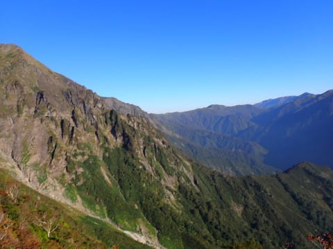

# 2022年10月，谷川岳→茂倉岳に登ってみた…その3

📅 投稿日時: 2023-08-25 10:08:56

🏷️ カテゴリ: [登山・旅行](c1d637a11a25b457ac978d197adbdafc5.md)

（[前回](eaa003dd801f3ed295e799bf477ea3afa.md)から続く）

ってなことで．

日本3大急登の西黒尾根を

登り続けること1時間で，開けた場所に

出てきたわけですが…

ここからは，ところどころ鎖場が

現れてきて．

何か所か，鎖場を乗り越えていくと…

目の前に，谷川岳から一ノ倉が見張らせる

ようになってきました！！

おおおお！

見事な山容！！

でも…

この先に歩く登山道が目の前に見渡せ．

…まだこれだけ登んないといけないのね…

いや．

しかし．

これだけ景色がいい中歩いていくのは，

まさに山歩きという感じ！

天気も最高だし．

いいですね～！！

ってなことで．

スタートから1時間27分で，

「ラクダの背」通過！

ここはまさにルート中の尾根が

盛り上がった地形になっていて．

だいぶ谷川岳のてっぺんが近くに

見えるようになってきました…

…が．

みたところ，ここからもかなり急な斜面が

続きそうですね（涙）

でも．

こんな絶景を眺めながらの山行なので…

西黒尾根，かなり楽しいですよ！これ．

ってなことで．

ここから谷川岳まで，標準コースタイムでは

1時間40分ほど．

これから，目の前に連なるあの道を…

ひたすら登っていくわけです．

…しかし．

今日はホントに最高の山登り日和だな！！

（[続く](eff5cc5db51cca569a08ec365db4b5545.md)）
