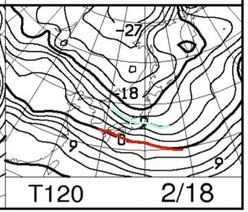

# 2月17，18日の週末の志賀高原スキー場の天気は…かなり冷え冷え！17日は雪がちらつき，18日は曇り⇒晴れかな？

📅 投稿日時: 2018-02-15 04:06:53

🏷️ カテゴリ: [スキー天気予想](c6554f5c3c106093b511a8daae23757e8.md)

えー．

今晩から明日の朝にかけて．

20cmほど積雪がありそうだけど．

そのあとは週末まで全く積もらなさそうな

天気図を見て，また悲しんでいるSkier_Sです．

うーむ．

なんということだ…

今シーズン，正月4日まではかなりの

雪降りが続いて，太板の出番が続いたのに．

…正月休みが終了後から2月中旬まで，

普通のシーズンならトップシーズンである

この一か月半に，全くパウダーを

楽しめていないのはなぜ？？

と，嘆きたくなる今日この頃．

うーん．今シーズン，このままだと春はヤバそう…

とりあえず．

果たして今週末は降ってくれるのか？？

いつも通り，専門天気図を読み解いてみましょうか…

まず，土曜17日，夜9時の予想天気図ですが．

うむ．

この日は水色の降水域が，わずかに志賀高原に

かかっていますね…

だもんで，土曜の志賀は一日雪がちらつく

天気になりそうかな～．

そして，土曜の850hpa気温図は…

うむ．赤い0℃線は日本のはるか南．

で，志賀高原には-12℃線が掛かっているくらい

なので…

この日は昼間も-10℃程度までしか上がらず．

冷え冷えの一日になりそう…

次に，日曜18日ですが．

850hpa気温はこんな感じで．

水色の-9℃線が志賀高原にかかってるので．

この日も，最高気温が-5℃以下という

冷え冷えの一日になりそうです．

で，日曜の地上天気図はこんな感じで…

降水域の網掛けは，志賀高原にかかっていないので．

うーむ．

朝は曇り，午後には晴れ…といった

感じかな…

ってことで．

まとめると．

17日土曜：昨晩からの積雪はほとんどないのに，

　この日は朝から終日雪がちらつきそう．

　朝の気温は-10℃近くまで冷え込み，

　昼間もほとんど気温は上がらず．

　冷え冷えの一日！

　朝イチは，曇り空ながらもいい雪質の圧雪が

　楽しめそうで．

　昼間も気温が上がらないので，雪質自体は

　良さそうな，冷え冷えの寒い一日．

　…ただ，急斜面は，午後になったら表の

　柔らかい雪が剥げて，下地の固いのが

　でてくるかも…

18日日曜：この日も，積雪はほとんどなさそうかな．

　朝は曇り空，気温は-10℃くらい．

　朝イチはピカピカ圧雪を楽しめそう．

　午後になって晴れてくるか．

　昼間も気温は-5℃程度と冷え冷え．

　この日も急斜面はじきに下地の固いのが

　出てきそうだけど．

　トップシーズンらしい，冷え冷えの一日．

という感じで．

この土日も，気温自体は冷えそうですけど．

…というか，こんな感じで．

17，18日は平年比-5℃程度の冷え冷え

になりそうなんですけど

でも…

やっぱりこの週末も積もらなさそう（涙）．

そろそろ積雪が無いと，春スキーがヤバそう

なんですけど．

なぜ，冷えてくれてるのに，雪が積もらないのか…（泣）．

そろそろドサドサ積もって，パウダーを滑りたいなぁ…

うーむ．

今度は．

冷え冷え踊りではなく．

降れ降れ踊りを踊らなくてはならないのか…？？

## 💬 コメント一覧

### 💬 コメント by (はっち)
**タイトル**: 週末の志賀は
**投稿日**: 2018-02-15 19:33:48

17日(土)の昼頃から雪となり、18日(日)の昼過ぎまで降り続くと予測しています。　ただし、トータルの降雪量はそれほど多くないかも。。。

今週末は志賀高原を予定していますので、お会いできるといいですね。

### 💬 コメント by (ホンダです。)
**タイトル**: ヤケビこみこみです。
**投稿日**: 2018-02-15 20:17:36

はじめてコメントします。今週ずっとヤケビです。失敗です。空いてると思いましたが。日体大ご一行様でメチャクチャ混んでいます。9時過ぎにはオリンピックを占領され第三フードはほぼ貸し切り状態になります。今週末はますます混んでるとおもいます。

### 💬 コメント by (しんちゃん)
**タイトル**: 週末参戦予定
**投稿日**: 2018-02-15 21:56:47

平日にどさどさ降って、土日は晴れてほしいですね。

読者の皆さんの冷え冷え踊りがこのところ効きすぎている感じがしています。降れ降れ踊りに切り替えないといけないですね（？(笑)？）

今週末行けそうなので、お会い出来たらよろしくお願いします。

### 💬 コメント by (megalith)
**タイトル**: Unknown
**投稿日**: 2018-02-16 07:14:54

ﾌﾚｰヾ(ﾟ▽ﾟゞ)( ｼﾟ▽ﾟ)尸_ﾌﾚｰ 

ヾ(￣ー￣ゞ))..( ｼ￣ー￣)ﾂ_ﾌﾚｰﾌﾚｰ

ﾌﾚｰ ゞ(´ω｀ゞ))))...((((ﾂ´ω｀)ﾂ ﾌﾚｰ

日本！＼(´・∀・｀)／ンバッ

ﾊﾞｷｯ!∑(ﾟoﾟC=(__; ｿｯﾁﾉﾌﾚｰｼﾞｬﾅｲﾀﾞﾛｯ!

### 💬 コメント by (Skier_S)
**タイトル**: 昨日はコメント返事できずすみません
**投稿日**: 2018-02-17 00:10:14

＞はっちさま

ほぼ予想は私と同じですね…

積雪量はそれほどなさそうだし，

17日に降りはじめ，18日の昼間で雪が続くと

思います…

ただ，私は17日の降り始めは朝9時~10時ごろで，

昼前，リフト営業開始からそれほど遅くない段階で

降り始めるかな～……と思ってますが．

うーむ．

でも，確かに降り始めは昼近いかも…

では，また志賀高原でお会いしましょう！

＞ホンダさま

あら！初コメントですね．

いらっしゃいませ（笑）．

今週はずっと焼額ですか…

うらやましい限りです．

でも，団体さんとぶつかったのはちょっと

残念でしたね…

週末まで日体大御一行様いらっしゃるのですか…

だとすると，いろいろ混みそうですね…

明日志賀高原でお会いしましょう！

＞しんちゃんさま

ホントにそろそろ平日にドサドサ降ってほしい

ところですが…

まぁ，この週末．

運が良ければ土曜夜にちょっと積もりそうです．

でも，膝パフとかまでは行かないですが…（涙）．

しかし，冷え冷え踊りは効いてるようで，

気温は低いんですけどね～．

今週からは降れ降れ踊りを踊ってください！

＞megalithさま

踊りが違います（笑）

でも，ホントにそろそろドサドサ降ってほしい

ところです…

ゲレンデの固い下地が隠れてくれないと（泣）．

